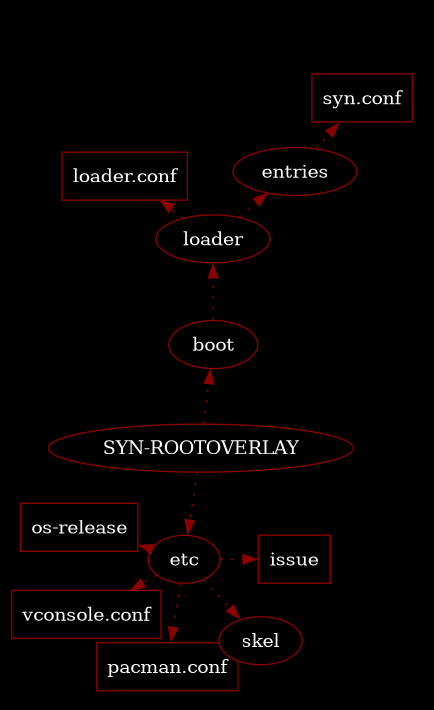

# SYN-OS: 
# A Customizable Arch Linux-based Operating System

Welcome to SYN-OS, a lightweight, Arch Linux-based distribution created by William Hayward-Holland (Syntax990), offering a highly customizable, minimalistic, and efficient desktop experience through Tint2 and Openbox, designed for revitalizing older hardware like aged MacBooks with modern packages, and optimized resource usage, while simultaneously maximizing performance and control on modern systems, housing all relevant project files, resources, updates, and instructions in its definitive repository.

<p align="center">
  
</p>


## Features

- **Lightweight and Resource-Efficient:** SYN-OS is optimized to consume less than 160MB of memory on idle, making it ideal for running on older hardware with limited resources. It ensures smooth performance even on modern hardware, utilizing system resources efficiently for maximum control and performance on a wide range of tasks.
- **Tint2 and Openbox:** The default desktop environment consists of Tint2 panel and the highly customizable Openbox window manager, providing a sleek and efficient user interface.
- **Customizable Installer:** SYN-OS uses shell scripts with easily adjustable variables, allowing you to customize the installation process to suit your preferences and specific hardware requirements.
- **Modern Packages:** Despite its lightweight nature, SYN-OS supports the installation of modern software packages, giving you access to the latest applications and utilities.
- **Compatibility:** SYN-OS is a fully compatible derivative of Arch Linux, ensuring compatibility with a vast ecosystem of software and tools.

## Embark on Your SYN-OS Adventure

To forge a customized ISO of SYN-OS employing the SYN-ISO-PROFILE, please follow these comprehensive steps:


1. **Obtain the Repository:** Clone or download this repository to your local environment.
```bash
git clone https://github.com/syn990/SYN-OS.git
```
2. **Ensure Necessary Dependencies:** Check if all required dependencies, such as `mkarchiso`, are already installed. If not, install them before moving forward.
```bash
sudo pacman -S archiso
```
3. **Modify the SYN-ISO-PROFILE:** The SYN-ISO-PROFILE serves as the blueprint for your custom ISO. Tailor it to your preferences by choosing your package selection, configuring dot files, and implementing any additional adjustments.
4. **Populate the `airootfs` Directory:** Any files you want to be present on the ISO should be copied into the `airootfs/root` directory. These might be configuration files, scripts, or other assets.
```bash
cp YOUR_FILES SYN-OS/SYN-ISO-PROFILE/airootfs/root/
```
5. **Adjust the Installer Scripts:** Alter the installer scripts by modifying the relevant variables to correspond with your desired installation settings.
6. **Commence the Build Process:** Begin the generation of your personalized ISO by running the build command: `sudo mkarchiso -v path/to/SYN-ISO-PROFILE`.
```bash
sudo mkarchiso -v SYN-OS/SYN-ISO-PROFILE
```
7. **Patience is Key:** Allow the build process to complete. The resulting custom ISO will be located in the `out` directory, ready for you to explore your tailored SYN-OS experience.

```Note: Be aware that the build process can take a significant amount of time, depending on your system's capabilities and the customizations you've implemented.```

## Introduction

## Installation Process Explained...

#### Disk Partitioning
Modify variables related to disk partitioning, including disk wiping, boot partition creation, root partition setup, mount points, and filesystem types to suit your preferences.

#### Package Installation
In SYN-OS, packages are neatly grouped into variables for a seamless installation process. You can modify these variables for personalized package selection. The script uses the Pacstrap tool for package installation.

#### Live System Configuration
It covers keyboard layout setup, Network Time Protocol (NTP) configuration, DHCP setup for network connectivity, and mirrorlist optimization using the Reflector tool. Additionally, the script ensures the keyring's security and updates package databases.

#### Root Overlay + Dotfiles
Place your custom files and configurations in the `SYN-OS-V4/root_overlay` directory. These will be copied into the root directory during the installation. Be advised the SYN-OS dotfiles can be found in /etc/skel. This is to ensure that all users created always get the same constistent configuraiton, as defined from the applications included via the intial pacstrap.



When adding packges/configuration changes to the ISO before building always ensure /etc/skel has the accompanying dotfiles.

#### System Configuration
The script sets up the username, hostname, locale settings, hardware clock, and mirrorlist.

#### Bootloader Configuration
The script leverages the bootctl tool to configure the bootloader.

### Customization
SYN-OS is designed for advanced users with deep understanding of Linux systems, specifically Arch Linux. It allows users to customize aspects like disk partitioning, package selection, locale settings, and system configurations. Users can directly manipulate the build scripts, giving you the power to shape the distro according to your vision, rather than relying on disk images or cloning technology.

<p align="center">
  
</p>
<p align="center">
  
</p>

### SYN-OS-V3: `syn-stage0.sh` & `syn-stage1.sh`

The 'SYN-OS-V3 or Earlier' directory contains the necessary installation scripts and dotfiles to establish the system. However, it does not automate the arch-chroot process, necessitating manual script execution. Prior to running, it's essential to ensure both scripts contain suitable variables.

These scripts are relatively simple; they are designed to wipe your disks and install the software with rudimentary error-checking and conditional output. This design prevents the system from spiralling into corruption without user intervention and increases the chances of successful installation. This approach was consistently employed from 2017 to 2022.

Although these scripts are intuitive, they can prove challenging to maintain as the system develops and increases in complexity. Ensuring these scripts cooperate may require somewhat unconventional approaches, especially when dealing with elements like ASCII controls and colours in a chroot environment.

Despite the reliability of this installation method, it falls short in providing the necessary organization and branching essential for the project's evolution and comprehension. However, these scripts serve as valuable reference material for those wishing to delve deeper or utilize them.

This directory also preserves early versions of legacy code, providing a glimpse into the fundamental inception and philosophy of this distro.

## Conclusion
SYN-OS provides a powerful platform tailored for advanced users, enabling a high degree of customization to align with their specific needs. It serves as an ideal stepping-stone for users transitioning to more intermediate operating systems like Arch Linux, providing a clear vision and roadmap. This approach reduces the need for brute force learning through The Arch Wiki. That being said, The Arch Wiki remains an invaluable resource, offering concise instructions and comprehensive learning materials for the broader Linux ecosystem.

#### Check out SYN-OS in action! Late Long Nights - Timelapsed
<p align="center">
  <a href="http://www.youtube.com/watch?v=fTbNA8TIzDM">
    
  </a>
</p>

#### Check out SYN-OS, terminal stuff and Half-Life 2 Overwatch offering a simple description!
<p align="center">
  <a href="http://www.youtube.com/watch?v=fTbNA8TIzDM">
    
  </a>
</p>

### ⚠️ Extreme Warning ⚠️

**Attention: This warning is of utmost importance. Please read it carefully before proceeding.**

**Legal Disclaimer: By using the SYN-OS scripts and customizing variables, you acknowledge and accept full responsibility for any consequences that may arise. The creators and maintainers of SYN-OS, including William Hayward-Holland (Syntax990), disclaim all liability for any damages, data loss, or system instability resulting from the use or misuse of these scripts. Use at your own risk.**

**This OS is strictly intended for advanced users who possess a high level of technical knowledge and are comfortable operating in a potentially unstable and undocumented environment. If you choose to deviate from the initial build scripts or dotfiles provided, you are venturing into uncharted territory. Be aware that errors or inappropriate changes can have severe consequences, including irreversible data loss or system instability. There is no webpage, guide or wiki that can help you after that...**

**Exercise extreme caution at all times, and ensure that you have a comprehensive backup strategy in place. Before making any modifications, thoroughly understand the potential impact on your system. Make sure to test changes in a controlled and isolated environment before applying them to your production systems.**

**Remember: You are solely responsible for the outcomes of any modifications made to the SYN-OS scripts and variables. Proceed with caution. Dedicate this to a VM or perhaps and isolated computer to ensure you do not loose your data**

**By using SYN-OS, you agree to these terms and acknowledge the inherent risks involved.**

**Once again, use at your own risk. Your data and system integrity are at stake.**

**Compile your own ISO and do not trust any download links found anywhere...**


## Please Note
SYN-OS is a continuously evolving project with frequent script updates. Due to its dynamic nature, data-loss incidents and stress, version control is not fully maintained. The project's structure, form, and design goals are subject to constant revision, and comprehensive documentation is currently not under any major development. As such, I may not always have the bandwidth to maintain a perfectly planned project at all times.

## License

This project is licensed under the [MIT License](LICENSE). The MIT License is a permissive open-source license that provides users with maximum creative and commercial freedom.

With the MIT License, you are free to use, modify, and distribute this software for any purpose, including commercial purposes. You can incorporate this code into your own projects, build upon it, and even sell your derivative works. The license does not impose any requirements on how you use or distribute the software.

Unlike copyleft licenses such as the GPL, the MIT License does not require derivative works to be licensed under the same license. You have the freedom to choose the license terms for your modifications and enhancements, allowing you to maintain maximum control of your derived source code.

Contributions and sharing your modifications are encouraged but not required. You have the choice to keep your modifications private or contribute them back to the community, without any obligation. While it is always appreciated when improvements are shared, the MIT License ensures that you have the freedom to make your own decisions regarding your derived works.

## Support

For support or general questions, you can reach out to me via [LinkedIn](https://www.linkedin.com/in/william-hayward-holland-990/) or email me at william@npc.syntax990.com.