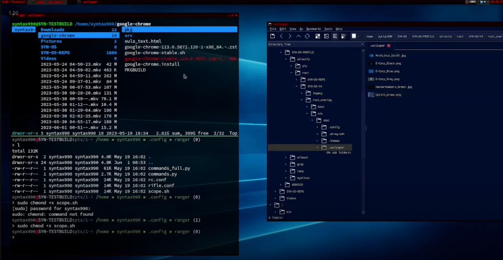

<p align="center">
  
</p>
  
  
## Overview

SYN-OS is a compact distribution based on Arch Linux, meticulously crafted by William Hayward-Holland (Syntax990). This operating system offers a streamlined and highly adaptable desktop environment by integrating Tint2 and Openbox. One of its unique strengths is its ability to optimize resource usage and enhance performance, making it an excellent choice for reviving outdated hardware while still being able to run modern packages. Additionally, SYN-OS is optimized to provide exceptional control and performance on advanced systems.

This project is suitable for individuals seeking complete control over their devices. It is built entirely on vanilla Arch Linux and utilizes well-known utilities and relatively simple bash scripts. My goal is to provide an installation process that allows users to easily adapt and customize the system to their specific needs. I hope that you will find value in using SYN-OS or, perhaps unintentionally, learn a great deal from it. I have dedicated a significant amount of time to learning Arch Linux and have built numerous systems, and I believe no other installer compares to what I have created. It started as a comprehensive script that I could modify as needed to build Arch, and it has evolved into something truly special.

<p align="center">
  
</p>

### Timelapse: (Click the video below)
<div align="center">
  <a href="https://www.youtube.com/watch?v=07uWPOyV7cw">
    
  </a>
</div>


**Important note:** This installer is not designed to be used as a shortcut for installing Arch Linux. If that is your intention, then this project may not be suitable for you. However, if you are interested in delving into the provided sources and reverse engineering them, you will undoubtedly gain a deeper understanding of Arch Linux within this environment.

## REPO DIRECTORIES

SYN-OS is a modular operating system that comprises several components and directories. Here's a brief description of each:

- **SYN-ISO-PROFILE**: Includes the ISO profile for building the operating system image. This directory contains the necessary files and configurations. See [archsio](https://wiki.archlinux.org/title/archiso).

<p align="center">
  
</p>

- **SYN-ROOTOVERLAY**: Contains the root overlay for the operating system. It includes boot-related files and configuration in the `boot` directory as well as system-wide configurations in the `etc` directory. The dotiles are also included in `etc/skel`. This SYN-ROOTFSOVERLAY is to be copied into the project's airootfs directory, or any other existing profile including baseline or releng (however without accompanying dotfiles the enviroment may fail).

Place your custom files and configurations in the `/SYN-OS/SYN-OS-V4/SYN-ROOTOVERLAY/` directory. These should be be copied into the `/SYN-OS/SYN-OS-V4/SYN-ISO-PROFILE/airootfs/` manually before building the ISO, else the installed packages will have default dotfiles which aren't appropriate for xorg or openbox.

<p align="center">
  
</p>

- **SYN-DOTFILES**: Contains a collection of dotfiles for setting up and customizing various applications and tools. If you change the pacakges in [syn-pacstrap-variables.sh](https://github.com/syn990/SYN-OS/blob/main/SYN-OS-V4/SYN-INSTALLER-SCRIPTS/syn-pacstrap-variables.sh) then you can also add your custom dotfiles from `~/.config`.

<p align="center">
  
</p>

 **Be advised** the SYN-OS dotfiles can be found in `/etc/skel` post-install and `/SYN-OS/SYN-OS-V4/SYN-ROOTOVERLAY/etc/skel/` and are coped in `SYN-OS/SYN-OS-V4/SYN-ISO-PROFILE/airootfs/root/SYN-INSTALLER-SCRIPTSS????`. This is to ensure that all users created always get the same constistent configuraiton, as defined from the applications included via the intial pacstrap.


```Note: When adding packges/configuration changes to SYN-ISO-PROFILE before building always ensure /etc/skel has the accompanying dotfiles.```


- **SYN-INSTALLER-SCRIPTS**: Houses installer scripts that facilitate the setup and configuration of SYN-OS-V4.

- **SYN-TOOLS**: Provides various tools, scripts, or utilities that exist in the context of SYN-OS-V4.

#### Bootloader Configuration
The installer leverages the bootctl tool to configure the bootloader as a single disk gpt `SYN-ROOTOVERLAY/boot/` contains neccessary information. Here you can see the files deposited into the installer.

Currently the scripts will ensure the system wipes the drives present in `syn-disk-variables.sh` and ensure a single root partition with a seperate GPT/UEFI boot partition.

It also contains an MBR fallback should the [UEFI Variables](https://wiki.archlinux.org/title/Unified_Extensible_Firmware_Interface) not get detected. This will install a single MBR root linux partition.

There is no swap, you can add these yourself.

<p align="center">
  
</p>

### Customization
SYN-OS is designed for advanced users with deep understanding of Linux systems, specifically Arch Linux. It allows users to customize aspects like disk partitioning, package selection, locale settings, and system configurations. Users can directly manipulate the build scripts, giving you the power to shape the distro according to your vision, rather than relying on disk images or cloning technology.

<p align="center">
  
</p>
<p align="center">
  
</p>

### [SYN-INSTALLER-MAIN.sh](https://github.com/syn990/SYN-OS/blob/main/SYN-OS-V4/SYN-INSTALLER-SCRIPTS/SYN-INSTALLER-MAIN.sh)

This is the main script to execute the installation of SYN-OS, an Arch Linux ISO project. Once the ISO has been created and booted, running this script is the primary step to initialize the system setup.

SYN-INSTALLER-MAIN.sh is the cornerstone of the SYN-OS installation process. It sets up partitions, filesystems, mounting points, tests network connectivity, sets up the keyboard layout and NTP, checks the accessibility of Arch Linux repositories, and wipes disks. It partitions and formats the drive according to whether EFI variables are present or not. Then it manages package installation, sets up the keyring, updates mirror lists, generates fstab, copies root overlay materials, and prepares the system for the next stage of installation.

This script also serves as a gateway to the remainder of the installation process by sourcing several other scripts in the `SYN-INSTALLER-SCRIPTS` directory. Each of these sourced scripts performs specific tasks, and their code can be reviewed individually for a deeper understanding of the installation process.

### [syn-disk-variables.sh](https://github.com/syn990/SYN-OS/blob/main/SYN-OS-V4/SYN-INSTALLER-SCRIPTS/syn-disk-variables.sh)

This script is where you define the partitioning scheme for the SYN-OS installation. It includes variables that determine which devices will be targeted for formatting, partitioning, and mounting.

Modify these variables to match your [specific configuration](https://man.archlinux.org/man/lsblk.8.en#:~:text=lsblk%20lists%20information%20about%20all,types%20from%20the%20block%20device.). This is where the script decides on which disk to destroy and format.:

Disk to be wiped: `WIPE_DISK_990="/dev/vda"`  
Boot Partition: `BOOT_PART_990="/dev/vda1"`  
Root Partition: `ROOT_PART_990="/dev/vda2"`  
Location to the new system's boot directory: `BOOT_MOUNT_LOCATION_990="/mnt/boot"`  
Location to the new system's root directory: `ROOT_MOUNT_LOCATION_990="/mnt/"`  
Filesystem for the boot partition: `BOOT_FILESYSTEM_990="fat32"`  
Filesystem for the root partition: `ROOT_FILESYSTEM_990="f2fs"`

### [syn-pacstrap-variables.sh](https://github.com/syn990/SYN-OS/blob/main/SYN-OS-V4/SYN-INSTALLER-SCRIPTS/syn-pacstrap-variables.sh)

This script is responsible for defining the 
kage installation variables used by pacstrap during the initial setup of the main system.

The script includes multiple variables that contain the names of packages to be installed. These variables can be modified to add or remove packages as needed to customize the SYN-OS installation.

Here are the main package variables: (All packages are using Arch Linux offical repositories)
- `basePackages`: Basic system packages required for the initial setup.
- `systemPackages`: Packages for audio, networking, and other system-related utilities.
- `controlPackages`: Packages for controlling the system settings.
- `wmPackages`: Packages for window managers and Xorg server setup.
- `cliPackages`: Command-line interface (CLI) utilities.
- `guiPackages`: Graphical user interface (GUI) utilities.
- `fontPackages`: Packages for fonts and font rendering.
- `cliExtraPackages`: Additional CLI utilities for specialized tasks.
- `guiExtraPackages`: Additional GUI utilities for specific applications.
- `vmExtraPackages`: Packages for virtualization (commented out).

The `SYNSTALL` variable combines all the package variables to form the pacstrap command. When executed with the specified mount point, this command installs all the packages listed in the `SYNSTALL` variable to the target system.

You can directly execute the pacstrap command with the `$SYNSTALL` variable at the end of the `SYN-INSTALLER-MAIN.sh` script to install the defined packages. Alternatively, you have the flexibility to customize the installation process by modifying the package variables or adding an additional pacstrap command as needed.

Please ensure that the package names are valid and accessible through the configured mirrors.

Refer to the `syn-pacstrap-variables.sh` script in the [SYN-INSTALLER-SCRIPTS](https://github.com/syn990/SYN-OS/tree/main/SYN-OS-V4/SYN-INSTALLER-SCRIPTS) directory for more details.

## Getting Started

To forge a customized ISO of SYN-OS employing the SYN-ISO-PROFILE, please follow these comprehensive steps:

1. **Obtain the Repository:** Clone or download this repository to your local environment.
```bash
git clone https://github.com/syn990/SYN-OS.git
```
2. **Ensure Necessary Dependencies:** Check if all required dependencies, such as `mkarchiso`, are already installed. If not, install them before moving forward.
```bash
sudo pacman -S archiso
```
3. **Modify the SYN-ISO-PROFILE:** The SYN-ISO-PROFILE serves as the blueprint for your custom ISO. Tailor it to your preferences by choosing your package selection, configuring dot files, and implementing any additional adjustments.
4. **Populate the `airootfs` Directory:** Any files you want to be present on the ISO should be copied into the `airootfs/root` directory. These might be configuration files, scripts, or other assets.
```bash
cp YOUR_FILES SYN-OS/SYN-ISO-PROFILE/airootfs/root/
```
5. **Adjust the Installer Scripts:** Alter the installer scripts by modifying the relevant variables to correspond with your desired installation settings.
6. **Commence the Build Process:** Begin the generation of your personalized ISO by running the build command: `sudo mkarchiso -v path/to/SYN-ISO-PROFILE`.
```bash
sudo mkarchiso -v SYN-OS/SYN-ISO-PROFILE
```
7. **Patience is Key:** Allow the build process to complete. The resulting custom ISO will be located in the `out` directory, ready for you to explore your tailored SYN-OS experience.

```Note: Be aware that the build process can take a significant amount of time, depending on your system's capabilities and the customizations you've implemented.```

## Please Note
SYN-OS is a continuously evolving project with frequent script updates. Due to its dynamic nature, data-loss incidents and stress, version control is not fully maintained. The project's structure, form, and design goals are subject to constant revision, and comprehensive documentation is currently not under any major development. As such, I may not always have the bandwidth to maintain a perfectly planned project at all times.

## License

This project is licensed under the [MIT License](LICENSE). The MIT License is a permissive open-source license that provides users with maximum creative and commercial freedom.

With the MIT License, you are free to use, modify, and distribute this software for any purpose, including commercial purposes. You can incorporate this code into your own projects, build upon it, and even sell your derivative works. The license does not impose any requirements on how you use or distribute the software.

Unlike copyleft licenses such as the GPL, the MIT License does not require derivative works to be licensed under the same license. You have the freedom to choose the license terms for your modifications and enhancements, allowing you to maintain maximum control of your derived source code.

Contributions and sharing your modifications are encouraged but not required. You have the choice to keep your modifications private or contribute them back to the community, without any obligation. While it is always appreciated when improvements are shared, the MIT License ensures that you have the freedom to make your own decisions regarding your derived works.

## Support

For support or general questions, you can reach out to me via [LinkedIn](https://www.linkedin.com/in/william-hayward-holland-990/) or email me at william@npc.syntax990.com.

All project-related files, resources, updates, and guidelines are conveniently hosted in a comprehensive, centralized repository.

You are expected to go directly to the [The Arch Wiki](https://wiki.archlinux.org) for resources and instructions that are outside the scope of the project itself. This system is vanilla so all resources found will be relevent.
