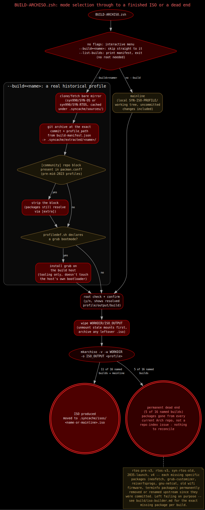
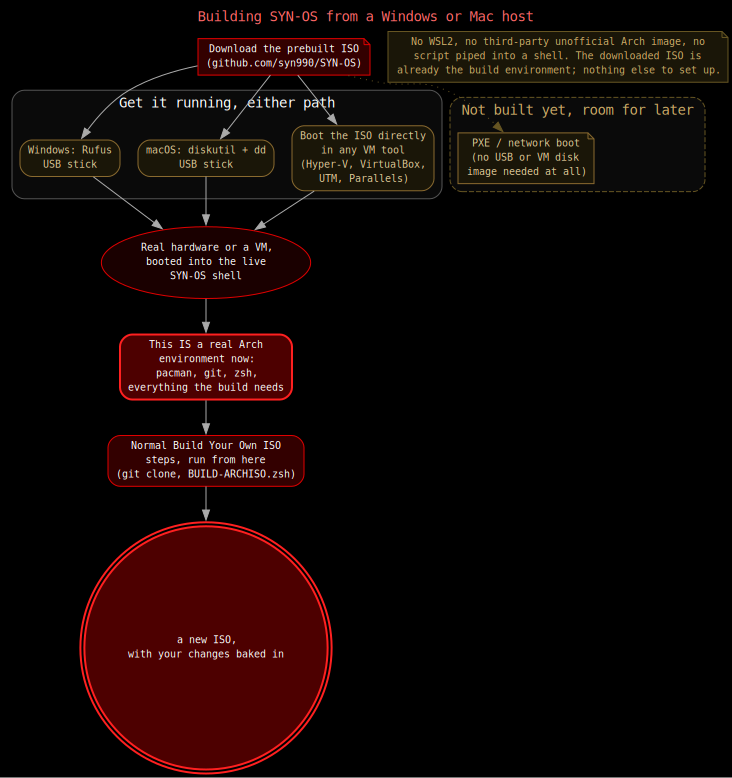

# Building your own ISO

Want to build SYN-OS yourself instead of downloading it? One script does
the whole thing.



```bash
sudo pacman -S archiso git
git clone https://github.com/syn990/SYN-OS.git
cd SYN-OS
sudo zsh ./BUILD-ARCHISO.zsh
```

Run it with no options and you'll get a menu. The first choice is always
today's version, everything currently in the project. The finished ISO
lands in `ISO_OUTPUT/`.

## Building an older version

As a bit of a curiosity, this same script can also reach back into the
project's own history and build one of its past editions exactly as it
shipped at the time, going all the way back to 2021. Pick one from the
same menu, or use `--build=<name>` to jump straight to it.

Not every old edition still builds today. Some depended on packages that
no longer exist anywhere in Arch's repositories and simply can't be
built anymore, that's a fact of software aging, not a bug in this
script.

## Building without a Linux machine

You do need a real Arch environment to run the build script itself,
Windows and macOS can't run it directly. But the SYN-OS ISO you'd
download already is that environment. Boot it in a VM (Hyper-V,
VirtualBox, UTM, whatever you've got), clone the project, and build from
inside that live session.


