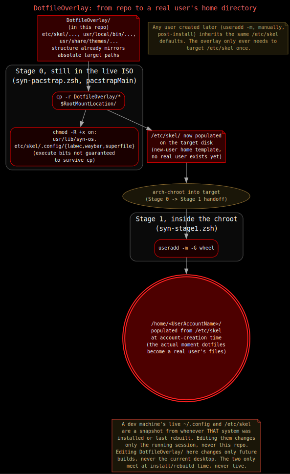

# Dotfile Overlay

If you want to change a config file, a theme, or anything under `.config`, edit it in `DotfileOverlay/` (`SYN-ISO-PROFILE/airootfs/usr/lib/syn-os/DotfileOverlay/`). That's where every per-user default lives in this repo — the one exception is `/usr/share/syn-os/docs`, which is static system data deployed by its own step in `syn-pacstrap.zsh`, not part of this overlay (see [Stage 0](./stage0.md#5-pacstrapmain-syn-pacstrapzsh)).

It's a plain folder laid out exactly like the real filesystem it gets copied onto:

```
DotfileOverlay/
├── etc/
│   ├── motd, os-release, pacman.conf, vconsole.conf   (installed-system /etc files)
│   └── skel/                    → /etc/skel/       (new-user home template)
│       ├── .zshrc                see docs/zsh.md
│       ├── .wallpaper/           14 wallpapers, one per SYN-OS-* theme
│       └── .config/
│           ├── labwc/            see docs/labwc.md (rc.xml, menu.xml,
│           │                      autostart, environment, themerc)
│           ├── waybar/           see docs/waybar.md (config.jsonc, style.css)
│           ├── syn-os/themes/    14 SYN-OS-*.theme files (SYN_* vars) —
│           │                      see docs/theming/theme-engine.md
│           ├── foot/, superfile/, falkon/, vlc/, pavucontrol-qt/
│           └── qt5ct/, qt6ct/    both configs exist; environment currently
│                                  points the live session at qt6ct only
└── usr/
    ├── local/bin/                 → /usr/local/bin/
    │                                 (syn-theme-apply, syn-docs-view.zsh)
    ├── lib/
    │   └── syn-os/
    │       ├── syn-pipe-*.zsh     labwc pipe-menu generators (audio, display,
    │       │                       docs, share, superfile, theme, blackarch)
    │       ├── syn-bar-*.zsh      waybar modules/handlers (disk, launcher,
    │       │                       power, share-quickmenu, share-status,
    │       │                       toggle-position, wifi)
    │       ├── screenshot.zsh, screen-recorder.zsh
    │       ├── syn-*-toggle.zsh, syn-*-prompt.zsh, syn-graphmap-*.zsh
    │       └── theme-templates/  → /usr/lib/syn-os/theme-templates/
    │                                (waybar/labwc/qt5ct/qt6ct/foot/superfile
    │                                 templates rendered by syn-theme-apply)
    └── share/
        └── themes/
            └── SYN-OS-RED/       → /usr/share/themes/SYN-OS-RED/
                └── openbox-3/    (LabWC reads Openbox-format theme dirs;
                                    only RED needs one here — the other
                                    13 themes work entirely through the
                                    SYN_* variables + templates above)
```

## How it actually gets onto a real system



Two steps, in two different stages:

**Stage 0**, still running in the live ISO, `pacstrapMain` in [`syn-pacstrap.zsh`](./stage0.md#5-pacstrapmain-syn-pacstrapzsh) runs one copy:

```zsh
cp -r /usr/lib/syn-os/DotfileOverlay/* "${RootMountLocation}/"
```

Because the folder is already laid out like the real filesystem, this single command puts everything in the right place with no per-file logic. Immediately after, it runs targeted `chmod -R +x` calls, since a plain recursive copy doesn't reliably preserve the execute bit on every script:

```zsh
chmod -R +x "${RootMountLocation}/usr/lib/syn-os"
chmod -R +x "${RootMountLocation}/usr/local/bin"
chmod -R +x "${RootMountLocation}/etc/skel/.config/labwc"
chmod -R +x "${RootMountLocation}/etc/skel/.config/waybar"
chmod -R +x "${RootMountLocation}/etc/skel/.config/superfile"
```

`/usr/lib/syn-os` and `/usr/local/bin` need this because that's where the `syn-pipe-*`/`syn-bar-*` scripts and `syn-theme-apply`/`syn-docs-view.zsh` actually live; the three `.config` subdirectories need it because `labwc`'s `autostart` and files under `waybar`/`superfile` also have to execute in place. Note this same `pacstrapMain` step separately re-installs every `/usr/lib/syn-os/*.zsh` script directly (`install -Dm755`) before the overlay copy even runs, so the scripts are executable twice over by two different mechanisms — the `DotfileOverlay/usr/lib/syn-os/` copies and the top-level script copies end up at the same path, and the later overlay copy is what actually lands last.

Two more things happen in this same Stage 0 step, both worth knowing about since they're easy to miss reading only the tree above:
- `synos.conf` (with `LuksPassphrase` already stripped — it was fully consumed earlier in Stage 0 and never needs to reach the target disk) is installed to `${RootMountLocation}/etc/syn-os/synos.conf` for Stage 1 to re-source.
- `syn-filemanager`'s already-built binary (and `.desktop` file) is copied from the live ISO straight onto the target — built once from source under `SYN-SOFTWARE/syn-filemanager-src` at ISO-build time, not compiled per-install. See [syn-filemanager](./tools/syn-filemanager.md) and [Building the ISO](./build/iso-builder.md).

**Stage 1**, inside the chroot, creates the actual user account:

```zsh
useradd -m -G wheel -s "$UserShell" "$UserAccountName"
```

The `-m` flag copies `/etc/skel` into the new user's home directory. This is the moment the dotfiles become someone's actual files — the `cp -r` in Stage 0 only staged them at `/etc/skel` on the target root, it didn't put them in any user's home yet.

Because this happens through `/etc/skel` rather than writing directly into `/home/<user>`, any user created afterward — including one added by hand post-install — gets the same defaults for free. The overlay only ever has to target `/etc/skel` once; `useradd -m` does the fan-out.

## Your dev machine's `/etc/skel` is not the source of truth

If you're editing this repo from a computer already running SYN-OS, that machine's live `~/.config` (and its `/etc/skel`, if you ever look at it directly) is a snapshot from whenever that system was installed or last rebuilt. Neither updates itself when you edit this repo, or even after you commit here — they're two independent copies that only ever synchronize at install/rebuild time, and only in one direction (repo → disk, never disk → repo).

Concretely: editing your live `~/.config/waybar/config.jsonc` changes your desktop right now, but does nothing to `DotfileOverlay/`, and won't show up in the next ISO build unless you copy the same edit into the repo by hand. Editing `DotfileOverlay/` here does nothing to your current desktop. `DotfileOverlay/etc/skel/` in this repo is always the actual source of truth for what a *new* install or a *future* rebuild will contain — a dev machine's own `/etc/skel` or `~/.config` should never be read as if it reflects the current state of the repo, since it can silently drift the moment either side changes without the other. If you need to know whether they've drifted, diff them explicitly rather than assuming they match because they look similar.
