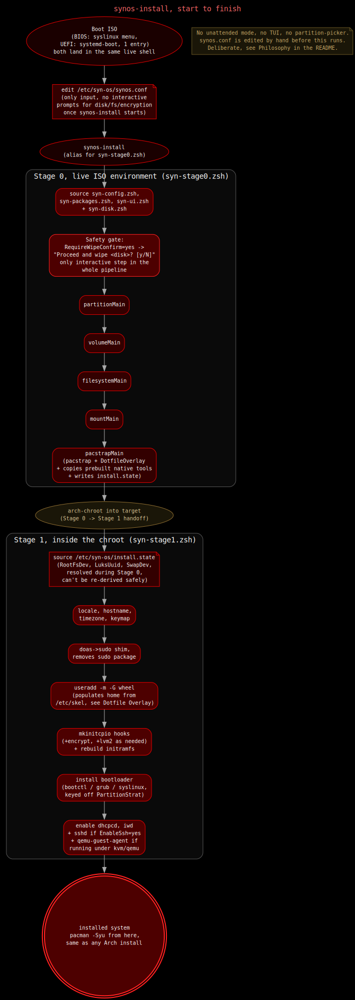

# How installing SYN-OS works

There's no graphical installer, no wizard clicking through screens. You
edit one config file with your choices, run one command, and the rest
happens on its own.



## Booting the ISO

The USB boots straight into a plain shell, no desktop yet. Everything the
installer needs is already there.

## Setting your choices

Run `synos-config` for a quick interactive picker, it walks you through
your settings one at a time and loops until you're happy, no need to open
a text editor at all. If you'd rather edit the file directly, or you're
copying in a config you prepared ahead of time, `nano /etc/syn-os/synos.conf`
works too. Either way you're setting the same things: which disk to
install to, your username and password, whether you want encryption, and
so on. See [Choosing your setup](./synos-conf.md) for what every option
does.

Once you're happy with it:

```zsh
zsh /usr/lib/syn-os/syn-stage0.zsh
```

Everything printed during install gets saved to a log file, so if
anything goes wrong you've got a record of exactly what happened.

## What happens next

The installer runs in two parts. First it partitions and formats your
disk, then installs the base system onto it. Once that's done, it
switches into that freshly installed system and finishes the job from
inside it: setting your locale and timezone, creating your user account,
setting up the bootloader so your machine can actually boot into it, and
turning on the services you'll need, like networking.

Nothing gets compiled or built during install. Every SYN-OS tool is
already built and ready to go, it just gets copied onto your disk.

## What this installer doesn't do

No dual-boot detection, no resizing an existing partition to make room.
It expects a disk it can use freely and wipes it clean before installing.
There's no first-run setup wizard either, whatever you put in the config
file is what you get on first boot.
