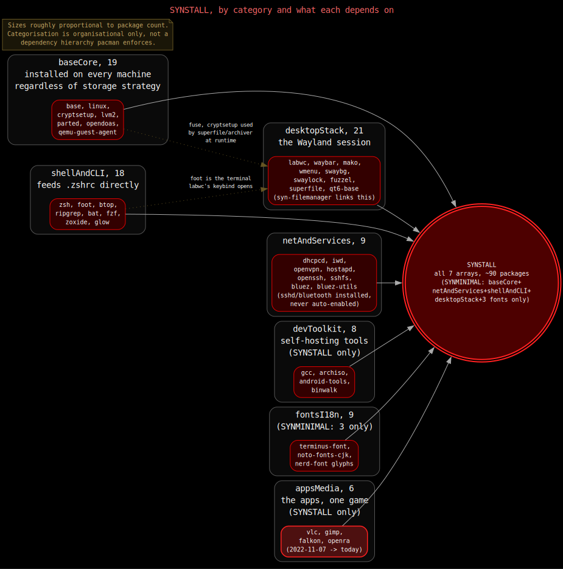
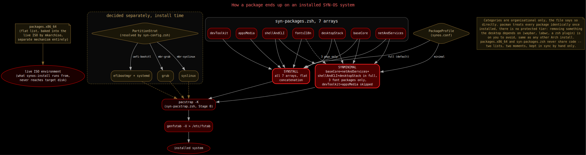

# Package Collection

SYN-OS has two separate package lists that are easy to conflate but serve different moments in the system's life:

- **`SYN-ISO-PROFILE/packages.x86_64`** — the flat, unstructured list `archiso`/`mkarchiso` bakes into the live ISO itself. This is what's available *before* anything is installed: the live environment you boot into and run the installer from.
- **`syn-packages.zsh`** (`SYN-ISO-PROFILE/airootfs/usr/lib/syn-os/syn-packages.zsh`) — the categorized package arrays `pacstrapMain` installs onto the *target disk* during [Stage 0](./stage0.md#5-pacstrapmain-syn-pacstrapzsh). This is the actual installed system's package set: desktop, shell, dev tools, apps, fonts.

They don't share a mechanism and aren't kept in sync automatically — a package needed by the live installer (`parted`, `cryptsetup`) has to appear in `packages.x86_64` even though it's *also* in `syn-packages.zsh`'s `baseCore` for the installed system, because the two lists install onto two different filesystems at two different times.



## `packages.x86_64`: the live-ISO bootstrap set

A plain newline-separated package list, one entry per line, no categories or comments — the format `mkarchiso` expects. It's what makes the live environment itself bootable and usable enough to run `syn-stage0.zsh`:

- **Base system**: `base`, `linux`, `linux-firmware`, `linux-firmware-marvell`, `archlinux-keyring`, `mkinitcpio`, `mkinitcpio-archiso`.
- **Disk/filesystem tools the installer itself calls**: `arch-install-scripts` (`pacstrap`/`genfstab`), `parted`, `dosfstools`, `e2fsprogs`, `f2fs-tools`, `btrfs-progs`, `xfsprogs`, `lvm2`, `device-mapper`, `cryptsetup`, `gparted`, `testdisk`.
- **Network**: `dhcpcd`, `dhclient`, `iwd`, `wpa_supplicant`, `wireless_tools`, `broadcom-wl`, `modemmanager`, `openbsd-netcat`, `bind`, `curl`, `systemd-resolvconf`, `openssh`.
- **Bootloaders for the ISO's own two boot modes**: `syslinux` (BIOS), `edk2-shell` (UEFI shell, useful for troubleshooting UEFI boot).
- **Shell/CLI on the live environment**: `zsh`, `zsh-completions`, `zsh-syntax-highlighting`, `zsh-autosuggestions`, `nano`, `ranger`, `fzf`, `zoxide`, `ripgrep`, `fd`, `bat`, `kbd`, `pv`.
- **Misc**: `alsa-utils`, `terminus-font`, `opendoas`, `reflector`, `qemu-guest-agent`, `open-vm-tools` (guest-agent support when the live ISO itself boots under QEMU or VMware, independent of the equivalent conditional enablement Stage 1 does for the *installed* system — see [Stage 1](./stage1.md)).

None of this reaches the installed disk directly — it exists purely so the live session can partition, format, and pacstrap. What actually lands on the target system after `pacstrap -K` runs is controlled entirely by `syn-packages.zsh`, below.

## `syn-packages.zsh`: the installed-system package set

Seven category arrays, described in the file's own words as grouped "for organizational purposes" rather than any functional boundary — nothing depends on which array a package lives in, only on whether it ends up in the array `pacstrapMain` actually installs.

### `baseCore`

Kernel, firmware, build tools, and every filesystem/encryption/partitioning tool the installer itself depends on once it's running from the target's perspective (mirroring several of `packages.x86_64`'s tools, since Stage 0/Stage 1 keep using them after pacstrap too). Installs on every machine regardless of which storage strategy was picked — the installer doesn't selectively install only the filesystem tool matching `FilesystemStrat`.

| Package | What it's for |
|---|---|
| `base` | Minimal package set to define a basic Arch Linux installation |
| `linux` | The Linux kernel and modules |
| `linux-firmware` | Firmware files for Linux hardware compatibility |
| `archlinux-keyring` | Arch Linux PGP keyring for verifying package signatures |
| `reflector` | Mirrorlist generator and ranker, for faster package downloads |
| `opendoas` | Privilege escalation tool (lightweight `sudo` alternative — see [Stage 1](./stage1.md)) |
| `qemu-guest-agent` | Host↔guest control channel under QEMU/libvirt; idles harmlessly with nothing to talk to on real hardware. Installed unconditionally, but only *enabled* at boot when Stage 1 detects it's actually running under KVM/QEMU (see [Stage 1](./stage1.md)) |
| `sof-firmware` | Sound Open Firmware (modern audio drivers) |
| `sof-tools` | Tools and utilities for Sound Open Firmware |
| `fuse` | Filesystem in Userspace library and utilities |
| `dosfstools` | Utilities for creating and checking DOS/FAT filesystems |
| `e2fsprogs` | Ext2/3/4 filesystem utilities |
| `f2fs-tools` | Tools for the Flash-Friendly File System |
| `btrfs-progs` | Btrfs filesystem utilities |
| `xfsprogs` | XFS filesystem utilities |
| `lvm2` | Logical Volume Manager 2 utilities |
| `cryptsetup` | Disk encryption tool (LUKS) |
| `parted` | GNU Parted disk partitioning program |

### `netAndServices`

Connectivity plus the extras (VPN, hotspot, Bluetooth) that need more than basic DHCP/Wi-Fi.

| Package | What it's for |
|---|---|
| `dhcpcd` | DHCP client daemon for automatic network configuration |
| `iwd` | iNet wireless daemon (Wi-Fi management) |
| `openvpn` | Open source VPN daemon and client |
| `dnsmasq` | Lightweight DNS and DHCP server, useful for local network services |
| `hostapd` | Host Access Point Daemon, turns the machine into a Wi-Fi hotspot |
| `openssh` | SSH server/client — `sshd.service` is installed but only auto-enabled if `EnableSsh=yes` (see [synos.conf Reference](./synos-conf.md)) |
| `sshfs` | Mount a remote SSH filesystem locally (FUSE-based) |
| `bluez` | Bluetooth protocol stack (`bluetooth.service`, not auto-enabled, same opt-in pattern as `sshd`) |
| `bluez-utils` | `bluetoothctl` and friends |

### `shellAndCLI`

The zsh experience plus general CLI tooling — see [Zsh Configuration](./zsh.md) for how the shipped `.zshrc` uses these.

| Package | What it's for |
|---|---|
| `zsh` | Advanced command interpreter (shell) |
| `zsh-completions` | Additional completion definitions for zsh |
| `zsh-syntax-highlighting` | Fish-shell like syntax highlighting for zsh |
| `zsh-autosuggestions` | Fish-like fast, unobtrusive autosuggestions for zsh |
| `fzf` | Command-line fuzzy finder |
| `zoxide` | Smarter `cd`, directory jumper |
| `ripgrep` | Extremely fast `grep` alternative |
| `fd` | Simple, fast, user-friendly alternative to `find` |
| `bat` | `cat` clone with syntax highlighting and Git integration |
| `inetutils` | Collection of common network programs (`ping`, `ftp`, `telnet`) |
| `calc` | Arbitrary precision console calculator |
| `git` | Distributed version control system |
| `btop` | Resource monitor (CPU, memory, disks, network, processes) |
| `nano` | Easy-to-use command line text editor |
| `foot` | Lightweight Wayland terminal emulator |
| `brightnessctl` | Tool to read and control screen brightness |
| `pamixer` | PulseAudio command-line mixer (waybar scroll/middle-click); also pulls in `libpulse`, which `syn-audio` links against |
| `pipewire-pulse` | Provides `pulse-native-provider`, the running server `syn-audio`/`pamixer` talk to — previously only a transitive pull via `pavucontrol-qt`, now explicit |
| `glow` | Markdown renderer for the terminal, backs the Docs pipe-menu |

### `desktopStack`

The Wayland desktop itself: compositor, launcher, panel, wallpaper, screenshot tools, Qt theming, and the runtime libraries `syn-filemanager` links against.

| Package | What it's for |
|---|---|
| `labwc` | Wayland window-stacking compositor (Openbox alternative — see [LabWC](./labwc.md)) |
| `wmenu` | Dynamic menu for Wayland (dmenu/tint2 alternative) |
| `wlr-randr` | Screen management utility for wlroots-based compositors |
| `grim` | Screenshot utility for Wayland compositors |
| `slurp` | Selection utility for Wayland compositors, used with `grim` |
| `archlinux-xdg-menu` | Arch Linux menu generator for XDG desktop entries (creates `wmenu` entries) |
| `waybar` | Highly customizable Wayland status bar (see [Waybar](./waybar.md)) |
| `mako` | Lightweight Wayland notification daemon, renders `notify-send` toasts |
| `swaybg` | Background setter for Sway/wlroots-based compositors |
| `swaylock` | Screen locker for Wayland/wlroots (bound to Super+L — see [LabWC](./labwc.md)) |
| `fuzzel` | Application launcher for Wayland (bound to Super+A) |
| `rofi` | Window switcher, application launcher, dmenu replacement |
| `feh` | Lightweight image viewer and background setter |
| `qt5ct` | Qt5 Configuration Utility |
| `qt6ct` | Qt6 Configuration Utility |
| `kvantum` | SVG-based theme engine for Qt |
| `kvantum-qt5` | Qt5 styles for the Kvantum theme engine |
| `superfile` | Terminal file manager |
| `qt6-base` | Qt6 core libraries — `syn-filemanager` (file browser, Super+E) links against this at runtime. `syn-filemanager` itself isn't built here: it's compiled once from source (`SYN-SOFTWARE/syn-filemanager-src`) at ISO-build time and already on this disk as a prebuilt binary before `pacstrap` even runs — see [Building the ISO](./build/iso-builder.md) |
| `lxqt-archiver` | Lightweight archive manager (Qt port of Xarchiver) |
| `featherpad` | Lightweight text editor from the LXQt project |

### `devToolkit`

General build tooling plus utilities for rebuilding the ISO and basic hardware/binary inspection. None of SYN-OS's own locally-authored tools need this anymore — every one of them is prebuilt at ISO-build time (see [Building the ISO](./build/iso-builder.md)) — this category exists so the installed system's own user still has a real build toolchain available for their own AUR/manual building.

| Package | What it's for |
|---|---|
| `base-devel` | Full build toolchain (`make`, `patch`, `pkgconf`, `gcc`, etc.) for `makepkg`/AUR building |
| `gcc` | The GNU Compiler Collection (C, C++, etc.) |
| `fakeroot` | Simulates superuser privileges, needed for `makepkg` |
| `android-tools` | Android platform tools (`adb`, `fastboot`) |
| `archiso` | Tools for creating Arch Linux live and install ISO images |
| `binwalk` | Searches a binary image for embedded files |
| `hexedit` | View and edit files in hexadecimal or ASCII |
| `lshw` | Utility to extract detailed hardware configuration |
| `yt-dlp` | Command-line audio/video downloader |

### `fontsI18n`

Console font, panel glyphs, and broad Unicode/script coverage.

| Package | What it's for |
|---|---|
| `terminus-font` | Monospaced console font |
| `ttf-bitstream-vera` | Bitstream Vera fonts |
| `ttf-dejavu` | Bitstream Vera-based family, high Unicode coverage |
| `noto-fonts` | Google Noto TTF fonts (Latin, Greek, Cyrillic) |
| `noto-fonts-emoji` | Google Noto emoji fonts |
| `noto-fonts-cjk` | Google Noto CJK fonts (Chinese, Japanese, Korean) |
| `ttf-liberation` | Metric-compatible with Arial, Times New Roman, Courier New |
| `ttf-terminus-nerd` | Terminus patched with Nerd Font glyphs, used for Waybar icons |
| `otf-font-awesome` | Iconic font and CSS toolkit |

### `appsMedia`

The apps that round out a usable desktop.

| Package | What it's for |
|---|---|
| `vlc` | Multi-platform media player |
| `openra` | Open source reimplementation of classic RTS games (Red Alert, Tiberian Dawn, Dune 2000) |
| `audacity` | Digital audio editor and recording application |
| `obs-studio` | Free, open source video recording and live streaming |
| `falkon` | Lightweight web browser based on QtWebEngine |
| `gimp` | GNU Image Manipulation Program |

## `SYNSTALL` and `SYNMINIMAL`: the two combined arrays

`syn-packages.zsh` concatenates the seven category arrays into `SYNSTALL` at parse time, before Stage 0 ever runs:

```zsh
SYNSTALL=(
  "${baseCore[@]}"
  "${netAndServices[@]}"
  "${shellAndCLI[@]}"
  "${desktopStack[@]}"
  "${devToolkit[@]}"
  "${fontsI18n[@]}"
  "${appsMedia[@]}"
)
```

A second array, `SYNMINIMAL`, exists for lean test-boot installs: `baseCore`, `netAndServices`, `shellAndCLI`, and `desktopStack` in full (enough to boot to a working labwc/waybar session and prove the install pipeline itself is sound), plus just `terminus-font`, `ttf-dejavu`, and `ttf-terminus-nerd` from fonts — skipping `devToolkit` and `appsMedia` entirely, along with the rest of `fontsI18n` (including `noto-fonts-cjk`), since none of those affect whether a fresh install boots and renders a desktop.

Which one `pacstrapMain` actually installs is controlled by `PackageProfile` in [synos.conf](./synos-conf.md): `full` (the default) uses `SYNSTALL`, `minimal` uses `SYNMINIMAL`. Bootloader packages (`efibootmgr`, `grub`, or `syslinux`) aren't in either array — `syn-pacstrap.zsh` decides those separately based on the resolved `PartitionStrat` (see [Storage Strategies](./storage-strategies.md)) and appends them to whichever profile array was selected, right before the single `pacstrap -K` call that installs everything at once.



## Customizing

To change what the installed system gets, edit the category arrays directly in `syn-packages.zsh` and rebuild the ISO — `SYNSTALL` and `SYNMINIMAL` both pick up the change automatically, since they're just concatenations of the category arrays (with `SYNMINIMAL` excluding `devToolkit`/`appsMedia` explicitly). To change what the *live installer environment* itself has available before anything is pacstrapped, edit `packages.x86_64` instead — that's a separate list, rebuilt into the ISO image itself, not read at install time. There's no shared metadata between the two files to keep in sync; each just has to carry whatever it independently needs.
