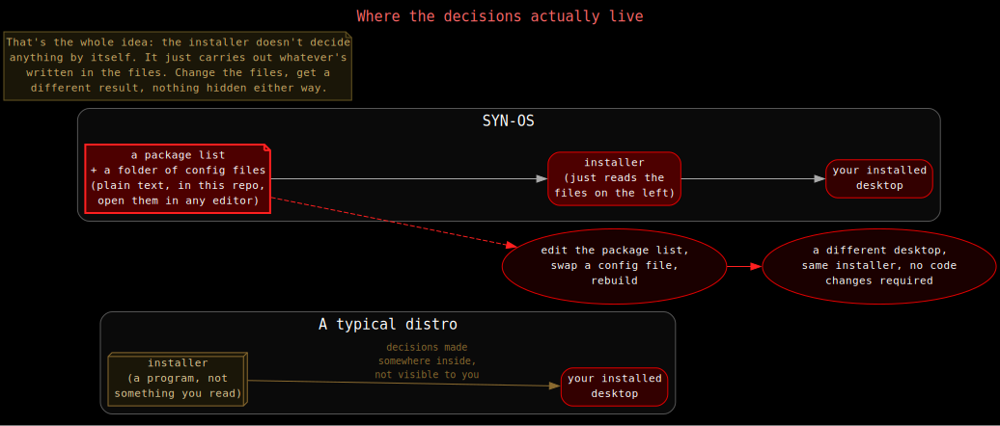

# Why SYN-OS exists

Most distros make the choices for you and then hide where those choices
live. This one doesn't. Mostly because I never wanted to reverse-engineer
my own system six months down the line.

Every package is listed plainly, every config is just the actual file,
not something generated behind the scenes. The install itself runs
through scripts you can open and read start to finish. If something
behaves oddly, the file that caused it is somewhere in this project,
readable.

I've rebuilt this system from nothing more times than I'd like to admit,
going back to before this project even existed. [Project history](./history.md)
has the real story of that.
