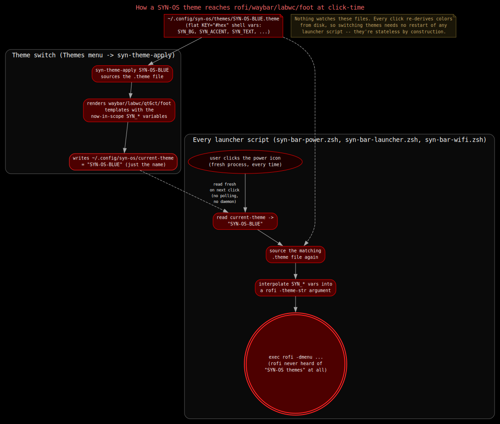

# Theme Engine

SYN-OS ships 63 themes as flat, human-editable `.theme` files. Picking one from
the desktop's Themes menu re-renders every themed app's own config format —
Waybar's CSS, LabWC's Openbox-style `themerc`, Qt's `qt6ct`/`qt5ct` color
schemes, GTK3's CSS overrides, `foot`'s terminal palette, `mako`'s toast
styling — from that one file's variables. Nothing
about this is templated at build time or baked into a package: the `.theme`
files, the templates that consume them, and the script that renders them are
all plain text under `DotfileOverlay/`, editable on a running system exactly
as they ship in this repo. This is the one place in SYN-OS where a generated
file is the right tradeoff over a hand-authored one — see
[Philosophy](../philosophy.md) — because the alternative is hand-editing six
unrelated config formats every time an accent color changes.

This document covers the `.theme` file format, the full `SYN_*` variable
contract, every template `syn-theme-apply` renders and why two of them need
theme-specific overrides, and the complete apply flow from a menu click to
pixels changing on screen.

## The `.theme` file format

A theme is a flat shell-variable file at
`~/.config/syn-os/themes/<SYN-OS-NAME>.theme` (in the repo:
`DotfileOverlay/etc/skel/.config/syn-os/themes/*.theme`). It is sourced
directly — by `syn-theme-apply`, by `syn-theme-lib.zsh`'s `syn_theme_load`,
and by `syn-pipe-theme.zsh` when building the Themes menu — so its syntax is
constrained to what a POSIX shell can safely dot-source: flat
`KEY="value"` assignments, no arrays, no command substitution beyond the one
case noted below. Comments (`#`) are allowed and several theme files use them
to record where a palette's colors came from.

### The full `SYN_*` variable set

Every one of the 63 shipped `.theme` files defines exactly these 15 keys, no
more and no fewer. This table uses `SYN-OS-RED` — the default theme, applied
automatically on first login — as the canonical reference, with a second
example column from other themes to show the real range of values:

| Variable | Meaning | `SYN-OS-RED` value | Other examples |
|---|---|---|---|
| `SYN_THEME_NAME` | The theme's own identifier; must match the filename minus `.theme`. Used to look up theme-specific override templates and to name the rendered qt5ct/qt6ct/LabWC theme directories. | `"SYN-OS-RED"` | `"SYN-OS-MATRIX"`, `"SYN-OS-WIN95"` |
| `SYN_THEME_MODE` | `"dark"` or `"light"` — which top-level submenu of the Themes pipe-menu the theme is listed under. See [Mode and Family](#mode-and-family-how-63-themes-are-organized) below. | `"dark"` | `"light"` (BRIGHT, SILVER, WIN95, every `*-LIGHT-*` palette) |
| `SYN_THEME_FAMILY` | Which structural family the theme belongs to — `SYN-OS-VANILLA`, `SYN-OS-FLATLINE`, `SYN-OS-SLAB`, `SYN-OS-HALO`, or `SYN-OS-BEVEL`. Selects both the pipe-menu submenu and, via `override_template()`, which shared override templates (if any) a theme without its own exact-name override falls back to. | `"SYN-OS-VANILLA"` | `"SYN-OS-FLATLINE"` (MATRIX), `"SYN-OS-BEVEL"` (WIN95) |
| `SYN_BG` | Base background — window client area, terminal background, panel base in flat-solid contexts. | `#000000` | `#c0c0c0` (WIN95), `#f5f5f5` (BRIGHT) |
| `SYN_BG_ALT` | Secondary background — titlebars, menu backgrounds, Waybar's own window background and bottom border. | `#100000` | `#001a00` (GREEN), `#d4d0c8` (WIN95) |
| `SYN_PANEL` | Waybar module backgrounds (CPU/memory/network/etc. segments). | `#2c0101` | `#003300` (MATRIX), `#e8e8e8` (SILVER) |
| `SYN_PANEL_HOVER` | Hover state for Waybar modules and LabWC window buttons. | `#400101` | `#006600` (MATRIX), `#dfdfdf` (WIN95) |
| `SYN_ACCENT` | The theme's signature color — menu text, active window titlebar text, Waybar workspace-focus underline, LabWC border/button highlight, terminal ANSI color 1. | `#800000` (dark maroon) | `#32cd32` (MATRIX green), `#0a246a` (WIN95 titlebar blue) |
| `SYN_ACCENT_DIM` | A muted variant of `SYN_ACCENT` — inactive window labels, OSD highlight background, qt palette's disabled-state highlight. | `#260101` | `#64aa64` (MATRIX), `#a6caf0` (WIN95) |
| `SYN_TEXT` | Primary foreground/text color across every consumer. | `#f8f8f2` | `#90ee90` (MATRIX mint-green), `#000000` (WIN95, SILVER) |
| `SYN_BORDER` | Window borders, disabled menu items, GTK3 `borders`, qt palette's disabled-text roles. | `#444444` | `#228b22` (MATRIX), `#808080` (WIN95) |
| `SYN_URGENT` | Critical/urgent state color — Waybar critical thresholds, `mako`'s `[urgency=critical]` border, LabWC urgent workspace button. | `#ff5555` | `#a70b06` (BLUE), `#aa0000` (WIN95) |
| `SYN_WALLPAPER` | Absolute path to the theme's wallpaper image, always under `$HOME/.wallpaper/`. | `"$HOME/.wallpaper/SYN-OS-RED-wallpaper.png"` | same pattern, one PNG per theme |
| `SYN_GLYPH` | A single Unicode glyph shown in Waybar's `#custom-glyph` module. Several themes leave this empty (see below). | `"●"` | `"❄"` (BLUE), `"⚡"` (YELLOW), `""` (GRAPHITE, GREEN, M141, MATRIX, ORANGE, PURPLE, SILVER, WIN95) |
| `SYN_THEME_GROUP` | Legacy lowercase family label (`"vanilla"`, `"flatline"`, `"slab"`, `"halo"`, `"bevel"`). Predates `SYN_THEME_MODE`/`SYN_THEME_FAMILY` and is no longer read by `syn-pipe-theme.zsh` or `syn-theme-apply`; kept set on every theme for now since nothing has needed to remove it yet. | `"vanilla"` | `"flatline"` (MATRIX), `"bevel"` (WIN95) |

`SYN_WALLPAPER`'s value is the one field that isn't a plain literal — it
embeds `$HOME`, which the shell expands at source-time (every consumer that
needs it has already sourced the file into a shell, so this is safe and
intentional, not an oversight).

One additional variable exists only in `syn-theme-apply` itself, not in any
shipped `.theme` file: `SYN_WAYBAR_POSITION`. The apply script reads it as
`${SYN_WAYBAR_POSITION:-top}` when deciding whether to write `"position":
"top"` or `"position": "bottom"` into Waybar's `config.jsonc`. No theme
currently sets it, so every theme resolves to `top` — the field exists so a
future theme could ship pinned to the bottom bar without any change to
`syn-theme-apply`, but as of today it's dead weight in every `.theme` file
that doesn't set it (which is all of them).

### Mode and family: how 63 themes are organized

Every theme belongs to exactly one **mode** (`dark` or `light`) and one
**family** — a structural design language shared by every palette in it,
independent of color. There are 5 families:

- **Vanilla** — the original SYN-OS look: flat color fields, no borders
  beyond a hairline, no gradients or shadows. This is the historical
  family, tracing back to the red/black and blue/black Openbox themes from
  SYN-RTOS; every other family is a deliberate structural departure from
  it, invented for this expansion rather than derived from an existing
  reference.
- **Flatline** — zero border-radius, zero shadow, hairline borders only;
  Waybar modules have no panel background at all, just text on the bar's
  own background. The most minimal family.
- **Slab** — thick (6px) square-cornered borders, chunky bordered/margined
  Waybar module blocks. The most maximal family.
- **Halo** — glow/outline styling: accent-colored borders with no fill
  (titlebar and module backgrounds match `SYN_BG` exactly), plus a
  `box-shadow` glow on the active Waybar taskbar button.
- **Bevel** — `Gradient Vertical` titlebars and buttons, `linear-gradient()`
  Waybar module backgrounds, a drop shadow on the bar itself. The most
  skeuomorphic family.

Each family (other than Vanilla) has its own pair of override templates —
`labwc-themerc.<SYN_THEME_FAMILY>.tmpl` and
`waybar-style.<SYN_THEME_FAMILY>.css.tmpl` — that every theme in that family
renders through, unless the theme also has its own *exact-name* override
(see [override templates](#theme-specific-override-templates-matrix-and-win95)
below — this is how MATRIX and WIN95 keep their unique looks despite now
also carrying a `SYN_THEME_FAMILY`).

`SYN_THEME_MODE` is orthogonal to family: every family ships both a `dark`
set and a `light` set, so switching mode never means switching structural
language, only the underlying palette.

Full breakdown, 63 themes total:

| Family | Dark | Light |
|---|---|---|
| Vanilla | 10: RED, BLUE, GREEN, M141, ORANGE, PINK, PURPLE, YELLOW, GRAPHITE, LIGHT | 4: BRIGHT, SILVER, VANILLA-LIGHT-CREAM, VANILLA-LIGHT-FROST |
| Flatline | 9: FLATLINE-CYAN, FLATLINE-MAGENTA, FLATLINE-LIME, FLATLINE-GOLD, FLATLINE-ICE, FLATLINE-CRIMSON, FLATLINE-TEAL, FLATLINE-SLATE, MATRIX | 4: FLATLINE-LIGHT-INK, FLATLINE-LIGHT-ROSE, FLATLINE-LIGHT-AMBER, FLATLINE-LIGHT-SKY |
| Slab | 8: SLAB-AMBER, SLAB-CRIMSON, SLAB-FOREST, SLAB-COBALT, SLAB-VIOLET, SLAB-BRASS, SLAB-ROSE, SLAB-MONO | 4: SLAB-LIGHT-STONE, SLAB-LIGHT-SAGE, SLAB-LIGHT-DUSK, SLAB-LIGHT-CLAY |
| Halo | 8: HALO-VIOLET, HALO-CYAN, HALO-AMBER, HALO-CRIMSON, HALO-LIME, HALO-ROSE, HALO-ICE, HALO-GOLD | 4: HALO-LIGHT-AZURE, HALO-LIGHT-CORAL, HALO-LIGHT-MINT, HALO-LIGHT-ORCHID |
| Bevel | 8: BEVEL-STEEL, BEVEL-COPPER, BEVEL-EMERALD, BEVEL-SLATE, BEVEL-WINE, BEVEL-BRONZE, BEVEL-TEAL, BEVEL-PLUM | 4: BEVEL-LIGHT-PEARL, BEVEL-LIGHT-BLUSH, BEVEL-LIGHT-SEAFOAM, WIN95 |

MATRIX and WIN95 — previously their own "Homage" category — are now
classified structurally: MATRIX's flat, hairline-bordered, no-background
look is Flatline; WIN95's gradient-titlebar, beveled look is Bevel, and its
genuinely light `SYN_BG` (`#c0c0c0`) means it belongs in Bevel's light set,
not dark. GRAPHITE and LIGHT (previously "Neutral") are structurally plain
flat color fields with no distinguishing border/shadow treatment, so they
became ordinary Vanilla-dark themes. BRIGHT and SILVER — the only other
former-Neutral themes, and the two that are genuinely light-background —
became Vanilla-light. None of these six themes' colors changed as part of
reclassification, though BRIGHT and SILVER separately had a real
`SYN_ACCENT` contrast bug fixed at the same time (both had an accent color
that failed a 4.5 contrast ratio against their own light background) —
that fix was independent of the mode/family relabeling itself.

9 of the original 14 themes leave `SYN_GLYPH` empty (`""`); the new
palettes generally set one. An empty `SYN_GLYPH` is a real, valid value —
`syn-theme-apply` falls back to `●` (`"${SYN_GLYPH:-●}"`) only when the
variable is entirely unset, and a `.theme` file that defines
`SYN_GLYPH=""` still counts as "set," so Waybar's glyph module renders
blank for those themes rather than falling back to a dot.

### The Mode > Family > Palette pipe menu


*Placeholder — LabWC's Preferences > Themes menu open, showing the
Dark/Light top level and one family submenu expanded.*

`syn-pipe-theme.zsh`, the script behind the desktop's Themes menu, builds a
3-level nested menu — **Dark**/**Light**, each containing **Vanilla**/
**Flatline**/**Slab**/**Halo**/**Bevel** submenus, each containing that
family+mode's individual palettes. It sources each `.theme` file in a
subshell and reads back `SYN_THEME_MODE` and `SYN_THEME_FAMILY` (defaulting
to `dark`/`SYN-OS-VANILLA` for a theme that sets neither), bucketing into a
flat `"$mode:$family"`-keyed associative array since zsh has no native
nested associative arrays:

```zsh
key="${mode}:${family}"
themes_by_mode_family[$key]="${themes_by_mode_family[$key]:-}${theme_name}|${label}"$'\n'
```

Each leaf item's label is the palette's own name with the family/mode
prefix stripped (`SYN-OS-FLATLINE-LIGHT-SKY` renders as just "Sky") — the
enclosing Dark/Light and family submenus already carry that information,
so repeating it in every leaf label would be redundant. The currently
active theme is marked with `(active)` in its label, exactly as before.

## `theme-templates/`: one template per consumer

`syn-theme-apply` renders each theme's `SYN_*` values into a set of
templates at `/usr/lib/syn-os/theme-templates/` (in the repo:
`DotfileOverlay/usr/lib/syn-os/theme-templates/`). Templates are plain text
with literal `SYN_*` tokens in place of values — there is no templating
engine involved; substitution is `sed`, described in full in
[the apply flow](#the-apply-flow-end-to-end) below. Three different
placeholder conventions are used depending on what format each target app
expects:

- **Bare `SYN_*`** (e.g. `SYN_BG`, `SYN_ACCENT`) — replaced with the theme's
  literal value including its leading `#`. Used by templates that want a
  CSS/Openbox-style `#rrggbb` hex string as-is.
- **`SYN_*_FF` / `SYN_*_80`** — replaced with an 8-digit ARGB hex string:
  `SYN_ACCENT_FF` becomes `#ff800000` (the `ff`/`80` prefix is the alpha
  channel, prepended by `syn-theme-apply` itself, not present in the
  `.theme` file). Used only by the qt5ct/qt6ct color templates, which
  require Qt's `#AARRGGBB` format.
- **`SYN_*_RAW`** — replaced with the bare 6-digit hex, no `#`. Used only by
  the `foot` terminal color template, which wants raw hex per `foot.ini`'s
  `[colors-*]` section format.

| Template | Renders to | Consumer | Placeholder style |
|---|---|---|---|
| `waybar-style.css.tmpl` | `~/.config/waybar/style.css` | Waybar bar CSS | bare `SYN_*` |
| `labwc-themerc.tmpl` | `~/.local/share/themes/<name>/openbox-3/themerc` | LabWC window/menu/OSD decoration | bare `SYN_*` |
| `qt5ct-colors.conf.tmpl` | `~/.config/qt5ct/colors/<name>.conf` | Qt5 apps via qt5ct (currently none installed) | `SYN_*_FF`/`SYN_*_80` |
| `qt6ct-colors.conf.tmpl` | `~/.config/qt6ct/colors/<name>.conf` | Falkon, syn-filemanager | `SYN_*_FF`/`SYN_*_80` |
| `gtk3.css.tmpl` | `~/.config/gtk-3.0/gtk.css` | Audacity, EtherApe, virt-manager, virt-viewer (GTK3/wxWidgets-on-GTK3/PyGObject apps qt6ct can't reach) | bare `SYN_*` |
| `foot-colors-dark.tmpl` | rewrites `[colors-dark]` in `~/.config/foot/foot.ini` | `foot` terminal | `SYN_*_RAW` |
| `mako-config.tmpl` | `~/.config/mako/config` | `mako` notification toasts | bare `SYN_*` |

`qt5ct-colors.conf.tmpl` and `qt6ct-colors.conf.tmpl` are near-identical
21-role `QPalette::ColorRole` mappings (`active_colors=`/`disabled_colors=`/
`inactive_colors=`, comma-separated, in the exact enum order Qt expects).
qt5ct's copy is rendered and kept current on every theme switch even though
no Qt5 application is currently installed — every real Qt app SYN-OS ships
(Falkon, syn-filemanager) links against Qt6, so `qt5ct`'s
`QT_QPA_PLATFORMTHEME` plugin is never actually loaded in a live session
(`environment` sets `QT_QPA_PLATFORMTHEME=qt6ct` only — see
[LabWC](../labwc.md)). The qt6ct template is the one that actually reaches a
running app; qt5ct's is rendered defensively, in case a Qt5-only binary is
ever installed by hand.

### Override resolution: exact-name, then family, then shared default

`syn-theme-apply` resolves which template a consumer renders from through a
three-tier lookup, `override_template()`:

```zsh
override_template() {
  local base="$1" ext="$2"
  if [[ -f "$TEMPLATES_DIR/$base.$SYN_THEME_NAME.$ext" ]]; then
    print -r -- "$TEMPLATES_DIR/$base.$SYN_THEME_NAME.$ext"
  elif [[ -n "${SYN_THEME_FAMILY:-}" && -f "$TEMPLATES_DIR/$base.$SYN_THEME_FAMILY.$ext" ]]; then
    print -r -- "$TEMPLATES_DIR/$base.$SYN_THEME_FAMILY.$ext"
  else
    print -r -- "$TEMPLATES_DIR/$base.$ext"
  fi
}
```

1. **Exact-name override** — `<template>.<SYN_THEME_NAME>.tmpl` — a one-off
   template for that one specific theme, regardless of family. This is how
   MATRIX and WIN95 keep their unique looks (below) even though both now
   also carry a `SYN_THEME_FAMILY`.
2. **Family override** — `<template>.<SYN_THEME_FAMILY>.tmpl` — a template
   shared by every palette in a structural family (Flatline, Slab, Halo,
   Bevel; Vanilla has none, since it *is* the shared default). This is what
   makes one Flatline template correctly style 13 different Flatline
   palettes instead of needing 13 near-duplicate override files.
3. **Shared default** — `<template>.tmpl` — used by Vanilla and by any
   theme in another family that has no family override for a given
   consumer (no family currently overrides `foot` or `gtk3`, for instance).

Only Waybar and LabWC templates use this lookup (`qt5ct`, `qt6ct`, `gtk3`,
and `mako` render through the shared template unconditionally
for every theme) — `foot` is the one exception, still resolved by an
exact-name check only (`<template>.<SYN_THEME_NAME>.tmpl` or the shared
default; no family tier), since WIN95 is still the only theme that needs a
`foot` override and no family has needed one yet.

### Theme-specific override templates: MATRIX and WIN95

Three templates exist as theme-specific overrides, selected automatically by
`syn-theme-apply` when a template named `<template>.<SYN_THEME_NAME>.tmpl`
exists next to the shared one:

- `labwc-themerc.SYN-OS-MATRIX.tmpl` and `labwc-themerc.SYN-OS-WIN95.tmpl`
- `waybar-style.SYN-OS-MATRIX.css.tmpl` and `waybar-style.SYN-OS-WIN95.css.tmpl`
- `foot-colors-dark.SYN-OS-WIN95.tmpl` (MATRIX uses the shared `foot`
  template — only WIN95 overrides `foot`)

Every other theme uses either its family's override template or, for
Vanilla, the shared template for every consumer. MATRIX and WIN95 need
their own exact-name overrides — a tier above their families' own Flatline/
Bevel overrides — because they're not new palettes on a shared visual
language, they're recreations of a *specific, different* aesthetic that
even their own family's override can't express:

**LabWC (`labwc-themerc.*`)**: the shared `labwc-themerc.tmpl` sets several
keys — `window.active.label.bg`, `.client.color`, `.handle.bg`, `.grip.bg`,
`.indicator.tiled.color`, `cornerRadius`, and per-button-state `.bg` — that
labwc's real theme engine (`labwc-theme(5)`) does not implement at all; they
are silently ignored. The two override files carry a comment stating this
explicitly and use *only* keys labwc actually reads. Beyond that pruning,
each pursues its own specific look:
  - **MATRIX** uses flat `Solid` titlebars in `SYN_BG` (pure black) with
    `SYN_ACCENT` (lime green) text, a thin 1px border, and tight padding —
    reproducing the flat green-on-black terminal aesthetic of the original
    "Retro 1 (Terminal)" Openbox theme it's based on.
  - **WIN95** uses `Gradient Vertical` titlebars (`SYN_ACCENT` fading to
    `SYN_ACCENT_DIM`) with hardcoded white active-label text, giving the
    beveled, gradient-lit titlebar look of real Windows 95 chrome — a look
    the shared template's flat-solid titlebars cannot produce, since it only
    ever sets a single flat `.bg.color`, never a `.bg.colorTo` gradient stop.

**Waybar (`waybar-style.*.css.tmpl`)**: the differences here are smaller —
both overrides flip `window#waybar`'s accent border from `border-bottom` to
`border-top` and the workspace-focus indicator's `box-shadow` from `inset 0
-3px` to `inset 0 3px` (i.e., the bar's accent line renders on the opposite
edge, matching a bar drawn at the top rather than the bottom in the
reference themes these look back to). MATRIX additionally drops the
`#custom-recording` blink-text rule entirely (the reference theme's
minimalism didn't carry a recording-indicator style to adapt). WIN95
additionally recolors the `.warning` state (`background-color: @syn_accent;
color: @syn_panel_hover;` instead of the shared template's
`@syn_accent_dim`/`@syn_bg`) to stay legible against WIN95's light gray
palette, where the shared warning colors would render as pale-on-pale.

**`foot` (`foot-colors-dark.SYN-OS-WIN95.tmpl` only)**: this override does
not use `SYN_*_RAW` placeholders at all — every color is a hardcoded literal
matching the classic 16-color VGA/console palette (`background=000000`,
`regular1=800000`, `bright2=00ff00`, `bright7=ffffff`, and so on). This is
deliberate: WIN95's actual `SYN_*` palette is a *UI chrome* palette (silver
panels, titlebar blue), not a 16-color ANSI terminal palette, and mapping it
through the normal 9-key substitution would produce a low-contrast, muted
terminal with no real red/green/yellow/blue distinction between ANSI colors.
The override instead reproduces the actual `cmd.exe`/console palette a
Windows 95-era terminal would have used, and sets `alpha=1.0` (fully opaque)
where the shared template uses `alpha=0.7` — a translucent terminal doesn't
fit a flat, opaque retro look. MATRIX does not need a `foot` override; its
palette maps cleanly through the shared `SYN_*_RAW` substitution because its
colors were already chosen as a terminal palette (foreground/background/ANSI
green) in the first place.

No theme other than MATRIX and WIN95 has an exact-name override for
`foot` — WIN95's remains the only one. For LabWC and Waybar, every other
theme renders through its family's override template (Flatline, Slab,
Halo, Bevel) or, for Vanilla themes including SILVER and BRIGHT despite
being light-background, the shared default templates.

## The apply flow, end to end



The whole mechanism is one script, `syn-theme-apply` (in the repo:
`DotfileOverlay/usr/local/bin/syn-theme-apply`), invoked as
`syn-theme-apply <theme-name>` with no other arguments. There is no daemon,
no file watcher, and no background process involved anywhere in this flow.

1. **User picks a theme.** The desktop's `Themes` pipe menu
   (`syn-pipe-theme.zsh`, reached from LabWC's root menu — see
   [LabWC](../labwc.md)) lists all 63 themes nested Dark/Light > family (see
   [Mode and family](#mode-and-family-how-63-themes-are-organized) above),
   marking whichever one is currently active with `(active)` in its label.
   Each entry's action is literally `syn-theme-apply <name>` — the menu
   itself carries no theme logic beyond building the nested list and
   reading the current theme for the active-item label.

2. **`syn-theme-apply` sources the `.theme` file.** `source
   "$THEMES_DIR/$name.theme"` pulls every `SYN_*` variable from step 1
   directly into the script's own shell scope — not a subshell, so every
   line after this point can reference `$SYN_BG`, `$SYN_ACCENT`, and so on
   as ordinary shell variables. It asserts `SYN_THEME_NAME` is non-empty
   before doing anything else (`: "${SYN_THEME_NAME:?palette missing
   SYN_THEME_NAME}"`).

3. **Every template is rendered.** A shared `render()` helper builds one
   `sed` invocation per template, substituting each `SYN_*` key for its
   real value — keys are ordered longest-first (`SYN_PANEL_HOVER` before
   `SYN_PANEL`, `SYN_ACCENT_DIM` before `SYN_ACCENT`, etc.) so a shorter key
   name never partially matches inside a longer one and leaves a stray
   suffix behind. Three variants of this helper exist for the three
   placeholder conventions described above (`render` for bare `SYN_*`,
   `render_qt` for the `_FF`/`_80` ARGB forms, `render_foot` for the `_RAW`
   bare-hex form). For Waybar and LabWC, the script calls
   `override_template()` — exact-name, then family, then shared default
   (see [Override resolution](#override-resolution-exact-name-then-family-then-shared-default)
   above). `foot` uses the same exact-name-or-default check it always has,
   with no family tier.

   Along the way it also:
   - Writes `${SYN_GLYPH:-●}` to `~/.config/waybar/glyph`, read by
     Waybar's `#custom-glyph` module.
   - Sets `"position"` in `~/.config/waybar/config.jsonc` from
     `${SYN_WAYBAR_POSITION:-top}` (in place, via `sed`, so any hand-edited
     `modules-left`/`modules-right` arrays are left untouched).
   - Restarts `swaybg` with `$SYN_WALLPAPER`, if the file exists.
   - Rewrites `rc.xml`'s `<theme><name>...</name>` to the new
     `SYN_THEME_NAME`, scoped to only the first `<name>` after `<theme>`
     opens (an unanchored replace would also corrupt every `<font><name>`
     tag in the same file).

4. **Live-reload signals fire per consumer, where one exists:**
   - **Waybar**: `pkill -SIGUSR2 waybar` — Waybar's native config/style
     reload signal. Fires twice in the script (once after the style/
     position/glyph writes, once again after the wallpaper/glyph block) so
     it always reloads with every relevant file already on disk.
   - **`mako`**: `makoctl reload` — reflects new toast colors before the
     next notification fires.
   - **LabWC**: `labwc --reconfigure`, falling back to `pkill -SIGHUP
     labwc` if that fails — picks up the new `themerc` and `rc.xml` theme
     name without restarting the compositor or losing window state.
   - **`foot`**: `pkill -SIGUSR1 foot` — but `foot` only supports toggling
     between colors it already loaded at startup, not re-reading
     `foot.ini`. This signal does not actually recolor an already-open
     terminal; only windows opened *after* the switch pick up the new
     palette. `syn-theme-apply`'s own final output says this explicitly.
   - **qt5ct, qt6ct, GTK3**: no reload signal exists for any of
     these. The rendered files are correct on disk immediately, but each
     app only reads its config/theme path at its own next launch.

5. **`current-theme` is written last.** `print -r -- "$SYN_THEME_NAME" >
   ~/.config/syn-os/current-theme` — a one-line file containing nothing but
   the theme's name (e.g. `SYN-OS-BLUE`). This is the single source of
   truth for "which theme is active" that every other script in SYN-OS
   reads back.

6. **Every launcher script re-reads it, fresh, on its own next
   invocation.** `syn-theme-lib.zsh` (`DotfileOverlay/usr/lib/syn-os/
   syn-theme-lib.zsh`) is a small POSIX-sh library — deliberately POSIX,
   not zsh, because LabWC's `autostart` has no shebang and runs under
   `/bin/sh` — exposing two functions:
   - `syn_theme_current()` — prints the contents of `current-theme`,
     defaulting to `SYN-OS-RED` if the file doesn't exist yet.
   - `syn_theme_load()` — calls `syn_theme_current()`, then dot-sources
     `~/.config/syn-os/themes/<that name>.theme` directly into the caller's
     own shell (not a subshell), so its `SYN_*` variables land in whatever
     script called it. A no-op if the theme file can't be found.

   Two Waybar on-click handlers confirm this pattern is real, not just
   documented intent — each one sources `syn-theme-lib.zsh`, calls
   `syn_theme_load`, and only then applies its own `${SYN_X:-fallback}`
   guards before building UI:
   - `syn-bar-power.zsh` — builds a full `rofi -theme-str` override
     (background, foreground, selection, border) for the Lock/Log Out/
     Reboot/Power Off picker.
   - `syn-bar-launcher.zsh` — passes `SYN_BG`/`SYN_TEXT`/`SYN_PANEL_HOVER`/
     `SYN_ACCENT_DIM` as `wmenu-run` color flags.

   `syn-wifi` follows the same live-theme principle but isn't a zsh
   script — it's a compiled C binary that reads `~/.config/syn-os/
   current-theme` directly (`syn_theme.c`, shared with
   [syn-crypter](../tools/syn-crypter.md)) rather than sourcing
   `syn-theme-lib.zsh`, since its UI is an ncurses TUI, not a themed rofi
   popup. See [Wi-Fi](../tools/wifi.md).

   Each of these is a fresh process launched by a Waybar click — there is
   no persistent instance of any of them to invalidate or notify. The
   moment `current-theme` and the `.theme` file it points at change, the
   *next* click of any of these three buttons picks up the new colors
   automatically, with zero code in any of them aware that a theme switch
   ever happened. This is what makes the whole system stateless: nothing
   watches these files, nothing polls, and no running process needs to be
   told to refresh — nothing is cached anywhere past the lifetime of a
   single invocation.

## Where the default theme's static fallback fits in

`/usr/share/themes/SYN-OS-RED/openbox-3/` (in the repo:
`DotfileOverlay/usr/share/themes/SYN-OS-RED/openbox-3/`) is a statically
shipped Openbox-format theme directory — the only one that ships this way.
It exists purely as what `rc.xml`'s `<theme><name>SYN-OS-RED</name>` points
at *before* `syn-theme-apply` has ever run for a given user, i.e. between
`useradd -m` populating a fresh home directory from `/etc/skel` and
`autostart`'s `bootstrap_or_relaunch_theme()` calling `syn-theme-apply
SYN-OS-RED` a few lines later on first login (see [LabWC](../labwc.md) for
the full `autostart` sequence). Once that first apply completes,
`~/.local/share/themes/SYN-OS-RED/openbox-3/themerc` exists too, generated
from the template — the static and generated copies are separate files at
separate paths, and every later theme switch only ever touches the generated
one. None of the other 13 themes need or get a static directory of their own
for this reason; they're never active before the first `syn-theme-apply` run
has already happened.

## Related docs

- [LabWC](../labwc.md) — where the Themes menu entry lives, `rc.xml`'s
  `<theme><name>`, and the `autostart` bootstrap sequence.
- [Waybar](../waybar.md) — the bar itself, its modules, and the
  `custom/glyph` module this document's glyph table feeds.
- [Dotfile Overlay](../dotfile-overlay.md) — how `DotfileOverlay/` (including
  every `.theme` file and template referenced here) reaches a real
  installed system.
- [Philosophy](../philosophy.md) — why the theme engine is the one
  deliberate exception to "every config ships as the literal file."
- [Theme Gallery](./theme-gallery.md) — a screenshot-placeholder listing of
  all 63 themes.
