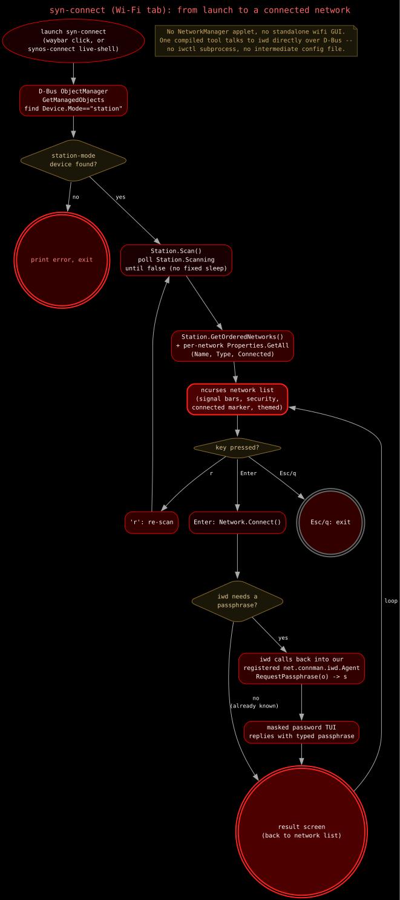

# Connectivity (syn-connect)

Click the network icon on the bar to open it. One full-screen terminal
tool for Wi-Fi, Bluetooth, Ethernet, and VPN, not four separate popups.

## Using it

| Key | Does |
|---|---|
| `Tab` / `Shift+Tab` | Switch between tabs |
| `↑` / `↓` (or `j` / `k`) | Move the selection |
| `Enter` | Connect (or pair, on Bluetooth) |
| `d` | Disconnect |
| `r` | Rescan / refresh |
| `Esc` / `q` | Quit |

### Wi-Fi

The list shows every network in range: name, security type, and signal
strength as a bar count. Whatever you're already connected to gets a
marker. If a network needs a password and you haven't connected to it
before, you'll get a masked entry prompt right there in the same window.
Get it wrong and it just lets you try again instead of kicking you out.
You don't need to type a password for a network you've already
connected to once before, it's remembered.

This same picker is also what you get on the very first boot, before
you've even installed anything, since it's a plain terminal program and
doesn't need a full desktop running to work.

### Bluetooth

Scans for nearby devices and lists them with signal strength. Press
`Enter` on a new device to pair, trust, and connect in one step — no
separate "pair" and "connect" actions to remember. Already-paired
devices just connect. `x` forgets a device entirely (unpairs and
untrusts it).

### Ethernet

Read-only: whatever's plugged into the wired port, if anything.
There's no daemon to talk to for a cable, so this just shows link
state, IP address, and MAC address straight from the kernel. `r`
refreshes it.

### VPN

Lists whatever `.ovpn` configs you've got in `~/.ovpn/`. If a config
needs a username and password it hasn't collected yet, connecting pops
a separate graphical prompt (the same dialpad-style popup used
elsewhere in SYN-OS) to collect them once — after that they're saved
alongside the config and it won't ask again. The actual connect step
needs root, so you'll see a normal `doas` password prompt in the same
window.

## Where else you'll see it

It's themed to match whatever look you've got active, same as the
audio mixer and the encryption tool.
