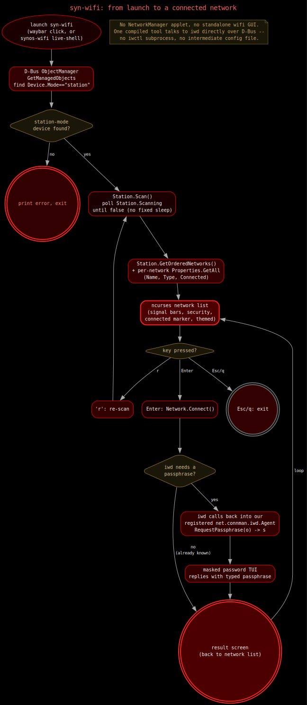

# Wi-Fi picker

Click the network icon on the bar to see and connect to nearby Wi-Fi
networks. It's a full-screen terminal picker, not a popup, so it's easy
to read and doesn't get in the way.

## Using it

The list shows every network in range: name, security type, and signal
strength as a bar count. Whatever you're already connected to gets a
marker.

| Key | Does |
|---|---|
| `↑` / `↓` (or `j` / `k`) | Move the selection |
| `Enter` | Connect |
| `r` | Rescan |
| `Esc` / `q` | Quit |

If a network needs a password and you haven't connected to it before,
you'll get a masked entry prompt right there in the same window. Get it
wrong and it just lets you try again instead of kicking you out.

You don't need to type a password for a network you've already connected
to once before, it's remembered.

## Where else you'll see it

This same picker is also what you get on the very first boot, before
you've even installed anything, since it's a plain terminal program and
doesn't need a full desktop running to work.

It's themed to match whatever look you've got active, same as the audio
mixer and the encryption tool.
