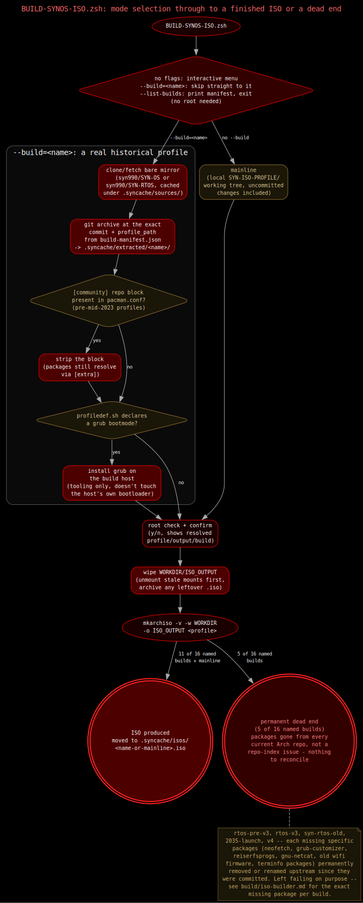
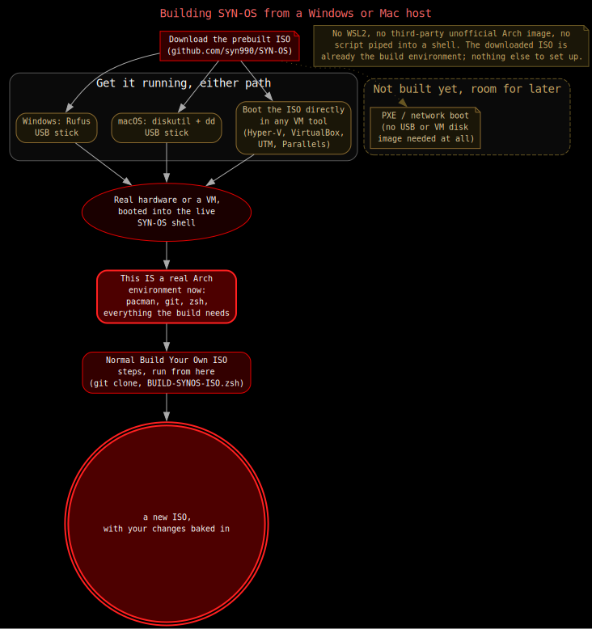

# The ISO Builder

`BUILD-SYNOS-ISO.zsh`, at the root of the `SYN-OS/` project directory, builds
a SYN-OS ISO with `mkarchiso`. It has two modes: build today's working tree,
or pull one of 16 named historical builds straight out of real git history
and build that instead. This doc covers what the script does and, plainly,
which of those 16 historical builds actually work on current Arch
infrastructure and which don't.



## Two ways to build

**No flags** — an interactive menu. Option 1 is always today's mainline: the
local `SYN-ISO-PROFILE/` working tree, uncommitted changes included. Below
that, one numbered entry per named build in `build-manifest.json`, each
labeled with its date, name, and a rough package-count weight class
(`thin`/`medium`/`fat`).

```
SYN-OS ISO builder — what do you want to build?
  1) Current SYN-OS — this local working tree (.../SYN-ISO-PROFILE), uncommitted changes included
  -- Named builds — fetched fresh from real git history, NOT this working tree --
  2) rtos-pre-v3           2021-03-08  SYN-RTOS pre-V3 releng scaffold [fat, 102pkg]
  3) rtos-v3               2023-02-11  SYN-RTOS-V3 [fat, 140pkg]
  ...
Pick a number (or Ctrl+C to cancel):
```

**`--build=<name>`** — skip the menu and build a named historical edition
directly, e.g. `--build=aegis`. The name is the `id` field from
`build-manifest.json`. A historical build is fetched fresh from the real,
unmodified commit history of `syn990/SYN-OS` or `syn990/SYN-RTOS` at the
exact commit and profile path recorded in the manifest — it is not a
recreation, it is the actual profile tree that shipped at that point in the
project's history.

**`--list-builds`** — prints the full manifest as a plain list (id, commit
date, package-count weight class, desktop stack) and exits. Doesn't need
root.

Either build mode ends the same way: the script prints the resolved profile
path, output path, and which build it's about to run, then asks for
confirmation before touching anything:

```
This will build a fresh SYN-OS ISO.
Profile: .../SYN-ISO-PROFILE
Output:  .../ISO_OUTPUT
Build:   Current SYN-OS — this local working tree, uncommitted changes included
Continue? (y/n):
```

The script must run as root — it checks `$EUID` up front and refuses
otherwise (`sudo zsh ./BUILD-SYNOS-ISO.zsh`, or `--list-builds` alone, which
is the only path that doesn't require root).

Package selection (full vs. minimal) is a separate concern, resolved at
*install* time by `synos.conf`'s `PackageProfile` field and handled by
`syn-pacstrap.zsh` — not something this build script controls. What this
script builds is the live-ISO bootstrap set baked into each profile's
`packages.x86_64`.

## The `.syncache/` layout

Everything the `--build=<name>` path touches lives under
`SYN-OS/.syncache/`, sitting next to (but separate from) the scratch
`WORKDIR`/`ISO_OUTPUT` directories that mainline builds also use:

- **`sources/`** — bare mirror clones of `syn990/SYN-OS` and
  `syn990/SYN-RTOS` (`syn-os.git`, `syn-rtos.git`). Cloned once on first use
  of `--build=`, then reused and fetched (not re-cloned) on every later run,
  for either repo.
- **`extracted/`** — one profile tree per named build, named after its `id`
  (e.g. `extracted/aegis/`). Pulled from the relevant mirror via
  `git archive` at the exact commit and profile path the manifest records,
  then untarred fresh — the directory is wiped and recreated on every run of
  that build, not reused/patched incrementally.
- **`isos/`** — every finished ISO this script has ever produced, one file
  per build (`<name>.iso`, or `mainline.iso` for the working-tree build).
  Permanent, never wiped automatically. This is distinct from the scratch
  `WORKDIR`/`ISO_OUTPUT` directories at the project root, which get wiped
  at the start of every single run regardless of what's being built.

## Reconciliation fixes applied to historical profiles

Pulling a profile out of real git history means building it against
*today's* Arch package repositories, not the repositories that existed when
it was committed. Two gaps between "then" and "now" are common enough across
the historical builds that the script reconciles them automatically, without
touching anything else about how a given build actually installs:

**Retired `[community]` repo block.** Arch merged the `[community]`
repository into `[extra]` in mid-2023 — same packages, same mirrors, just a
repo-index consolidation on Arch's side. Any profile committed before that
merge still has a `pacman.conf` with a `[community]` block pointing at a
repo that no longer exists, which makes every package in it 404 at build
time. If the extracted profile's `pacman.conf` has a `[community]` block,
the script strips it before building. Every package that used to live there
still resolves via `[extra]` under the same name — this is pure repo-index
cleanup, not a change to what gets installed.

**Conditional host `grub` install.** `mkarchiso` validates a profile's
declared boot modes before building, and refuses to proceed if
`profiledef.sh` declares a grub boot mode (`bios.grub` or `uefi.grub`) but
`grub-install` isn't present on the build host. Most named builds use
systemd-boot/`bootctl` or syslinux and never trip this. When a profile *does*
declare a grub boot mode, the script installs `grub` on the build host
before running `mkarchiso` — this only supplies the `grub-install`/
`grub-mkconfig` tooling `mkarchiso` needs to validate and assemble a
grub-capable ISO image; it does not touch the build host's own bootloader
configuration.

## Cleanup before a fresh build

Every run starts by cleaning up after whatever ran last, regardless of
which build is being built:

1. Any leftover `.iso` still sitting in `ISO_OUTPUT` (left behind by a run
   that crashed between `mkarchiso` finishing and the archive-move step) is
   moved into `.syncache/isos/` before anything is wiped, so a crashed run
   never loses a finished ISO.
2. `mkarchiso` bind-mounts host filesystems into `WORKDIR/*/airootfs` while
   building. A killed or crashed run can leave those mounted, which makes a
   plain `rm -rf` fail with "Read-only file system" — the script finds and
   unmounts anything still mounted under `WORKDIR` first.
3. `WORKDIR` and `ISO_OUTPUT` are then wiped outright. There is no
   incremental build — every run starts from a clean scratch directory. If
   `WORKDIR` can't be fully removed (still mounted, or a permissions issue),
   the script aborts rather than building on top of a stale tree.

## Where the ISO ends up

On a successful `mkarchiso` run, the resulting `.iso` is moved out of the
scratch `ISO_OUTPUT` directory (which the *next* run wipes) into the
permanent archive: `.syncache/isos/<name>.iso`, where `<name>` is the
build's manifest `id`, or `mainline.iso` for a working-tree build with no
`--build=` flag.

## Current build status: all 16 named builds

Pulling a historical profile out of real git history and building it
against today's Arch repositories is not guaranteed to work — some of these
profiles depend on packages that no longer exist anywhere in Arch's package
repositories, under any name, on any mirror. That is not a bug in the build
script; there is nothing to reconcile when a package has been permanently
removed upstream. Eleven of the sixteen named builds produce a real, working
ISO today. Five do not, and cannot, until or unless a replacement package is
substituted for what they originally shipped — which this project has
deliberately not done, to keep each historical build's real, as-shipped
package list intact rather than quietly rewriting it.

| id | name | commit date | status | reason |
|---|---|---|---|---|
| `rtos-pre-v3` | SYN-RTOS pre-V3 releng scaffold | 2021-03-08 | **FAIL** | `gnu-netcat`, `ipw2100-fw`, `ipw2200-fw`, `reiserfsprogs`, `termite-terminfo` no longer exist in any current Arch repo |
| `rtos-v3` | SYN-RTOS-V3 (Openbox+tint2 era) | 2023-02-11 | **FAIL** | `neofetch`, `grub-customizer`, `reiserfsprogs` no longer exist in any current Arch repo |
| `syn-os-raw-baseline` | SYN-OS initial consolidation (RAW baseline) | 2023-02-12 | PASS | — |
| `syn-rtos-old` | SYN-RTOS-OLD (frozen V3 snapshot) | 2023-06-04 | **FAIL** | Same package list as `rtos-v3`: `neofetch`, `grub-customizer`, `reiserfsprogs` |
| `v4` | SYN-OS-V4 | 2023-06-05 | **FAIL** | `gnu-netcat`, `reiserfsprogs` no longer exist in any current Arch repo |
| `2035-launch` | SYN-OS-2035 (pre-rename, 128-package launch) | 2023-09-25 | **FAIL** | `gnu-netcat`, `reiserfsprogs`, `wezterm-terminfo` no longer exist in any current Arch repo |
| `2035-reset` | SYN-OS-2035 (reset phase, "Starting again from baseline") | 2024-01-27 | PASS | — |
| `chronomorph` | Chronomorph (first working end-to-end ISO) | 2024-01-28 | PASS | — |
| `soam-do-huawei` | SOAM-DO-HUAWEI | 2024-05-04 | PASS | — |
| `volition` | VOLITION | 2024-05-11 | PASS | — |
| `m-141` | M-141 | 2024-10-28 | PASS | — |
| `syntex` | SYNTEX | 2025-08-25 | PASS | — |
| `xenith` | XENITH | 2026-01-29 | PASS | — |
| `synaptics` | SYNAPTICS (Full Wayland Move) | 2026-02-09 | PASS | Needs `grub` on the build host (handled automatically, see above) |
| `aegis` | AEGIS | 2026-03-03 | PASS | — |
| `current` | Current / present (unbranded, post-AEGIS) | 2026-07-11 | PASS | This is what `mainline`/no-flags builds |

**11 pass, 5 fail.** The five failing builds — `rtos-pre-v3`, `rtos-v3`,
`syn-rtos-old`, `2035-launch`, `v4` — all fail for the same class of reason:
packages their real, as-shipped `packages.x86_64` depends on have been
permanently removed, renamed, or dropped from Arch's package repositories
since those builds were made, and the `[community]`→`[extra]` reconciliation
this script applies automatically does not help, because these are not
repo-index issues — the packages are simply gone. This is current, permanent
fact about these five builds on today's Arch infrastructure, not a
transient failure or something a future infra change is expected to fix.

For per-build testing detail — exact error output, disk-signature bugs
found and fixed along the way, and the reasoning behind leaving these five
unpatched rather than substituting replacement packages — see
[build-testing-notes.md](./build-testing-notes.md). For what each of these
16 named editions actually was — desktop stack, package counts, why the
naming changed over time — see [Project History](../history.md).

## Building from a Windows or macOS host

`BUILD-SYNOS-ISO.zsh` itself needs a real Arch environment — `mkarchiso`,
`pacman`, `git` — so it can't run directly on Windows or macOS. There's no
WSL2 dependency, no third-party unofficial Arch image, and nothing piped
into a shell: the downloaded SYN-OS ISO itself already is that environment.



Write the downloaded ISO to a USB stick (Rufus on Windows, `diskutil`+`dd`
on macOS) and boot real hardware from it, or point any VM tool (Hyper-V,
VirtualBox, UTM, Parallels) at the ISO file directly with no USB step at
all. Either way, once it's booted, the live shell is a real Arch
environment — `git clone` this repository and run
`BUILD-SYNOS-ISO.zsh` exactly as described above, from inside the live
session. PXE/network boot (no USB or VM disk image needed at all) isn't
built yet, but the same live-environment approach would extend to it
without changing anything about the build script itself.
