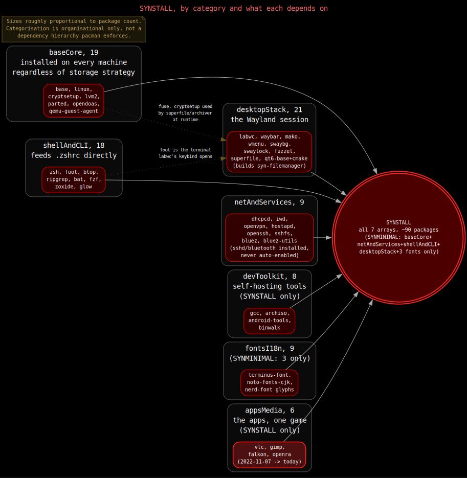
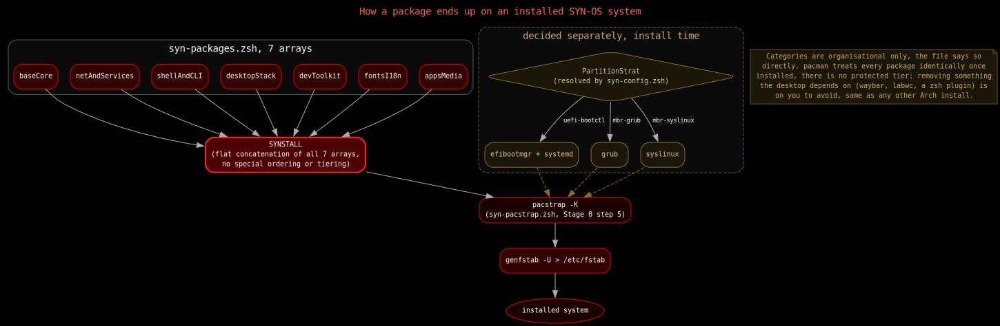

# Package Collection

Every package SYN-OS installs is listed in [`syn-packages.zsh`](../../../lib/syn-os/syn-packages.zsh), grouped into seven arrays purely for readability. The file says so directly: *"There is no special reason for the categorization of packages into these arrays. They are simply grouped for organizational purposes."* All seven are concatenated into one flat `SYNSTALL` array, which is what `pacstrapMain` actually installs, plus bootloader packages chosen at install time (see [Stage 0](./stage0.md)).

Descriptions below are the file's own inline comments. Links go to the Arch Wiki page for the package where one exists, otherwise the upstream project.

## `baseCore`

Kernel, firmware, build tools, and every filesystem/encryption/partitioning tool the installer itself depends on. This category installs on every machine regardless of which storage strategy you pick; the installer doesn't selectively install only the filesystem tool matching your `FilesystemStrat`.

| Package | What it's for |
|---|---|
| [`base`](https://wiki.archlinux.org/title/Base_package) | Minimal package set to define a basic Arch Linux installation |
| [`base-devel`](https://wiki.archlinux.org/title/Base-devel) | Essential build tools (`makepkg`, `gcc`, `make`, etc.) |
| [`linux`](https://wiki.archlinux.org/title/Kernel) | The Linux kernel and modules |
| [`linux-firmware`](https://wiki.archlinux.org/title/Linux-firmware) | Firmware files for hardware compatibility |
| [`archlinux-keyring`](https://wiki.archlinux.org/title/Pacman/Package_signing) | Arch Linux PGP keyring, verifies package signatures |
| [`reflector`](https://wiki.archlinux.org/title/Reflector) | Mirrorlist generator and ranker, used for faster downloads |
| [`opendoas`](https://wiki.archlinux.org/title/Doas) | Privilege escalation, lightweight `sudo` alternative |
| [`sof-firmware`](https://wiki.archlinux.org/title/Advanced_Linux_Sound_Architecture) | Sound Open Firmware, modern audio drivers |
| `sof-tools` | Utilities for Sound Open Firmware |
| [`fuse`](https://wiki.archlinux.org/title/FUSE) | Filesystem in Userspace library and utilities |
| [`dosfstools`](https://wiki.archlinux.org/title/DOSFSTOOLS) | Create and check DOS/FAT filesystems |
| [`e2fsprogs`](https://wiki.archlinux.org/title/Ext4) | Ext2/3/4 filesystem utilities |
| [`f2fs-tools`](https://wiki.archlinux.org/title/F2FS) | Tools for the Flash-Friendly File System |
| [`btrfs-progs`](https://wiki.archlinux.org/title/Btrfs) | Btrfs filesystem utilities |
| [`xfsprogs`](https://wiki.archlinux.org/title/XFS) | XFS filesystem utilities |
| [`lvm2`](https://wiki.archlinux.org/title/LVM) | Logical Volume Manager utilities |
| [`cryptsetup`](https://wiki.archlinux.org/title/Dm-crypt) | Disk encryption tool (LUKS) |
| [`parted`](https://wiki.archlinux.org/title/Parted) | GNU disk partitioning program |

## `netAndServices`

Basic connectivity plus the two use cases (VPN, hotspot) that need extra packages beyond that.

| Package | What it's for |
|---|---|
| [`dhcpcd`](https://wiki.archlinux.org/title/Dhcpcd) | DHCP client daemon, automatic network configuration |
| [`iwd`](https://wiki.archlinux.org/title/Iwd) | iNet wireless daemon, Wi-Fi management |
| [`openvpn`](https://wiki.archlinux.org/title/OpenVPN) | Open source VPN daemon and client |
| [`dnsmasq`](https://wiki.archlinux.org/title/Dnsmasq) | Lightweight DNS/DHCP server, useful for local network services |
| [`hostapd`](https://wiki.archlinux.org/title/Software_access_point) | Host access point daemon, turns the machine into a Wi-Fi hotspot |
| [`openssh`](https://wiki.archlinux.org/title/OpenSSH) | SSH server/client; `sshd.service` is installed but never auto-enabled on the installed system (opt-in, see [Zsh Configuration](./zsh.md)) |
| `sshfs` | Mount a remote SSH filesystem locally (FUSE-based) |

## `shellAndCLI`

The zsh experience described in the [README](../../../../../../../readme.md) (autosuggestions, syntax highlighting, `fzf`, `zoxide`) plus general CLI tooling.

| Package | What it's for |
|---|---|
| [`zsh`](https://wiki.archlinux.org/title/Zsh) | Advanced command interpreter (shell) |
| [`zsh-completions`](https://github.com/zsh-users/zsh-completions) | Additional completion definitions for zsh |
| [`zsh-syntax-highlighting`](https://github.com/zsh-users/zsh-syntax-highlighting) | Fish-shell like syntax highlighting for zsh |
| [`zsh-autosuggestions`](https://github.com/zsh-users/zsh-autosuggestions) | Fish-like fast, unobtrusive autosuggestions for zsh |
| [`fzf`](https://wiki.archlinux.org/title/Fzf) | Command-line fuzzy finder |
| [`zoxide`](https://github.com/ajeetdsouza/zoxide) | Smarter `cd`, directory jumper |
| [`ripgrep`](https://github.com/BurntSushi/ripgrep) | Extremely fast `grep` alternative |
| [`fd`](https://github.com/sharkdp/fd) | Simple, fast, user-friendly alternative to `find` |
| [`bat`](https://github.com/sharkdp/bat) | `cat` clone with syntax highlighting and Git integration |
| `inetutils` | Collection of common network programs (`ping`, `ftp`, `telnet`) |
| `calc` | Arbitrary precision console calculator |
| [`git`](https://wiki.archlinux.org/title/Git) | Distributed version control system |
| [`btop`](https://github.com/aristocratos/btop) | Resource monitor: CPU, memory, disks, network, processes |
| [`nano`](https://wiki.archlinux.org/title/Nano) | Easy-to-use console text editor |
| [`foot`](https://codeberg.org/dnkl/foot) | Lightweight Wayland terminal emulator |
| `brightnessctl` | Read and control screen brightness |
| [`pamixer`](https://github.com/cdemoulins/pamixer) | PulseAudio-compatible command-line mixer |
| [`glow`](https://github.com/charmbracelet/glow) | Markdown renderer for the terminal, backs the Docs menu (see [LabWC](./labwc.md)) |

## `desktopStack`

The Wayland desktop itself: compositor, launcher, panel, wallpaper, screenshot tools, Qt theming, and the apps that round out a minimal desktop.

| Package | What it's for |
|---|---|
| [`labwc`](https://labwc.github.io/) | Wayland window-stacking compositor, Openbox alternative (see [LabWC](./labwc.md)) |
| [`wmenu`](https://codeberg.org/adnano/wmenu) | Dynamic menu for Wayland, `dmenu`/tint2 alternative |
| [`wlr-randr`](https://sr.ht/~emersion/wlr-randr/) | Screen management utility for wlroots-based compositors |
| [`grim`](https://sr.ht/~emersion/grim/) | Screenshot utility for Wayland compositors |
| [`slurp`](https://github.com/emersion/slurp) | Selection utility for Wayland compositors, used with `grim` |
| `archlinux-xdg-menu` | XDG desktop entry menu generator (creates `wmenu` entries) |
| [`waybar`](https://github.com/Alexays/Waybar) | Highly customizable Wayland status bar (see [Waybar](./waybar.md)) |
| [`swaybg`](https://github.com/swaywm/swaybg) | Background setter for Sway/wlroots-based compositors |
| [`swaylock`](https://github.com/swaywm/swaylock) | Screen locker for Wayland/wlroots, bound to Super+L (see [LabWC](./labwc.md)) |
| [`fuzzel`](https://codeberg.org/dnkl/fuzzel) | Application launcher for Wayland, bound to Super+A (see [LabWC](./labwc.md)) |
| [`rofi`](https://wiki.archlinux.org/title/Rofi) | Window switcher, application launcher, `dmenu` replacement; also backs the theme-aware power menu (see [Waybar](./waybar.md)) |
| [`feh`](https://wiki.archlinux.org/title/Feh) | Lightweight image viewer and background setter |
| `pavucontrol-qt` | Qt port of the PulseAudio volume controller |
| [`qt5ct`](https://wiki.archlinux.org/title/Uniform_look_for_Qt_and_GTK_applications) | Qt5 configuration utility |
| `qt6ct` | Qt6 configuration utility |
| [`kvantum`](https://github.com/tsujan/Kvantum) | SVG-based theme engine for Qt |
| `kvantum-qt5` | Qt5 styles for the Kvantum theme engine |
| [`superfile`](https://github.com/yorukot/superfile) | Terminal file manager (referenced in the README as `spf`) |
| `lxqt-archiver` | Lightweight archive manager (Qt port of Xarchiver) |
| [`featherpad`](https://github.com/tsujan/FeatherPad) | Lightweight text editor from the LXQt project |

## `devToolkit`

General build tooling plus utilities for rebuilding the ISO and basic hardware/binary inspection.

| Package | What it's for |
|---|---|
| [`gcc`](https://wiki.archlinux.org/title/GCC) | The GNU Compiler Collection |
| [`fakeroot`](https://wiki.archlinux.org/title/Makepkg) | Simulates superuser privileges, needed for `makepkg` |
| [`android-tools`](https://wiki.archlinux.org/title/Android) | Android platform tools (`adb`, `fastboot`) |
| [`archiso`](https://wiki.archlinux.org/title/Archiso) | Tools for building Arch Linux live/install ISOs, used to rebuild SYN-OS itself from an already-installed system, see [Building the ISO](./building-the-iso.md) |
| [`binwalk`](https://github.com/ReFirmLabs/binwalk) | Searches a binary image for embedded files |
| `hexedit` | View and edit files in hexadecimal or ASCII |
| `lshw` | Extracts detailed hardware configuration |
| [`yt-dlp`](https://github.com/yt-dlp/yt-dlp) | Command-line audio/video downloader |

## `fontsI18n`

Console font, panel glyphs, and broad Unicode/script coverage for everything else.

| Package | What it's for |
|---|---|
| [`terminus-font`](https://wiki.archlinux.org/title/Font_configuration#Console_fonts) | Monospaced console font |
| `ttf-bitstream-vera` | Bitstream Vera fonts |
| [`ttf-dejavu`](https://dejavu-fonts.github.io/) | Bitstream Vera-based family, high Unicode coverage |
| [`noto-fonts`](https://wiki.archlinux.org/title/Noto_fonts) | Google Noto TTF fonts (Latin, Greek, Cyrillic) |
| `noto-fonts-emoji` | Google Noto emoji fonts |
| `noto-fonts-cjk` | Google Noto CJK fonts (Chinese, Japanese, Korean) |
| [`ttf-liberation`](https://github.com/liberationfonts/liberation-fonts) | Metric-compatible with Arial, Times New Roman, Courier New |
| `ttf-terminus-nerd` | Terminus patched with Nerd Font glyphs, used for Waybar icons |
| [`otf-font-awesome`](https://fontawesome.com/) | Iconic font and CSS toolkit |

## `appsMedia`

The apps that round out a usable desktop.

| Package | What it's for |
|---|---|
| [`vlc`](https://wiki.archlinux.org/title/VLC) | Multi-platform media player |
| [`openra`](https://www.openra.net/) | Open source reimplementation of Command & Conquer: Red Alert, Tiberian Dawn, and Dune 2000. The one game in the default install, and the single longest-running package in the project's history, see [Project History](./history.md#5-package-identity-what-the-manifests-actually-said) |
| [`audacity`](https://wiki.archlinux.org/title/Audacity) | Digital audio editor and recording application |
| [`obs-studio`](https://wiki.archlinux.org/title/OBS_Studio) | Free, open source video recording and live streaming |
| [`falkon`](https://wiki.archlinux.org/title/Falkon) | Lightweight web browser based on QtWebEngine |
| [`gimp`](https://wiki.archlinux.org/title/GIMP) | GNU Image Manipulation Program |

## How a package actually gets installed

The seven arrays are concatenated at parse time, before Stage 0 ever runs, into one flat `SYNSTALL`. Bootloader packages (`efibootmgr`+`systemd`, `grub`, or `syslinux`) aren't in any of the seven arrays — `syn-pacstrap.zsh` decides those based on the resolved `PartitionStrat` (see [Storage Strategies](./storage-strategies.md)) and appends them to `SYNSTALL` right before the single `pacstrap -K` call that installs everything.

## Customizing

To change what ships, edit the category arrays directly in `syn-packages.zsh` and rebuild the ISO — `SYNSTALL` picks up the change automatically, since it's just the concatenation of all seven arrays. There's no separate metadata to keep in sync: pacman treats every installed package the same way, no "protected" tier, so removing something the desktop or shell config depends on (`waybar`, `labwc`, a zsh plugin) is on you to avoid, same as any other Arch install.
