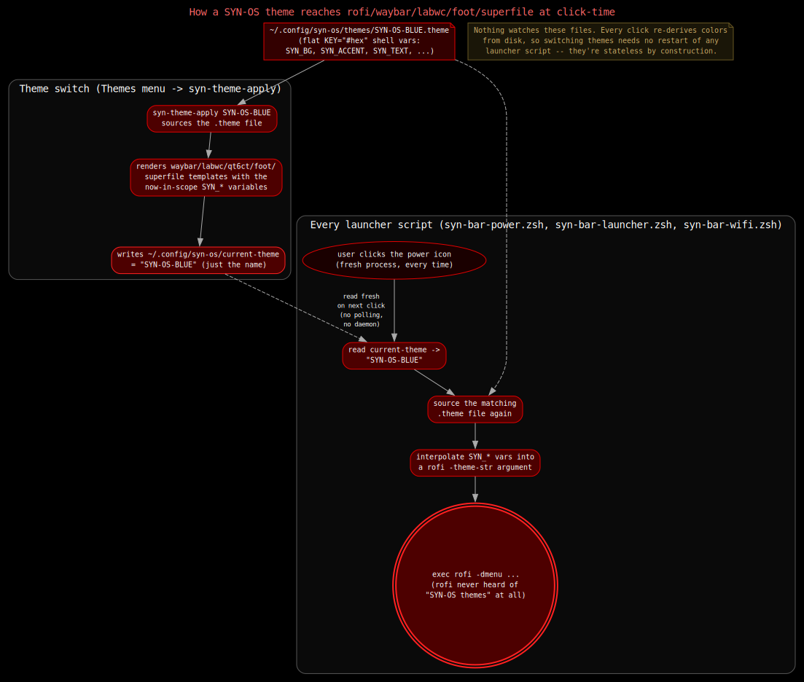

# Theme Engine

SYN-OS ships 14 themes as flat, human-editable `.theme` files. Picking one from
the desktop's Themes menu re-renders every themed app's own config format —
Waybar's CSS, LabWC's Openbox-style `themerc`, Qt's `qt6ct`/`qt5ct` color
schemes, GTK3's CSS overrides, `foot`'s terminal palette, `mako`'s toast
styling, Superfile's theme TOML — from that one file's variables. Nothing
about this is templated at build time or baked into a package: the `.theme`
files, the templates that consume them, and the script that renders them are
all plain text under `DotfileOverlay/`, editable on a running system exactly
as they ship in this repo. This is the one place in SYN-OS where a generated
file is the right tradeoff over a hand-authored one — see
[Philosophy](../philosophy.md) — because the alternative is hand-editing six
unrelated config formats every time an accent color changes.

This document covers the `.theme` file format, the full `SYN_*` variable
contract, every template `syn-theme-apply` renders and why two of them need
theme-specific overrides, and the complete apply flow from a menu click to
pixels changing on screen.

## The `.theme` file format

A theme is a flat shell-variable file at
`~/.config/syn-os/themes/<SYN-OS-NAME>.theme` (in the repo:
`DotfileOverlay/etc/skel/.config/syn-os/themes/*.theme`). It is sourced
directly — by `syn-theme-apply`, by `syn-theme-lib.zsh`'s `syn_theme_load`,
and by `syn-pipe-theme.zsh` when building the Themes menu — so its syntax is
constrained to what a POSIX shell can safely dot-source: flat
`KEY="value"` assignments, no arrays, no command substitution beyond the one
case noted below. Comments (`#`) are allowed and several theme files use them
to record where a palette's colors came from.

### The full `SYN_*` variable set

Every one of the 14 shipped `.theme` files defines exactly these 13 keys, no
more and no fewer. This table uses `SYN-OS-RED` — the default theme, applied
automatically on first login — as the canonical reference, with a second
example column from other themes to show the real range of values:

| Variable | Meaning | `SYN-OS-RED` value | Other examples |
|---|---|---|---|
| `SYN_THEME_NAME` | The theme's own identifier; must match the filename minus `.theme`. Used to look up theme-specific override templates and to name the rendered qt5ct/qt6ct/Superfile/LabWC theme directories. | `"SYN-OS-RED"` | `"SYN-OS-MATRIX"`, `"SYN-OS-WIN95"` |
| `SYN_BG` | Base background — window client area, terminal background, panel base in flat-solid contexts. | `#000000` | `#c0c0c0` (WIN95), `#f5f5f5` (BRIGHT) |
| `SYN_BG_ALT` | Secondary background — titlebars, menu backgrounds, Waybar's own window background and bottom border. | `#100000` | `#001a00` (GREEN), `#d4d0c8` (WIN95) |
| `SYN_PANEL` | Waybar module backgrounds (CPU/memory/network/etc. segments), Superfile file-panel selection background. | `#2c0101` | `#003300` (MATRIX), `#e8e8e8` (SILVER) |
| `SYN_PANEL_HOVER` | Hover state for Waybar modules and LabWC window buttons. | `#400101` | `#006600` (MATRIX), `#dfdfdf` (WIN95) |
| `SYN_ACCENT` | The theme's signature color — menu text, active window titlebar text, Waybar workspace-focus underline, LabWC border/button highlight, terminal ANSI color 1. | `#800000` (dark maroon) | `#32cd32` (MATRIX green), `#0a246a` (WIN95 titlebar blue) |
| `SYN_ACCENT_DIM` | A muted variant of `SYN_ACCENT` — inactive window labels, OSD highlight background, qt palette's disabled-state highlight. | `#260101` | `#64aa64` (MATRIX), `#a6caf0` (WIN95) |
| `SYN_TEXT` | Primary foreground/text color across every consumer. | `#f8f8f2` | `#90ee90` (MATRIX mint-green), `#000000` (WIN95, SILVER) |
| `SYN_BORDER` | Window borders, disabled menu items, GTK3 `borders`, qt palette's disabled-text roles. | `#444444` | `#228b22` (MATRIX), `#808080` (WIN95) |
| `SYN_URGENT` | Critical/urgent state color — Waybar critical thresholds, `mako`'s `[urgency=critical]` border, LabWC urgent workspace button. | `#ff5555` | `#a70b06` (BLUE), `#aa0000` (WIN95) |
| `SYN_WALLPAPER` | Absolute path to the theme's wallpaper image, always under `$HOME/.wallpaper/`. | `"$HOME/.wallpaper/SYN-OS-RED-wallpaper.png"` | same pattern, one PNG per theme |
| `SYN_GLYPH` | A single Unicode glyph shown in Waybar's `#custom-glyph` module. Several themes leave this empty (see below). | `"●"` | `"❄"` (BLUE), `"⚡"` (YELLOW), `""` (GRAPHITE, GREEN, M141, MATRIX, ORANGE, PURPLE, SILVER, WIN95) |
| `SYN_THEME_GROUP` | Which submenu of the Themes pipe-menu the theme is listed under: `vanilla`, `homage`, or `neutral`. See [grouping](#the-vanillahomageneutral-grouping) below. | `"vanilla"` | `"homage"` (MATRIX, WIN95), `"neutral"` (BRIGHT, GRAPHITE, LIGHT, SILVER) |

`SYN_WALLPAPER`'s value is the one field that isn't a plain literal — it
embeds `$HOME`, which the shell expands at source-time (every consumer that
needs it has already sourced the file into a shell, so this is safe and
intentional, not an oversight).

One additional variable exists only in `syn-theme-apply` itself, not in any
shipped `.theme` file: `SYN_WAYBAR_POSITION`. The apply script reads it as
`${SYN_WAYBAR_POSITION:-top}` when deciding whether to write `"position":
"top"` or `"position": "bottom"` into Waybar's `config.jsonc`. No theme
currently sets it, so every theme resolves to `top` — the field exists so a
future theme could ship pinned to the bottom bar without any change to
`syn-theme-apply`, but as of today it's dead weight in every `.theme` file
that doesn't set it (which is all of them).

### All 14 themes

| Theme | `SYN_THEME_GROUP` | `SYN_GLYPH` | Character |
|---|---|---|---|
| `SYN-OS-RED` | vanilla | `●` | Default. Near-black with a red tint, dark maroon accent. |
| `SYN-OS-BLUE` | vanilla | `❄` | Pure black, cold blue accent (`#0986d3`). |
| `SYN-OS-GREEN` | vanilla | *(none)* | Pure black, saturated green accent (`#1db31d`). |
| `SYN-OS-M141` | vanilla | *(none)* | Pure black (not red-tinted, unlike RED) with a brighter scarlet accent (`#e00000`) — a dedicated variant built for a specific person's own red/black request, not a copy of RED. |
| `SYN-OS-ORANGE` | vanilla | *(none)* | Near-black with warm amber tones, bright orange accent (`#ff8800`). |
| `SYN-OS-PINK` | vanilla | `✦` | Near-black, hot magenta-pink accent (`#ff0080`), pink-tinted border. |
| `SYN-OS-PURPLE` | vanilla | *(none)* | Pure black, violet accent (`#9b30d9`). |
| `SYN-OS-YELLOW` | vanilla | `⚡` | Near-black with warm-yellow tones, gold accent (`#e6d000`). |
| `SYN-OS-MATRIX` | homage | *(none)* | Green-on-black terminal look, sourced from a third-party "Retro 1 (Terminal)" Openbox theme. Mint-green text (`#90ee90`), lime accent (`#32cd32`). |
| `SYN-OS-WIN95` | homage | *(none)* | Flat, beveled Windows 95 look — silver-gray (`#c0c0c0`) surfaces, classic titlebar blue accent (`#0a246a`), colors lifted from a Wine-registry-extracted "Classic 98" Openbox theme. |
| `SYN-OS-BRIGHT` | neutral | *(none)* | The one genuinely light theme — near-white backgrounds (`#f5f5f5`), dark text, blue accent. |
| `SYN-OS-GRAPHITE` | neutral | *(none)* | Neutral dark gray, desaturated gray-blue accent (`#8a8f98`) — no hue lean. |
| `SYN-OS-LIGHT` | neutral | `◐` | Despite the name, a dark theme (`#1e1e1e` background) with a soft blue accent — a muted counterpart to GRAPHITE, not a light-background theme. |
| `SYN-OS-SILVER` | neutral | *(none)* | Light gray-on-gray, dark slate accent (`#3a3d42`) — the other light-background theme besides BRIGHT. |

9 of 14 themes leave `SYN_GLYPH` empty (`""`), including one whole group
(neutral has none set at all). An empty `SYN_GLYPH` is a real, valid value —
`syn-theme-apply` falls back to `●` (`"${SYN_GLYPH:-●}"`) only when the
variable is entirely unset, and a `.theme` file that defines
`SYN_GLYPH=""` still counts as "set," so Waybar's glyph module renders
blank for those themes rather than falling back to a dot. This is a real,
observable current-state quirk, not a bug fixed as part of this document.

### The vanilla/homage/neutral grouping


*Placeholder — LabWC's Preferences > Themes menu open, showing the three
grouped submenus this section describes.*

`syn-pipe-theme.zsh`, the script behind the desktop's Themes menu, builds
three separate LabWC submenus — **Vanilla**, **Homage**, **Neutral** — by
sourcing each `.theme` file in a subshell and reading back
`SYN_THEME_GROUP`, defaulting to `vanilla` for any theme that doesn't set it
(none currently omit it, but the fallback exists in the code regardless):

```zsh
case "$group" in
  homage)  homage_themes+=("${f:t:r}") ;;
  neutral) neutral_themes+=("${f:t:r}") ;;
  *)       vanilla_themes+=("${f:t:r}") ;;
esac
```

Verified against the actual `SYN_THEME_GROUP` value in all 14 files, the
grouping is:

- **Vanilla** (8): RED, BLUE, GREEN, M141, ORANGE, PINK, PURPLE, YELLOW —
  original SYN-OS palettes with no external reference point.
- **Homage** (2): MATRIX, WIN95 — deliberate recreations of a specific
  well-known look, both sourced from third-party Openbox `themerc` files
  found in the project's old theme archive (see the override templates
  section below for why these two specifically need more than the shared
  templates).
- **Neutral** (4): BRIGHT, GRAPHITE, LIGHT, SILVER — desaturated or
  monochrome palettes with no strong accent hue.

## `theme-templates/`: one template per consumer

`syn-theme-apply` renders each theme's `SYN_*` values into a set of
templates at `/usr/lib/syn-os/theme-templates/` (in the repo:
`DotfileOverlay/usr/lib/syn-os/theme-templates/`). Templates are plain text
with literal `SYN_*` tokens in place of values — there is no templating
engine involved; substitution is `sed`, described in full in
[the apply flow](#the-apply-flow-end-to-end) below. Three different
placeholder conventions are used depending on what format each target app
expects:

- **Bare `SYN_*`** (e.g. `SYN_BG`, `SYN_ACCENT`) — replaced with the theme's
  literal value including its leading `#`. Used by templates that want a
  CSS/Openbox-style `#rrggbb` hex string as-is.
- **`SYN_*_FF` / `SYN_*_80`** — replaced with an 8-digit ARGB hex string:
  `SYN_ACCENT_FF` becomes `#ff800000` (the `ff`/`80` prefix is the alpha
  channel, prepended by `syn-theme-apply` itself, not present in the
  `.theme` file). Used only by the qt5ct/qt6ct color templates, which
  require Qt's `#AARRGGBB` format.
- **`SYN_*_RAW`** — replaced with the bare 6-digit hex, no `#`. Used only by
  the `foot` terminal color template, which wants raw hex per `foot.ini`'s
  `[colors-*]` section format.

| Template | Renders to | Consumer | Placeholder style |
|---|---|---|---|
| `waybar-style.css.tmpl` | `~/.config/waybar/style.css` | Waybar bar CSS | bare `SYN_*` |
| `labwc-themerc.tmpl` | `~/.local/share/themes/<name>/openbox-3/themerc` | LabWC window/menu/OSD decoration | bare `SYN_*` |
| `qt5ct-colors.conf.tmpl` | `~/.config/qt5ct/colors/<name>.conf` | Qt5 apps via qt5ct (currently none installed) | `SYN_*_FF`/`SYN_*_80` |
| `qt6ct-colors.conf.tmpl` | `~/.config/qt6ct/colors/<name>.conf` | Falkon, pavucontrol-qt, syn-filemanager | `SYN_*_FF`/`SYN_*_80` |
| `gtk3.css.tmpl` | `~/.config/gtk-3.0/gtk.css` | Audacity, EtherApe, virt-manager, virt-viewer (GTK3/wxWidgets-on-GTK3/PyGObject apps qt6ct can't reach) | bare `SYN_*` |
| `foot-colors-dark.tmpl` | rewrites `[colors-dark]` in `~/.config/foot/foot.ini` | `foot` terminal | `SYN_*_RAW` |
| `mako-config.tmpl` | `~/.config/mako/config` | `mako` notification toasts | bare `SYN_*` |
| `superfile-theme.toml.tmpl` | `~/.config/superfile/theme/syn-os.toml` | Superfile file manager's bundled theme | bare `SYN_*`, quoted TOML strings |

`qt5ct-colors.conf.tmpl` and `qt6ct-colors.conf.tmpl` are near-identical
21-role `QPalette::ColorRole` mappings (`active_colors=`/`disabled_colors=`/
`inactive_colors=`, comma-separated, in the exact enum order Qt expects).
qt5ct's copy is rendered and kept current on every theme switch even though
no Qt5 application is currently installed — every real Qt app SYN-OS ships
(Falkon, pavucontrol-qt, syn-filemanager) links against Qt6, so `qt5ct`'s
`QT_QPA_PLATFORMTHEME` plugin is never actually loaded in a live session
(`environment` sets `QT_QPA_PLATFORMTHEME=qt6ct` only — see
[LabWC](../labwc.md)). The qt6ct template is the one that actually reaches a
running app; qt5ct's is rendered defensively, in case a Qt5-only binary is
ever installed by hand.

### Theme-specific override templates: MATRIX and WIN95

Three templates exist as theme-specific overrides, selected automatically by
`syn-theme-apply` when a template named `<template>.<SYN_THEME_NAME>.tmpl`
exists next to the shared one:

- `labwc-themerc.SYN-OS-MATRIX.tmpl` and `labwc-themerc.SYN-OS-WIN95.tmpl`
- `waybar-style.SYN-OS-MATRIX.css.tmpl` and `waybar-style.SYN-OS-WIN95.css.tmpl`
- `foot-colors-dark.SYN-OS-WIN95.tmpl` (MATRIX uses the shared `foot`
  template — only WIN95 overrides `foot`)

Every other theme (the other 12) uses the shared template for every
consumer. MATRIX and WIN95 need overrides because they're not new palettes
on the shared visual language — they're recreations of a *specific,
different* aesthetic, and the shared templates can't express either look:

**LabWC (`labwc-themerc.*`)**: the shared `labwc-themerc.tmpl` sets several
keys — `window.active.label.bg`, `.client.color`, `.handle.bg`, `.grip.bg`,
`.indicator.tiled.color`, `cornerRadius`, and per-button-state `.bg` — that
labwc's real theme engine (`labwc-theme(5)`) does not implement at all; they
are silently ignored. The two override files carry a comment stating this
explicitly and use *only* keys labwc actually reads. Beyond that pruning,
each pursues its own specific look:
  - **MATRIX** uses flat `Solid` titlebars in `SYN_BG` (pure black) with
    `SYN_ACCENT` (lime green) text, a thin 1px border, and tight padding —
    reproducing the flat green-on-black terminal aesthetic of the original
    "Retro 1 (Terminal)" Openbox theme it's based on.
  - **WIN95** uses `Gradient Vertical` titlebars (`SYN_ACCENT` fading to
    `SYN_ACCENT_DIM`) with hardcoded white active-label text, giving the
    beveled, gradient-lit titlebar look of real Windows 95 chrome — a look
    the shared template's flat-solid titlebars cannot produce, since it only
    ever sets a single flat `.bg.color`, never a `.bg.colorTo` gradient stop.

**Waybar (`waybar-style.*.css.tmpl`)**: the differences here are smaller —
both overrides flip `window#waybar`'s accent border from `border-bottom` to
`border-top` and the workspace-focus indicator's `box-shadow` from `inset 0
-3px` to `inset 0 3px` (i.e., the bar's accent line renders on the opposite
edge, matching a bar drawn at the top rather than the bottom in the
reference themes these look back to). MATRIX additionally drops the
`#custom-recording` blink-text rule entirely (the reference theme's
minimalism didn't carry a recording-indicator style to adapt). WIN95
additionally recolors the `.warning` state (`background-color: @syn_accent;
color: @syn_panel_hover;` instead of the shared template's
`@syn_accent_dim`/`@syn_bg`) to stay legible against WIN95's light gray
palette, where the shared warning colors would render as pale-on-pale.

**`foot` (`foot-colors-dark.SYN-OS-WIN95.tmpl` only)**: this override does
not use `SYN_*_RAW` placeholders at all — every color is a hardcoded literal
matching the classic 16-color VGA/console palette (`background=000000`,
`regular1=800000`, `bright2=00ff00`, `bright7=ffffff`, and so on). This is
deliberate: WIN95's actual `SYN_*` palette is a *UI chrome* palette (silver
panels, titlebar blue), not a 16-color ANSI terminal palette, and mapping it
through the normal 9-key substitution would produce a low-contrast, muted
terminal with no real red/green/yellow/blue distinction between ANSI colors.
The override instead reproduces the actual `cmd.exe`/console palette a
Windows 95-era terminal would have used, and sets `alpha=1.0` (fully opaque)
where the shared template uses `alpha=0.7` — a translucent terminal doesn't
fit a flat, opaque retro look. MATRIX does not need a `foot` override; its
palette maps cleanly through the shared `SYN_*_RAW` substitution because its
colors were already chosen as a terminal palette (foreground/background/ANSI
green) in the first place.

No theme other than MATRIX and WIN95 has an override template for anything —
every other theme, including SILVER and BRIGHT despite being light-background
themes, renders correctly through the 9 shared templates alone.

## The apply flow, end to end



The whole mechanism is one script, `syn-theme-apply` (in the repo:
`DotfileOverlay/usr/local/bin/syn-theme-apply`), invoked as
`syn-theme-apply <theme-name>` with no other arguments. There is no daemon,
no file watcher, and no background process involved anywhere in this flow.

1. **User picks a theme.** The desktop's `Themes` pipe menu
   (`syn-pipe-theme.zsh`, reached from LabWC's root menu — see
   [LabWC](../labwc.md)) lists all 14 themes grouped into Vanilla/Homage/
   Neutral submenus (see [grouping](#the-vanillahomageneutral-grouping)
   above), marking whichever one is currently active with `(active)` in its
   label. Each entry's action is literally `syn-theme-apply <name>` — the
   menu itself carries no theme logic beyond building the list and reading
   the current theme for the active-item label.

2. **`syn-theme-apply` sources the `.theme` file.** `source
   "$THEMES_DIR/$name.theme"` pulls every `SYN_*` variable from step 1
   directly into the script's own shell scope — not a subshell, so every
   line after this point can reference `$SYN_BG`, `$SYN_ACCENT`, and so on
   as ordinary shell variables. It asserts `SYN_THEME_NAME` is non-empty
   before doing anything else (`: "${SYN_THEME_NAME:?palette missing
   SYN_THEME_NAME}"`).

3. **Every template is rendered.** A shared `render()` helper builds one
   `sed` invocation per template, substituting each `SYN_*` key for its
   real value — keys are ordered longest-first (`SYN_PANEL_HOVER` before
   `SYN_PANEL`, `SYN_ACCENT_DIM` before `SYN_ACCENT`, etc.) so a shorter key
   name never partially matches inside a longer one and leaves a stray
   suffix behind. Three variants of this helper exist for the three
   placeholder conventions described above (`render` for bare `SYN_*`,
   `render_qt` for the `_FF`/`_80` ARGB forms, `render_foot` for the `_RAW`
   bare-hex form). For each of Waybar, LabWC, and `foot`, the script first
   checks whether a theme-specific override template exists
   (`$TEMPLATES_DIR/<template>.$SYN_THEME_NAME.tmpl`) and uses it in place
   of the shared one if so — this is the exact mechanism behind the MATRIX/
   WIN95 overrides above.

   Along the way it also:
   - Writes `${SYN_GLYPH:-●}` to `~/.config/waybar/glyph`, read by
     Waybar's `#custom-glyph` module.
   - Sets `"position"` in `~/.config/waybar/config.jsonc` from
     `${SYN_WAYBAR_POSITION:-top}` (in place, via `sed`, so any hand-edited
     `modules-left`/`modules-right` arrays are left untouched).
   - Restarts `swaybg` with `$SYN_WALLPAPER`, if the file exists.
   - Rewrites `rc.xml`'s `<theme><name>...</name>` to the new
     `SYN_THEME_NAME`, scoped to only the first `<name>` after `<theme>`
     opens (an unanchored replace would also corrupt every `<font><name>`
     tag in the same file).

4. **Live-reload signals fire per consumer, where one exists:**
   - **Waybar**: `pkill -SIGUSR2 waybar` — Waybar's native config/style
     reload signal. Fires twice in the script (once after the style/
     position/glyph writes, once again after the wallpaper/glyph block) so
     it always reloads with every relevant file already on disk.
   - **`mako`**: `makoctl reload` — reflects new toast colors before the
     next notification fires.
   - **LabWC**: `labwc --reconfigure`, falling back to `pkill -SIGHUP
     labwc` if that fails — picks up the new `themerc` and `rc.xml` theme
     name without restarting the compositor or losing window state.
   - **`foot`**: `pkill -SIGUSR1 foot` — but `foot` only supports toggling
     between colors it already loaded at startup, not re-reading
     `foot.ini`. This signal does not actually recolor an already-open
     terminal; only windows opened *after* the switch pick up the new
     palette. `syn-theme-apply`'s own final output says this explicitly.
   - **qt5ct, qt6ct, GTK3, Superfile**: no reload signal exists for any of
     these. The rendered files are correct on disk immediately, but each
     app only reads its config/theme path at its own next launch.

5. **`current-theme` is written last.** `print -r -- "$SYN_THEME_NAME" >
   ~/.config/syn-os/current-theme` — a one-line file containing nothing but
   the theme's name (e.g. `SYN-OS-BLUE`). This is the single source of
   truth for "which theme is active" that every other script in SYN-OS
   reads back.

6. **Every launcher script re-reads it, fresh, on its own next
   invocation.** `syn-theme-lib.zsh` (`DotfileOverlay/usr/lib/syn-os/
   syn-theme-lib.zsh`) is a small POSIX-sh library — deliberately POSIX,
   not zsh, because LabWC's `autostart` has no shebang and runs under
   `/bin/sh` — exposing two functions:
   - `syn_theme_current()` — prints the contents of `current-theme`,
     defaulting to `SYN-OS-RED` if the file doesn't exist yet.
   - `syn_theme_load()` — calls `syn_theme_current()`, then dot-sources
     `~/.config/syn-os/themes/<that name>.theme` directly into the caller's
     own shell (not a subshell), so its `SYN_*` variables land in whatever
     script called it. A no-op if the theme file can't be found.

   Three Waybar on-click handlers confirm this pattern is real, not just
   documented intent — each one sources `syn-theme-lib.zsh`, calls
   `syn_theme_load`, and only then applies its own `${SYN_X:-fallback}`
   guards before building UI:
   - `syn-bar-power.zsh` — builds a full `rofi -theme-str` override
     (background, foreground, selection, border) for the Lock/Log Out/
     Reboot/Power Off picker.
   - `syn-bar-launcher.zsh` — passes `SYN_BG`/`SYN_TEXT`/`SYN_PANEL_HOVER`/
     `SYN_ACCENT_DIM` as `wmenu-run` color flags.
   - `syn-bar-wifi.zsh` — sources the theme (alongside its own picker/popup
     libraries) before building the SSID picker.

   Each of these is a fresh process launched by a Waybar click — there is
   no persistent instance of any of them to invalidate or notify. The
   moment `current-theme` and the `.theme` file it points at change, the
   *next* click of any of these three buttons picks up the new colors
   automatically, with zero code in any of them aware that a theme switch
   ever happened. This is what makes the whole system stateless: nothing
   watches these files, nothing polls, and no running process needs to be
   told to refresh — nothing is cached anywhere past the lifetime of a
   single invocation.

## Where the default theme's static fallback fits in

`/usr/share/themes/SYN-OS-RED/openbox-3/` (in the repo:
`DotfileOverlay/usr/share/themes/SYN-OS-RED/openbox-3/`) is a statically
shipped Openbox-format theme directory — the only one that ships this way.
It exists purely as what `rc.xml`'s `<theme><name>SYN-OS-RED</name>` points
at *before* `syn-theme-apply` has ever run for a given user, i.e. between
`useradd -m` populating a fresh home directory from `/etc/skel` and
`autostart`'s `bootstrap_or_relaunch_theme()` calling `syn-theme-apply
SYN-OS-RED` a few lines later on first login (see [LabWC](../labwc.md) for
the full `autostart` sequence). Once that first apply completes,
`~/.local/share/themes/SYN-OS-RED/openbox-3/themerc` exists too, generated
from the template — the static and generated copies are separate files at
separate paths, and every later theme switch only ever touches the generated
one. None of the other 13 themes need or get a static directory of their own
for this reason; they're never active before the first `syn-theme-apply` run
has already happened.

## Related docs

- [LabWC](../labwc.md) — where the Themes menu entry lives, `rc.xml`'s
  `<theme><name>`, and the `autostart` bootstrap sequence.
- [Waybar](../waybar.md) — the bar itself, its modules, and the
  `custom/glyph` module this document's glyph table feeds.
- [Dotfile Overlay](../dotfile-overlay.md) — how `DotfileOverlay/` (including
  every `.theme` file and template referenced here) reaches a real
  installed system.
- [Philosophy](../philosophy.md) — why the theme engine is the one
  deliberate exception to "every config ships as the literal file."
- [Theme Gallery](./theme-gallery.md) — a screenshot-placeholder listing of
  all 14 themes.
