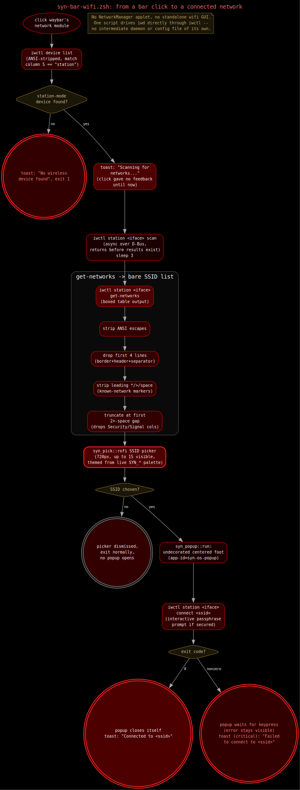

# WiFi Menu

SYN-OS has no NetworkManager applet or standalone wifi GUI. Wireless
connect/scan is a single script, `syn-bar-wifi.zsh`
(`/usr/lib/syn-os/syn-bar-wifi.zsh`), wired to waybar's `network` module as
its `on-click` action. It drives `iwd` directly through `iwctl` — there is no
intermediate daemon or config file of its own.



## Invocation

`syn-bar-wifi.zsh` takes no arguments. It's launched by clicking the
`network` module in the bar; see [../waybar.md](../waybar.md) for the rest
of that module's config. The relevant line in
`~/.config/waybar/config.jsonc`:

```jsonc
"network": {
  "format-wifi": "  {essid}  {bandwidthUpBytes}/{bandwidthDownBytes}",
  "format-ethernet": "󰈀 {ipaddr}  {bandwidthUpBytes}/{bandwidthDownBytes}",
  "format-disconnected": "󰤮",
  "tooltip-format": "{ifname} {ipaddr}/{cidr}",
  "interval": 2,
  "on-click": "/usr/lib/syn-os/syn-bar-wifi.zsh"
}
```

The module itself (icon/essid/bandwidth text) is waybar's own built-in
`network` module — `syn-bar-wifi.zsh` only handles the click, not the bar
display.

## Setup

The script sources three shared libraries and loads the live theme before
doing anything else:

```zsh
source /usr/lib/syn-os/syn-theme-lib.zsh
source /usr/lib/syn-os/syn-picker-lib.zsh
source /usr/lib/syn-os/syn-popup-lib.zsh
syn_theme_load
```

`syn-theme-lib.zsh` supplies the live `SYN_*` palette variables (see
[../theming/theme-engine.md](../theming/theme-engine.md)); `syn-picker-lib.zsh`
supplies the rofi picker used for the SSID list; `syn-popup-lib.zsh` supplies
the popup terminal used for the actual connect step. Both pickers render in
the current theme's colors, not a fixed rofi default theme.

## Step 1: find the wireless device

```zsh
INTERFACE=$(iwctl device list 2>/dev/null | sed 's/\x1b\[[0-9;]*[a-zA-Z]//g' | awk '$5=="station" {print $1; exit}')
```

`iwctl device list` prints a colored, column-aligned table with five real
columns: **Name / Address / Powered / Adapter / Mode**. The `sed` strips
ANSI color escape sequences (`\x1b\[[0-9;]*[a-zA-Z]`) that `iwctl` emits for
terminal coloring, since those escape codes break naive column parsing. The
`awk` filter then matches column **5** (`$5`) against `"station"` — that's
the `Mode` column, i.e. "is this device in station mode" (a wifi client),
not `$4` (`Adapter`, e.g. `phy0`, which never equals the string
`"station"`). It prints column 1 (the device name, e.g. `wlan0`) of the
first matching row and stops (`exit` inside the `awk` pattern block, so only
the first station-mode device is used if more than one is present).

If no device matches, `$INTERFACE` is empty, the script toasts `"WiFi" "No
wireless device found"` via `notify-send` (falling back to a stderr `echo`
if `notify-send` itself is unavailable) and exits `1`.

## Step 2: scan

```zsh
notify-send "WiFi" "Scanning for networks…" 2>/dev/null || true
iwctl station "$INTERFACE" scan > /dev/null
sleep 3
```

`iwctl station <iface> scan` is asynchronous over D-Bus: the command returns
as soon as `iwd` accepts the scan request, not once results are actually
in. Reading `get-networks` immediately afterward can return stale or empty
results. The script waits a flat 3 seconds before reading results back,
which is roughly how long `iwd`'s own scans typically take. Because the
click otherwise gives no feedback until the picker finally opens, the script
toasts "Scanning for networks…" first — without it, the 2-3 second pause
after clicking reads as the click having done nothing.

## Step 3: get networks and clean the output

```zsh
CHOSEN_SSID=$(iwctl station "$INTERFACE" get-networks | \
    sed 's/\x1b\[[0-9;]*[a-zA-Z]//g' | \
    sed '1,4d' | \
    sed -E 's/^[* > ]+//' | \
    sed -E 's/[ ]{2,}.*//' | \
    syn_pick::rofi "WiFi:" -l 15 -theme-str "window { width: 720px; }")
```

`iwctl station <iface> get-networks` output is a boxed table: a border, a
header row (`Network name`/`Security`/`Signal`), and a separator, before the
actual SSID rows begin — plus an optional leading marker (`*` or `>`) on
rows for networks already known/connected. The pipeline strips all of that
down to a bare SSID list, one per line, in four steps:

1. `sed 's/\x1b\[[0-9;]*[a-zA-Z]//g'` — strip ANSI color escapes, same
   pattern as the device-list step above.
2. `sed '1,4d'` — delete the first 4 lines (the box top border, the header
   row, and the header/body separator), leaving only network rows.
3. `sed -E 's/^[* > ]+//'` — strip any leading run of `*`, `>`, or space
   characters, which `iwctl` prefixes onto rows for the currently connected
   or a previously-known network.
4. `sed -E 's/[ ]{2,}.*//'` — truncate each remaining line at the first run
   of 2-or-more spaces, which is the column gap between the SSID and the
   Security/Signal columns that follow it. This is what actually isolates
   just the SSID text, since SSIDs can themselves contain single spaces.

The cleaned SSID list is piped into `syn_pick::rofi "WiFi:" -l 15
-theme-str "window { width: 720px; }"` — a themed rofi dmenu (not `wmenu`;
see below) showing up to 15 lines at once in a fixed-width 720px window. The
chosen SSID (or empty string, if the picker was dismissed) comes back on
stdout as `$CHOSEN_SSID`.

> **Picker backend note**: `syn-picker-lib.zsh` actually exposes two
> interchangeable backends, `syn_pick::wmenu` and `syn_pick::rofi` — both
> take the same "choices on stdin, prompt as `$1`" shape so scripts can use
> either without changing call sites. `syn-bar-wifi.zsh` calls
> `syn_pick::rofi` specifically: a centered, bordered card themed from the
> live `SYN_*` palette, not `wmenu`'s bar-anchored strip. The comment at the
> top of the script is explicit about this choice — it deliberately wants
> the same centered-card picker every other SYN-OS menu uses, not a
> different visual style for wifi alone.

## Step 4: connect

If `$CHOSEN_SSID` is non-empty, the script hands off to
`syn_popup::run` (from `syn-popup-lib.zsh`) to run the actual `iwctl
connect` interactively:

```zsh
syn_popup::run zsh -c '
  iwctl station "$1" connect "$2"
  rc=$?
  if (( rc == 0 )); then
    notify-send "WiFi" "Connected to $2" 2>/dev/null || true
  else
    notify-send -u critical "WiFi" "Failed to connect to $2" 2>/dev/null || true
  fi
  exit $rc
' -- "$INTERFACE" "$CHOSEN_SSID"
```

`syn_popup::run` is the one shared "run this, show me the result" popup used
by every `menu.xml` tool in SYN-OS, not something wifi-specific. It `exec`s:

```zsh
exec foot --app-id=syn-os-popup \
  -o main.pad="24x20 center" \
  -e zsh -c '"$@"; rc=$?; ...; exit $rc' -- "$@"
```

This opens a **`foot`** terminal tagged `app-id=syn-os-popup`, which
`rc.xml` matches with a window rule to render it undecorated and centered
(a "card" look, not a normal bordered/titled terminal window) — see
[../labwc.md](../labwc.md) for that window-rule mechanism. Inside it,
`iwctl station <iface> connect <ssid>` runs interactively: if the network is
secured, `iwctl` itself prompts for the passphrase right there in the popup.
On success the popup closes itself (via the wrapped `exit $rc` with `rc ==
0`); on failure it prints `[exit $rc — press any key to close]` and waits
for a keypress before closing, so a failed connection attempt's error output
stays visible instead of the window vanishing immediately.

Either way, the connect attempt also fires its own toast —
`"WiFi" "Connected to $2"` on success, or a critical-urgency `"WiFi" "Failed
to connect to $2"` on failure — independent of the popup window itself. See
[notifications.md](./notifications.md) for how these toasts are rendered
and themed.

If `$CHOSEN_SSID` is empty (picker dismissed with no selection), the script
does nothing further and exits normally — no popup opens.

## Summary of the flow

```
click network module
  -> find station-mode device (iwctl device list, ANSI-stripped, column 5)
  -> toast "Scanning for networks…"
  -> iwctl station <iface> scan   (async; sleep 3)
  -> iwctl station <iface> get-networks
       -> strip ANSI, drop 4 header lines, strip leading markers,
          truncate at first 2+-space gap  => bare SSID list
  -> syn_pick::rofi SSID picker (720px, up to 15 visible)
  -> syn_popup::run: undecorated centered foot window running
       iwctl station <iface> connect <ssid>  (interactive passphrase prompt)
  -> toast success/failure
```

## Dependencies

`iwd` (providing `iwctl`), `rofi`, `foot`. There is no fallback path if
`iwd`/`iwctl` isn't the active wifi backend — the script assumes `iwctl` is
on `$PATH` and that `iwd` is managing the wireless device.
