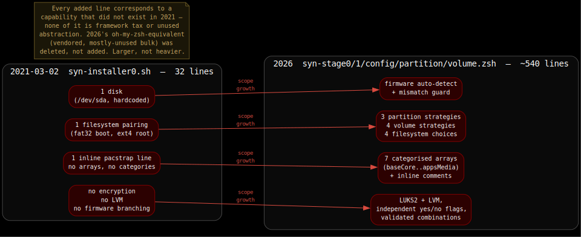
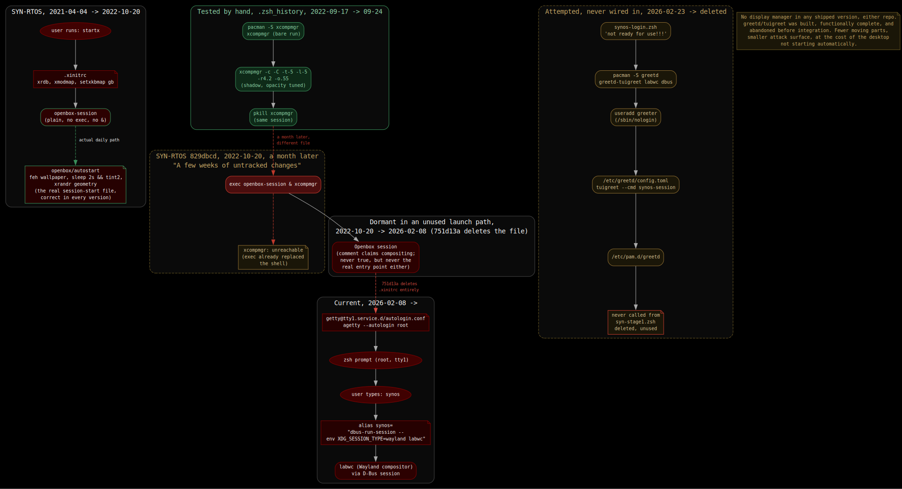
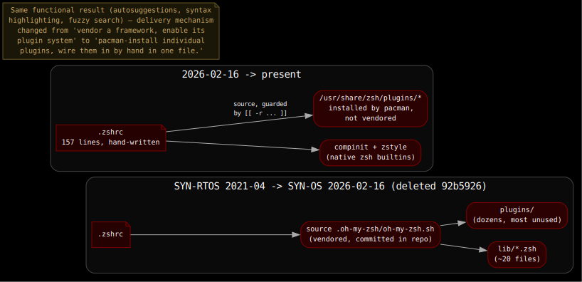
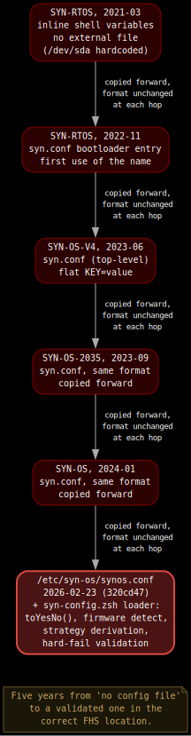
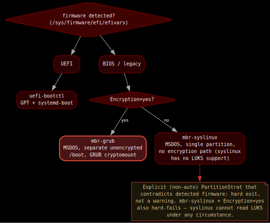

# Project History

SYN-OS has grown roughly 17× in code size since its first installer script and hasn't gotten heavier. Encryption, firmware detection, and strategy validation were added because the system needed to do more; oh-my-zsh, redundant tooling, and dead code paths were removed the moment they stopped earning their place. It's one project, not two. `SYN-OS` is not a spiritual successor to something called `SYN-RTOS`, it's the same repository's contents renamed and carried forward, more than once, since 2021. The intent was stated once, early, and hasn't moved since. From [`SYN-RTOS/README.md`](https://github.com/syn990/SYN-RTOS), 2021-04-04: *"a basic framework for creating other meta-distributions."*



Everything below is sourced from `git log`/`git show` against two repositories that are, functionally, one continuous history: [`syn990/SYN-RTOS`](https://github.com/syn990/SYN-RTOS) (2021 to 2023) and [`syn990/SYN-OS`](https://github.com/syn990/SYN-OS) (2023 to present). `SYN-OS`'s own buried `SYN-RTOS-OLD/` subtree is a snapshot of `SYN-RTOS` taken on 2023-02-12, not a separate origin. The two repositories share commits, file bodies, and even bugs across the boundary. That's the point of this document: there isn't a seam where you'd draw one.

---

## Before either repository: 2017–2021

No file from this period survives. This paragraph is memory, not `git log`, and it's the only part of this document that is. The practice this document traces (hand-building Arch installs without a desktop-environment installer, writing and iterating on dotfiles, compiling custom ISOs) predates any git history by roughly four years, back to approximately 2017. It existed as personal knowledge and repeated manual work: no version control, so no record survives of what it looked like at any point, lost and rebuilt from memory more than once before it was ever a repository at all. `SYN-RTOS` (2021) is not the beginning of this. It's the point the practice finally got a safety net, stated directly in the first README to survive anywhere:

```
d05b2a6  2021-03-02  first commit
```
```
# SYN-RTOS
# The SYN-RTOS is the Syntax990 Real-Time Operating System.
# This Repo serves as a place to store and manage the source tree, as it's getting quite messy!
```

Not "let's build an OS." "I need somewhere to stop losing this." Every reset documented below (`SYN-OS-2035`'s "Time to restart," "Starting again from baseline" ×3, the unnamed 2026 "MAJOR UPDATES" reset) continues a pattern that predates git entirely. One rebuild inside `SYN-RTOS` itself is documented in its own commit message, in exactly these terms, a year before any reset visible from inside the `SYN-OS` repository alone:

```
829dbcd  2022-10-20  Rework

    A few weeks of untracked changes
```

---

## 1. The first installer, and the shape everything after it kept

The actual first installer script, in full: 32 lines, `SYN-RTOS/aaaffa6`, 2021-03-02.

```sh
#!/bin/sh
#Assumption - System has internet access and script is being run inside installer without chroot. All detected disks to be erased

echo Setting up SYN-ARCHSO keyboard layout in TTY to UK
    loadkeys uk

echo Setting up SYN-ARCHSO for NTP
    timedatectl set-ntp true

echo Going completley nuclear and erasing disks with GPT partition and root partition
    parted --script /dev/sda mklabel gpt mkpart primary fat32 1Mib 200Mib set 1 boot on
    parted --script /dev/sda mkpart primary ext4 201Mib 100%
        mkfs.vfat /dev/sda1
        mkfs.ext4 /dev/sda2
            mount /dev/sda2 /mnt && mkdir /mnt/boot/
            mount /dev/sda1 /mnt/boot

echo Setting Up Mirrorlist On SYN-ARCHSO Using reflector Then pacstrap All Packages To New System partition
    pacman -Syy
        reflector -c "GB" -f 12 -l 10 -n 12 --save /etc/pacman.d/mirrorlist
            pacstrap /mnt alsa-utils base base-devel dhcpcd dnsmasq dosfstools fakeroot feh gcc git htop iwd kitty kwrite linux linux-firmware lshw lxqt-qtplugin lxrandr nano openbox pcmanfm-qt qutebrowser pulseaudio python-pyalsa ranger reflector rsync spectacle sshfs sudo tint2 vlc xf86-video-vesa xorg-... xterm zsh terminus-font engrampa

echo Generate filesystem table with boot information in respect to UUID assignment
    genfstab -U /mnt >> /mnt/etc/fstab

echo Create SYNSTALL profile template on new system
    mkdir /mnt/root/SYNSTALL
    cp -r /root/SYNSTALL /mnt/root/SYNSTALL
```

One disk, hardcoded (`/dev/sda`). One filesystem pairing. One inline `pacstrap` line, no arrays, no config file, no encryption, no LVM, no firmware branching (UEFI/GPT was simply assumed). `qutebrowser`, `pcmanfm-qt`, `tint2`, `openbox`, `ranger`, `kitty` are all already here. Every swap documented in Section 5 is a swap *of* this baseline, going back to this exact script, not an introduction to a blank one, including the browser, which took three more years and four more swaps to leave `chromium`'s side of that line permanently.

`SYN-RTOS`'s own `.xinitrc`, the file that would still be running, byte-for-byte close to this, in 2026, is added a month later, `80c0775`, 2021-04-04:

```sh
#!/bin/sh
userresources=$HOME/.Xresources
usermodmap=$HOME/.Xmodmap
sysresources=/etc/X11/xinit/.Xresources
sysmodmap=/etc/X11/xinit/.Xmodmap

if [ -f $sysresources ]; then xrdb -merge $sysresources; fi
if [ -f $sysmodmap ]; then xmodmap $sysmodmap; fi
if [ -f "$userresources" ]; then xrdb -merge "$userresources"; fi
if [ -f "$usermodmap" ]; then xmodmap "$usermodmap"; fi

if [ -d /etc/X11/xinit/xinitrc.d ] ; then
 for f in /etc/X11/xinit/xinitrc.d/?*.sh ; do
  [ -x "$f" ] && . "$f"
 done
 unset f
fi

#twm &
#xclock -geometry 50x50-1+1 &
#xterm -geometry 80x50+494+51 &
setxkbmap gb
openbox-session
```

Stock Arch wiki `xinitrc` template, `setxkbmap gb` appended, `openbox-session` on the last line. No `exec`, no ampersand, no compositor call. This runs clean. The line that would eventually break it isn't here yet.

Compositing was tested properly first, by hand, at the terminal, weeks before it ever touched this file. A committed `.zsh_history` shows the real sequence: `sudo pacman -S xcompmgr` and a first bare run on 2022-09-17, then a return session a week later on 2022-09-24 with actual tuned parameters, `xcompmgr -c -C -t-5 -l-5 -r4.2 -o.55` (shadow offset, opacity, the works), followed within the same minute by `pkill xcompmgr`. That's a deliberate evaluation, run and rejected, not an oversight.

The line that would look like an unnoticed bug is added to `.xinitrc` a month later, inside `SYN-RTOS`, inside the exact commit already quoted above for its own honesty about what it was:

```
829dbcd  2022-10-20  Rework  ("A few weeks of untracked changes")
```
```diff
 setxkbmap gb
-openbox-session
+exec openbox-session & xcompmgr
```

`exec` replaces the current shell process image immediately: control never returns to the script. `& xcompmgr` reads as "background `openbox-session`'s exec, then run `xcompmgr`," but `exec cmd &` backgrounds the *shell* running `exec`, and because `exec` doesn't return, `xcompmgr` after the `&` is unreachable in `sh`/`bash`/`dash`. As code it's genuinely dead, and it survives unchanged through every copy of this file across both repositories for the next three years and four months, including the header-bannered version still running in `SYN-OS` as of 2025-08-14 (`27f4552`):

```sh
# =============================================================================
#                                SYN-OS .xinitrc
# ...
# Set keyboard layout to GB and start Openbox with compositing
setxkbmap gb
exec openbox-session & xcompmgr
```

But `.xinitrc` itself was never the real session entry point this system used day to day. `default-dotfiles/.config/openbox/autostart` (present since the same 2021-04-04 commit as `.xinitrc`) is what actually ran on session start: wallpaper (`feh --bg-scale`), a delayed panel launch (`sleep 2s && tint2`), and display geometry (`xrandr`), correctly backgrounded, no compositor call anywhere in it, in any version across either repository. `kitty` launched the same way most terminals do on a window-manager desktop: by hand or from a panel launcher, not as part of session start. The dead `xcompmgr` line sat in a file governing a launch method (`startx`) that wasn't the daily path, carried forward at every repo copy because nothing depended on it, not because it went unchecked. It's deleted outright in `SYN-OS/751d13a` (2026-02-08), the commit that announces the Wayland move. X11 didn't get refactored out gradually; the file that represented it was removed the instant its replacement (LabWC's own session handling, no `.xinitrc` equivalent needed) existed.

### What replaced `startx`: TTY autologin and a plain alias

`/etc/systemd/system/getty@tty1.service.d/autologin.conf`, still present today:

```ini
[Service]
ExecStart=
ExecStart=-/sbin/agetty -o '-p -f -- \\u' --noclear --autologin root - $TERM
```

Overrides `getty@tty1` to auto-login as root on the first virtual terminal. No login prompt, no daemon watching for a session request. The `synos` alias, born the same day as the Wayland announcement, unchanged since:

```zsh
alias synos="dbus-run-session -- env XDG_SESSION_TYPE=wayland labwc"
```

Typing `synos` starts a D-Bus session and execs `labwc` inside it. That's the whole mechanism: autologin gets you to a shell, one alias gets you to a desktop.

### The abandoned middle step: greetd + tuigreet

Between the dead `.xinitrc` line and the current bare alias, a real display-manager path was built and shelved. `synos-login.zsh` (added `SYN-OS/320cd47`, 2026-02-23, deleted by `9c8875d`, 2026-03-02) is a complete, working installer for [greetd](https://sr.ht/~kennylevinsen/greetd/) plus [tuigreet](https://github.com/apognu/tuigreet), a minimal TUI login manager, not a graphical one. SDDM, GDM, LightDM were never attempted at all. Its own first line states its status:

```zsh
#!/usr/bin/env zsh
# SYN‑OS greetd + tuigreet setup (zsh) - not ready for use!!! use after stage1
```

It installs `greetd greetd-tuigreet labwc dbus shadow sed coreutils`, writes a session launcher, creates a dedicated unprivileged `greeter` user (`/sbin/nologin`), writes `/etc/greetd/config.toml` and a full PAM stack at `/etc/pam.d/greetd`, disables `getty@tty1`, and enables `greetd.service`. It was never called from `syn-stage1.zsh` and was deleted without shipping. What's currently in the ISO, root autologin at the TTY, `synos` as a manual alias, is strictly less machinery: no greeter daemon, no dedicated PAM stack, no seat-managed session, smaller attack surface, at the cost of the desktop not appearing automatically.



---

## 2. Shell environment: one config file, worn by four years of formatters and frameworks

`UserShell="/bin/zsh"` is set as early as `SYN-RTOS/aaaffa6`'s successor scripts. Zsh was always the target shell, even while the installer scripts themselves stayed `#!/bin/bash`, using `_990`-suffixed variable names (`DEFAULT_USER_990`, `SHELL_CHOICE_990`) and manual `sleep 0.5` calls after every echo in place of structured logging:

```bash
#!/bin/bash
echo "DO NOT RUN INSIDE THE INSTALL SHELL" & sleep 0.5
...
SHELL_CHOICE_990="/bin/zsh"
echo "Setting default shell choice to: $SHELL_CHOICE_990"
sleep 0.5
```
From `SYN-OS-2035/SYN-INSTALLER-SCRIPTS/syn-1_chroot-encrypted.sh`, `05fd4f7`, 2023-10-01. (`echo ... & sleep 0.5` backgrounds the echo and races the sleep; the pacing isn't actually guaranteed by this.)

From `SYN-RTOS`'s `default-dotfiles/.oh-my-zsh/` onward, the full oh-my-zsh framework was committed directly into the repository, not referenced as a dependency, the entire upstream tree, `lib/*.zsh`, dozens of `plugins/`, `custom/` scaffolding, and copied forward at every reset for four and a half years. Final deletion: `SYN-OS/92b5926` (2026-02-16, "Shell Improvements," the same commit that swapped `htop` for `btop`). No `.oh-my-zsh` directory exists anywhere in the tree today.

What replaced it doesn't vendor anything. The current `.zshrc` is 157 lines, sets `HISTFILE` under `$XDG_STATE_HOME`, configures `compinit`/`zstyle` by hand, and sources plugins from wherever pacman installs them system-wide:

```zsh
[[ -r /usr/share/zsh/plugins/zsh-autosuggestions/zsh-autosuggestions.zsh ]] && \
  source /usr/share/zsh/plugins/zsh-autosuggestions/zsh-autosuggestions.zsh
[[ -r /usr/share/zsh/plugins/zsh-syntax-highlighting/zsh-syntax-highlighting.zsh ]] && \
  source /usr/share/zsh/plugins/zsh-syntax-highlighting/zsh-syntax-highlighting.zsh
```

Same functional result, autosuggestions, syntax highlighting, fuzzy search, delivered by pacman-packaged plugins wired in by hand instead of a vendored framework's own plugin system. `EDITOR='nano'` is set here; `nano` is the only text editor that has ever appeared in any SYN-OS package list, from the earliest arrays through today.



---

## 3. Where the config file has actually lived

The idea of an install-time config a script reads from, rather than variables edited inline before each run, is present as early as `SYN-RTOS` itself: a `syn.conf` bootloader entry appears at `SYN-RTOS/ff4c3e4`/`19d247e`, 2022-11-01/08, over a year before `SYN-OS` existed as a repository. The full installer-config version of the idea, a `syn.conf` a script actually sources for hostname/disk/locale, is present by the time `SYN-OS-V4` forks off in June 2023, and gets copied forward at every subsequent reset (into `SYN-OS-2035` in September 2023, into the current `SYN-OS` tree in January 2024) in the same flat format each time, for two and a half years, before its format or location changed at all.

It isn't until `SYN-OS/320cd47` (2026-02-23), the same commit that rewrote the installer's whole strategy-dispatch architecture, that the config gets a correct home, `/etc/syn-os/synos.conf` (the location the Filesystem Hierarchy Standard actually specifies), and a real loader to match: `syn-config.zsh`, which normalizes booleans, detects real firmware via `/sys/firmware/efi/efivars`, derives strategy selections, and hard-fails on invalid combinations. The format was rewritten in the same six-week window as the rest of the installer. The *location* took five years to become correct.



---

## 4. Installer strategy dispatch: how MBR/UEFI branching became modules

`SYN-OS/7e1e0cd` (2024-10-28) describes the state reached after a 25-commit cluster on 2024-05-06 (all titled "revamp stage 1 to include MBR and UEFI parameters") as *"two scripts with enough logic to separate MBR and UEFI properties."* Two scripts, not a dispatch table. Firmware detection and partition layout were both decided with inline conditionals inside the file that did the partitioning, the same shape the 2021 script had, just with a branch added.

`320cd47` (2026-02-23) is the rewrite that introduced `syn-partition.zsh`, `syn-volume.zsh`, `syn-filesystem.zsh`, `syn-mount.zsh`, `syn-pacstrap.zsh` as separate sourced files, each exposing a `*Main()` entry point, dispatching internally on a config string:

```zsh
partitionMain() {
  case "${PartitionStrat}" in
    uefi-bootctl) partitionStrat_uefi_bootctl ;;
    mbr-syslinux) partitionStrat_mbr_syslinux ;;
    mbr-grub)     partitionStrat_mbr_grub ;;      # added later, see below
    *) syn_ui::error "Unknown PartitionStrat '${PartitionStrat}'"; exit 1 ;;
  esac
}
```

`syn-config.zsh` resolves `PartitionStrat=auto` before this dispatch ever runs, reading `/sys/firmware/efi/efivars` directly, and refuses to continue if an explicit value contradicts detected firmware. That's a hard exit, not a warning.

`mbr-syslinux` has no LUKS support at all and no separate boot partition to fall back on. `mbr-grub`, added after `320cd47`, closes that gap with its own small unencrypted boot partition, so GRUB can read `/boot/grub/grub.cfg` and the kernel/initramfs before anything is decrypted:

```zsh
if [ "$PartitionStrat" = "mbr-syslinux" ] && [ "$Encryption" = "yes" ]; then
  echo "ERROR: PartitionStrat=mbr-syslinux cannot use Encryption=yes, syslinux has no LUKS support." >&2
  echo "Use PartitionStrat=mbr-grub for encrypted BIOS/MBR installs, or PartitionStrat=uefi-bootctl." >&2
  exit 1
fi
```

GRUB was dropped for `systemd-boot` at `9df0f28` (2026-02-15) and reintroduced eight days later, scoped to exactly the one combination systemd-boot and syslinux both fail to cover.



---

## 5. Package identity: what the manifests actually said

### The browser: origin in 2021, five states, one reversal

`chromium` isn't a `SYN-OS`-era decision. It's in `SYN-RTOS/aaaffa6`'s very first `pacstrap` line, 2021-03-02, alongside `qutebrowser`'s later replacement target. Within `SYN-OS` specifically, where the array format allows tracking a clean swap history:

```
d9f1465  2023-05-26  guiExtraPackages=(... "chromium" ...)          # already 2+ years old
c4e26ec  2024-07-07  guiExtraPackages=(... "qutebrowser" ...)
d737165  2024-07-08  guiExtraPackages=(... "vivaldi" "vivaldi-ffmpeg-codecs" ...)
7e1e0cd  2024-10-28  guiExtraPackages=(... "chromium" ...)           # reverted
1989434  2026-02-24  appsMedia=(... falkon ...)
```

Chromium to qutebrowser to vivaldi to chromium (reverted) to falkon. Five states from one line in a 2021 script.

### `openra`: 2022-11-07, older than every other package here

```
7e9e5fa  2022-11-07  pacstrap /mnt ... obs-studio openra        (SYN-RTOS)
d9f1465  2023-05-26  GUI_XTRA_990="... obs-studio openra spectacle vlc"   (SYN-OS, inherited)
today    appsMedia=( ... openra ... )   # syn-packages.zsh:107
```

Same package name, present in every intermediate revision of every package-list file across both repositories, for three years and eight months, the longest-lived single line of configuration in this history. It has outlived chromium's entire tenure twice, kitty, htop, sudo, pulseaudio, and openbox.

### Six other swaps, one eight-day window

```
92b5926  2026-02-16  htop        → btop
4b44932  2026-02-18  kitty       → foot
320cd47  2026-02-23  sudo        → opendoas
1989434  2026-02-24  pcmanfm-qt  → superfile
1989434  2026-02-24  kwrite      → featherpad
1989434  2026-02-24  engrampa    → lxqt-archiver
```

All six trace back to the 2021 script (Section 1). Four of the six land within eight days in February 2026, alongside the modular installer rewrite. One coordinated pass, not six independent decisions.

### Audio: a removal with no named replacement

`pulseaudio`/`python-pyalsa` sat unchanged from `SYN-RTOS/aaaffa6` (2021) through `SYN-OS/e305df4` (2025-08-21, birth of `syn-packages.zsh`), over four years. That commit drops both. The string `pipewire` does not occur anywhere in either repository's tracked history. What remains, `sof-firmware`, `pamixer`, `pavucontrol-qt`, is drivers and mixer front-ends, not a sound server. Whichever sound server actually runs arrived as a transitive dependency, not a line in the manifest.

---

## 6. The release names the era table doesn't mention

Every past README that added a download link named the build. Pulled from `git log -p -- readme.md README.md` across both repositories, in order:

```
SYN-OS-Chronomorph        FEB 2024   (matches later era table)
SYN-OS-Soam-Do-Huawei     MAY 2024   (no mention in later era table)
SYN-OS-VOLITION           MAY 2024, relinked JUNE 2024   (no mention in later era table)
SYN-OS-ArchTech Corp. Edition   JULY 2024   (no mention in later era table)
SYN-OS-M-141 Edition      NOVEMBER 2024   (matches later era table)
```

`7b55f0f` ("Uploaded ArchTech Corp Edition ISO") is a 6-line README diff, a new download link above the existing ones, nothing else:

```diff
+     - **[SYN-OS-ArchTech Corp. Edition JULY 2024](...)**
+   - Earlier versions:
      - **[SYN-OS-VOLITION MAY 2024](...)**
-   - Older versions:
      - **[SYN-OS-Soam-Do-Huawei MAY 2024](...)**
```

No profile files, no package list, no script changed. "ArchTech Corp Edition" is the same build re-uploaded under a different label, not a fourth fork.

---

## 7. The project has drawn its own directory tree four times

`SYN-OS/2fe293a` (2023-06-08) introduces **SYN-GRAPHER**: *"we can now draw the dirs."* The actual implementation, `RelationshipGen.sh`, is 31 lines of `bash`+`awk`:

```bash
#!/bin/bash
DIR_TO_SCAN=~/SYN-OS
exec > SYN-OS.dot
echo "digraph SYNOS {"
find $DIR_TO_SCAN -type d | awk -F/ -v OFS='/' '{ if (NF>1) print "    \""$0"\" -> \""$1"/"$2"\""; }'
find $DIR_TO_SCAN -type f | awk -F/ -v OFS='/' '{ print "    \""$0"\" -> \""$1"/"$2"\""; }'
echo "}"
```

By 2024 this had grown into four overlapping variants (`SYN-DIR-GRAPH.sh`, `SYN-GRAPH-FILES.sh`, `SYN-GRAPH-LARGE.sh`, `RelationshipGen.sh` itself), none consolidated, all deleted at `7e1e0cd`. The habit resumed twice more, three days apart, in the current tree: `Graphviz/GRAPH.sh` (`1989434`, 2026-02-24, hand-emits DOT via `echo`) and `syn-mapper.sh` (`9c8875d`, 2026-03-02, shells out to real `dot`/`fdp`). Both exist simultaneously today, unreconciled. The `.zshrc` alias for the second one (`alias syn-mapper='/usr/lib/syn-os/syn-mapper.zsh'`) points at a `.zsh` file; the actual file on disk is `syn-mapper.sh`.

---

## 8. What the Xibo build actually was

`xibo-build/`, a full sibling ISO profile with its own `airootfs/etc/hostname`, `sshd_config`, `mkinitcpio.conf`, was uploaded to the `SYN-RTOS` repository root within the first hour of the repository's life (`0e35192`, 2021-03-02). `chromium_fullscreen_kiosk.sh` followed the next day (`9eeb76b`, 2021-03-03):

```sh
xset s off
xset -dpms
xset s noblank
chromium --kiosk http://calendar.google.com/
```

[Xibo](https://xibosignage.com/) is digital signage software: a wall-display kiosk, screen blanking disabled, Chromium locked to fullscreen, a Google Calendar page. A real, distinct build, different in purpose from the desktop-OS profile that became SYN-RTOS proper, described in the author's own words in the 2021-04-04 README: *"Archiso files used for an automated Digital-signage player."* It sat in the same repository from day one, not because it was mistaken for the desktop OS but because the repository existed to stop things getting lost, kiosk build included. When `SYN-OS/8ff0119` consolidated its own repo in June 2023, this kiosk build's `packages.x86_64` was the nearest file with roughly the right shape and got copied forward at 76% similarity, becoming, several renames and two more years later, the ancestor of `SYN-OS/SYN-ISO-PROFILE/packages.x86_64` as it exists today:

```
xibo-build/packages.x86_64        (SYN-RTOS, 2021-03-02)
   │ copy, 76% similarity (8ff0119, 2023-06-04)
   ▼
SYN-OS-V4/SYN-ISO-PROFILE/packages.x86_64
   │ copy, 94% similarity (fae5b43, 2023-09-25)
   ▼
SYN-OS-2035/SYN-ISO-PROFILE/packages.x86_64
   │ copy, 100% similarity (068459f, 2024-01-28), then gutted 128→12 same day
   ▼
SYN-OS/SYN-ISO-PROFILE/packages.x86_64   (52 lines today; boot-scoped only)
```

`syn-packages.zsh`, the desktop/application manifest, has no ancestor in that chain. It's a clean-slate file, born `e305df4` (2025-08-21), in a new format. Duplicated, not renamed, from `root/syn-resources/scripts/` to `usr/lib/syn-os/` at `320cd47` (2026-02-23); the two copies diverged for a week (`usr/lib` gained falkon/superfile/lxqt-archiver/featherpad, `root/scripts` didn't) until the old one was deleted at `9c8875d` (2026-03-02).

---

## 9. Directory-level resets

Five top-level names have existed, all one project:

```
SYN-RTOS                  2021-03-02 → present (repository still live, github.com/syn990/SYN-RTOS)
SYN-RTOS-OLD/              2023-02-12 → 2023-06-04 (snapshot of SYN-RTOS, deleted 8ff0119)
SYN-OS-ARCHISO_PROFILE/    2023-02-12 → 2023-06-04 (cloud-init/VM guest image, deleted 8ff0119)
SYN-OS-V4/                 2023-06-04 → 2024-10-28 (deleted 7e1e0cd)
SYN-OS-2035/                2023-09-23 → 2024-10-28 (deleted 7e1e0cd, same commit as SYN-OS-V4)
SYN-OS/                    2024-01-28 → present
```

`7e1e0cd`, the same commit that reverted the browser and finished separating MBR/UEFI logic, deleted both `SYN-OS-V4/` and `SYN-OS-2035/` in one stroke, consolidating three years of parallel trees into the one directory that exists today.

---

## Scope, not weight

The 32-line `SYN-RTOS/aaaffa6` installer (Section 1) and today's install pipeline (`syn-stage0.zsh` + `syn-stage1.zsh` + `syn-config.zsh` + `syn-partition.zsh` + `syn-volume.zsh`, ~540 combined lines, diagrammed at the top of this document) differ by roughly 17× in line count. Every added line maps to a capability the 2021 script didn't have, and everything that stopped earning its place has been removed on sight rather than left to accumulate: the vendored oh-my-zsh framework (Section 2), four overlapping directory-graphing scripts (Section 7), the greetd integration that was never wired in (Section 1). Additions track requirements. Deletions track anything that stopped earning its place.

The one long-lived exception, the dead `xcompmgr` line in `.xinitrc` (Section 1), didn't survive because it went unchecked. Compositing was tested properly, by hand, with tuned parameters, and rejected, in the same month the line's precursor was written. It survived because it sat in a launch path (`startx`) that wasn't the daily one; the file that mattered for session start, `openbox/autostart`, stayed correct across every version. Dead code in a path nobody depends on carries a different weight than dead code in one that does.

---

*Every commit hash in this document resolves in [`syn990/SYN-RTOS`](https://github.com/syn990/SYN-RTOS) (2021 to 2023, Sections 1 through 3 and 8 draw from it directly) or [`syn990/SYN-OS`](https://github.com/syn990/SYN-OS) (2023 to present, everything else). Verify any of it directly: `git show <hash>`, `git log -p -- <path>`, `git log --all -S '<string>'`.*
