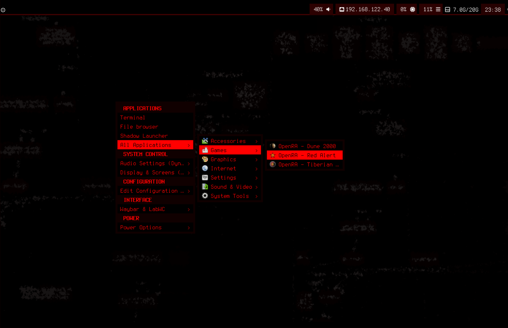

Big M here — got you.  
You want a **much simpler**, **clean**, **cool‑looking** SYN‑OS page with:

*   A **single banner**
*   A **clean table of download links**
*   A **clean table for installer stages**
*   **USB creation instructions**
*   **Boot + install steps**
*   **Start desktop steps**

**No deep philosophy, no history, no internal architecture.**  
A straight‑to‑the‑point “what is it, how to get it, how to install it”.

***



# **SYN‑OS — Simple Overview & Installer Guide**

**SYN‑OS** is a lightweight, modular Arch‑based operating system created by **William Hayward‑Holland** (*Syntax990*).  
It keeps everything transparent, terminal‑driven, and user‑controlled — with a **LabWC Wayland** desktop.

***

# **📥 Download Centre**

Below is a clean table of current and older releases.

### **Latest Release**

| Release                   | ISO                | Size     | Link                                                                     |
| ------------------------- | ------------------ | -------- | ------------------------------------------------------------------------ |
| **AEGIS** (MAR 2026) | `SYN-OS_AEGIS.iso` | \~1.1 GB | <https://drive.google.com/file/d/13CowFj1Pwo4XzBRVkGT-cBjKuVWJ50cW/view> |

### **Older Releases**

| Release        | Date           | Link                                                                     |
| -------------- | -------------- | ------------------------------------------------------------------------ |
| SYNAPTICS      | Feb 2026 | <https://drive.google.com/file/d/13CowFj1Pwo4XzBRVkGT-cBjKuVWJ50cW/view> |
| XENITH         | Jan 2026       | <https://drive.google.com/file/d/1bbKsw2FQ7d2Pb8Os1lwERGEyG5j3pnpg/view> |
| SYNTEX         | Apr 2025       | <https://drive.google.com/file/d/1CcPMeKCBjdqz6OJCzm1JcLhxzKSHe7ra/view> |
| M‑141          | Nov 2024       | <https://drive.google.com/file/d/1oX-hyHrG4M2JqXwFH2p5DxjbFT656jWH/view> |
| ArchTech Corp. | Jul 2024       | <https://drive.google.com/file/d/1WRDf0JfCCNhYJJkFUXb3Xheb3YInys52/view> |
| VOLITION       | Jun 2024       | <https://drive.google.com/file/d/16ETNY4jlTK_UCGEwBxMTTFMn0Mf7rrTR/view> |
| Soam‑Do‑Huawei | May 2024       | <https://drive.google.com/file/d/1bsa85uXRdrfxPydkVNI-oQnpGj4JmeQi/view> |
| Chronomorph    | Feb 2024       | <https://drive.google.com/file/d/142U6-w2CNOiL2jRPlHmfqcYTlEmTBXow/view> |

***

# **Create a Bootable USB**

### **Linux**

```bash
lsblk
sudo dd if=SYN-OS.iso of=/dev/sdX bs=4M status=progress oflag=sync
```

*(Replace `sdX` with your USB device.)*

***

### **macOS**

```bash
diskutil list
diskutil unmountDisk /dev/diskN
sudo dd if=SYN-OS.iso of=/dev/rdiskN bs=4m
sync
diskutil eject /dev/diskN
```

***

### **Windows (Rufus)**

1.  Open **Rufus**
2.  Select USB device
3.  Select the SYN‑OS ISO
4.  Partition Scheme:
    *   **GPT (UEFI)**
    *   **MBR (Legacy BIOS)**
5.  Press **Start**

***

#  Boot & Install SYN‑OS

### **1. Boot the ISO**

*   Select **SYN‑OS** from your BIOS/UEFI boot menu
*   You will enter a **clean terminal live environment**

***

### **2. (Optional) Configure Installer**

    nano /etc/syn-os/synos.conf

Here you can choose:

*   Partition layout
*   Filesystem
*   Encryption (LUKS)
*   Bootloader strategy

***

### **3. Start Installer**

    syntax990

***

# **Installer Overview — Quick Table**

| Stage                    | What It Does                                                            |
| ------------------------ | ----------------------------------------------------------------------- |
| **Stage 0** (pre‑chroot) | Partition disks, create LUKS/LVM, format FS, mount, install base system |
| **Stage 1** (in‑chroot)  | User creation, overlays, bootloader setup, services, locale/timezone    |

After Stage 1 completes → reboot.

***

# **First Boot**

Log in with your account, then start the desktop:

```bash
synos
```

This launches:

*   **LabWC (Wayland)**
*   **Waybar (panel)**
*   **Swaybg (background)**
*   Clean defaults ready for customisation


***
