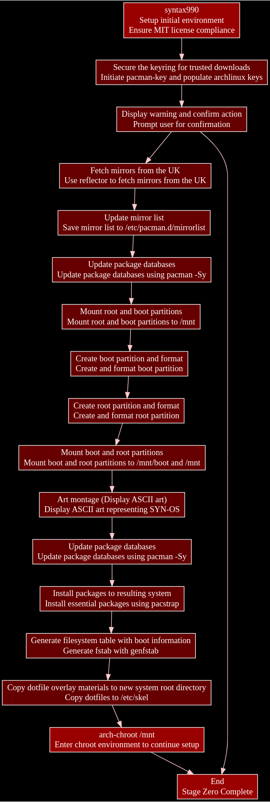
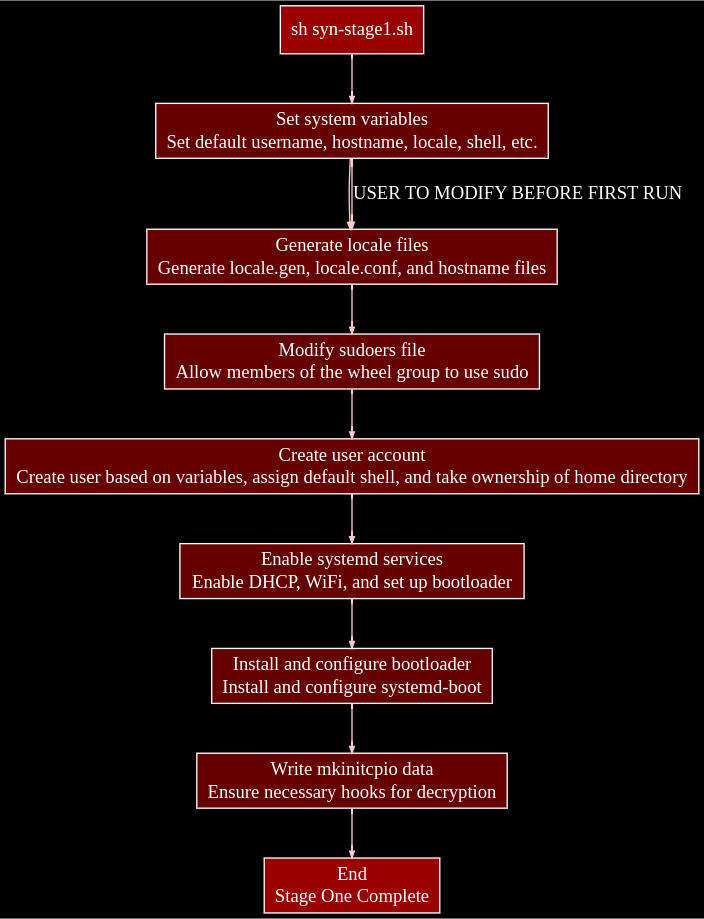

<p align="center">
  
</p>

# SYN-OS Readme - The Syntax Operating System - Based on Arch

### SYN-OS Overview

**SYN-OS** is an Arch Linux-based* operating system created by William Hayward-Holland (Syntax990). It utilises build scripts to systematically install and configure an Arch Linux system according to user preferences. This package serves as your template to assimilate and repurpose this system for an embedded system or a minimal desktop/server graphical environment that is predictable and transparent by design.

```markdown
#### Project Structure

1. **scripts:**
    - **syn-stage0.zsh:** Defines disks, installs packages, and prepares the system for chroot.
    - **syn-stage1.zsh:** Chrooting script for executing final stages of the installer.

2. **DotfileOverlay:**
    - **scripts:**
        - **syn-stage0.zsh:** Defines disks, installs packages, and prepares the system for chroot.
    - **etc/skel:** User-specific settings and preferences.
        - **.xinitrc:** X.Org initialization script for autostarting xcompmgr and openbox.
        - **.oh-my-zsh:** Customizations for Oh My Zsh.
        - **.zshrc:** Zsh shell configurations.
        - **.config:**
            - **kitty:** Terminal emulator settings.
            - **ranger:** File manager configurations.
            - **openbox:** Window manager settings.
            - **tint2:** Panel configuration.
            - **dconf:** dconf settings.
            - **vlc:** VLC media player configuration.
            - **htop:** htop system monitor settings.
            - **pcmanfm-qt:** PCManFM-Qt file manager configuration.
            - **pulse:** PulseAudio settings.
            - **pavucontrol-qt:** pavucontrol-qt audio control configuration.
            - **autostart:** Scripts for autostarting applications.
            - **qt5ct:** Qt5 applications configuration.
        - **.themes:** Custom user themes.

#### Archiso Profile

1. **pacman.conf:** Configuration file for Pacman, the package manager. Defines repository settings and package preferences.

2. **bootstrap_packages.x86_64:** List of essential packages necessary during initial bootstrapping process.

3. **syslinux:**
    - **archiso_sys-linux.cfg:** Configuration file specifying settings for the Syslinux bootloader when using the Linux kernel.
    - **archiso_pxe.cfg:** Configuration for PXE booting with Syslinux.
    - **archiso_sys.cfg:** Main configuration file for Syslinux in the Archiso environment.
    - **archiso_tail.cfg:** Tail configuration for Syslinux.
    - **syslinux.cfg:** General Syslinux configuration.
    - **archiso_head.cfg:** Header configuration for Syslinux.
    - **archiso_pxe-linux.cfg:** Configuration for PXE booting with Syslinux using the Linux kernel.

4. **airootfs:**
    - **airootfs/etc:**
        - **passwd:** User account information.
        - **resolv.conf:** Configuration for DNS resolution.
        - **motd:** Message of the day displayed at login.
        - **hostname:** Hostname configuration.
        - **os-release:** Information about the operating system release.
        - **mkinitcpio.d:** MKinitcpio configurations for the initial RAM disk.
        - **vconsole.conf:** Configuration for the virtual console.
    - **airootfs/root:** Root user's home directory.
    - **airootfs/usr:** Directory containing user-specific files.

5. **efiboot:**
    - **loader:**
        - **entries:**
            - **syn.conf:** Configuration for SYN-OS within the EFI loader.
        - **loader.conf:** General loader configuration.

6. **grub:**
    - **loopback.cfg:** Configuration for loopback booting.
    - **grub.cfg:** General GRUB configuration.

#### Auto-Start Properties

- SYN-OS embraces "Terminal By Design," starting in a tty and optionally employing an X session through `xinitrc`, invoked by executing `startx`. Basic compositing with transparency and shadows operates alongside openbox.

#### Building the ISO

To manually build the ISO:

1. Navigate to the SYN-ISO-PROFILE directory: `cd SYN-OS/SYN-ISO-PROFILE`
2. Run the build script: `./BUILD-SYNOS-ISO.zsh`
3. Locate the resulting ISO in the 'SYN-ISO-PROFILE' directory.

#### Customizing the ISO

1. Clone the repository: `git clone https://github.com/syn990/SYN-OS.git`
2. Navigate to the SYN-ISO-PROFILE directory: `cd SYN-OS/SYN-ISO-PROFILE`
3. Edit configurations and customize packages in `airootfs/etc` to suit your preferences.
4. Run the new build script: `./BUILD-SYNOS-ISO.zsh`
5. Find the output ISO in the 'out' directory.
6. Boot the ISO.
```

#### The installation process (syn-stage0.sh) (Run 'syntax990' to start)

<p align="center">
  
</p>

#### The installation process (syn-stage1.sh) (Run 'sh syn-stage1.sh' to start, within the chroot enviroment)


<p align="center">
  
</p>

#### Screenshots


<p align="center">
  
</p>


<p align="center">
  
</p>


```markdown
### Support

For support, you can contact William Hayward-Holland via [LinkedIn](https://www.linkedin.com/in/william-hayward-holland-990/) or through email at `william@npc.syntax990.com`. Additional guidance is available on [The Arch Wiki](https://wiki.archlinux.org).

Feel free to explore and customize SYN-OS to tailor it to your preferences and requirements.

#### License

SYN-OS is licensed under MIT. Refer to [LICENSE](https://github.com/syn990/SYN-OS/blob/main/LICENSE) for details.
```
