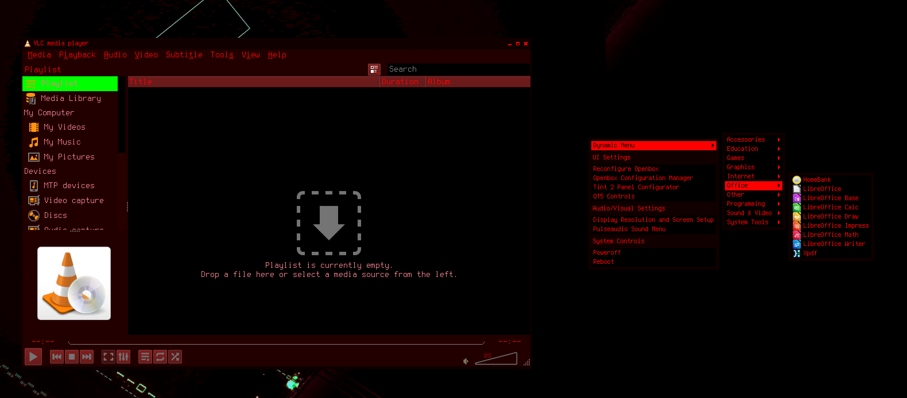
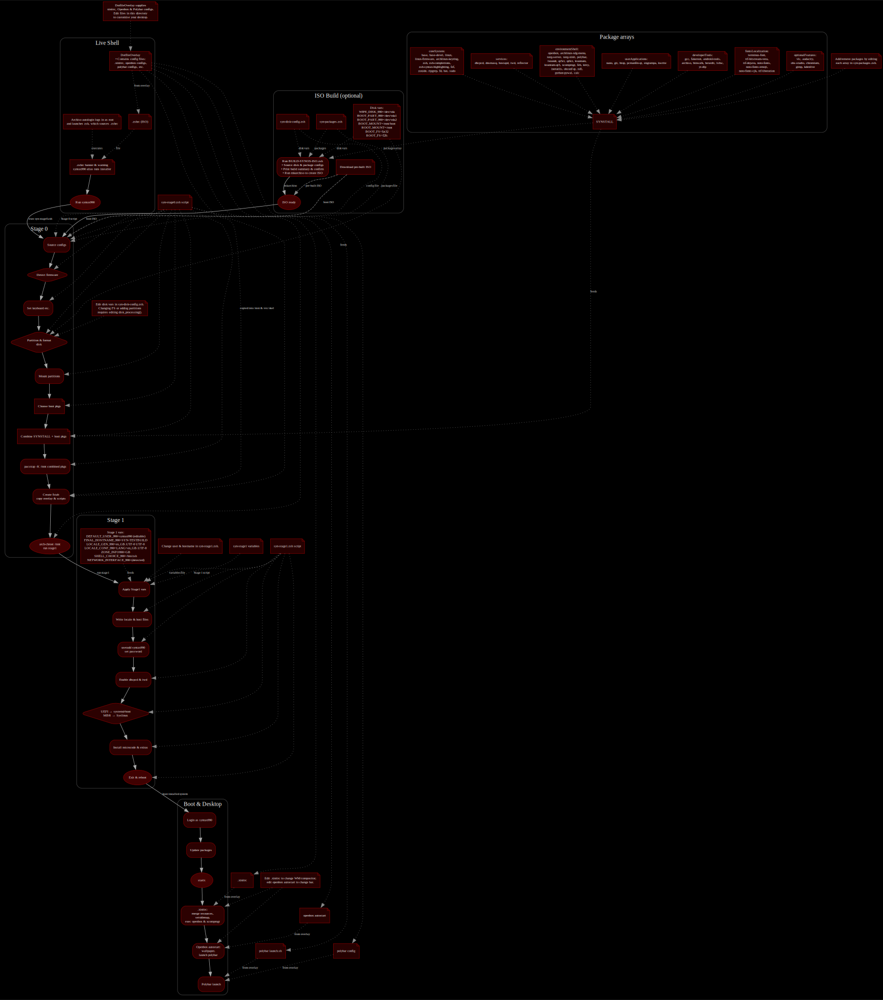

# SYN-OS

**SYN-OS** is a highly customizable Arch Linux–based operating system by **William Hayward-Holland** (*Syntax990*).

It combines Arch’s minimal base with curated build scripts, dotfiles, and custom theming to deliver a streamlined and efficient environment.

SYN-OS is designed for those who want:
- **Full control** over packages, themes, and configurations.
- **Terminal-first efficiency** with optional GUI via Openbox.
- **A ready-to-use base** that’s still true to Arch principles.

> **Note:** The live installer runs entirely in a command-line (CLI) environment. You can install SYN-OS on real hardware or test it first in a virtual machine (VirtualBox, VMware, QEMU, etc.) before committing. Once installed, you can launch the graphical desktop with `startx`, which opens a lightweight **Openbox** session with a **Polybar** panel across the top. Polybar uses simple ini-style configuration, making it easy to adjust modules, colours and layout without touching XML.

---

## 🚀 Download & Quick Start

**Latest Release:**  
- **Name:** SYN-OS SYNTEX Edition (April 2025)  
- **File:** `SYN-OS_SYNTEX_2025-04.iso`  
- **Size:** ~0.9 GB  
- **Download:** [SYN-OS_SYNTEX_2025-04.iso](https://drive.google.com/file/d/1CcPMeKCBjdqz6OJCzm1JcLhxzKSHe7ra/view?usp=sharing)

**Older Releases:**
- [SYN-OS M-141 (Nov 2024)](https://drive.google.com/file/d/1oX-hyHrG4M2JqXwFH2p5DxjbFT656jWH/view?usp=sharing)  
- [ArchTech Corp. Edition (Jul 2024)](https://drive.google.com/file/d/1WRDf0JfCCNhYJJkFUXb3Xheb3YInys52/view?usp=sharing)  
- [VOLITION (Jun 2024)](https://drive.google.com/file/d/16ETNY4jlTK_UCGEwBxMTTFMn0Mf7rrTR/view?usp=sharing)  
- [Soam-Do-Huawei (May 2024)](https://drive.google.com/file/d/1bsa85uXRdrfxPydkVNI-oQnpGj4JmeQi/view?usp=sharing)  
- [Chronomorph (Feb 2024)](https://drive.google.com/file/d/142U6-w2CNOiL2jRPlHmfqcYTlEmTBXow/view?usp=drive_link)

---

### Create a Bootable USB

#### Linux
    lsblk                                   # Identify your USB device (e.g., /dev/sdX)
    sudo dd if=SYN-OS_SYNTEX_2025-04.iso of=/dev/sdX bs=4M status=progress oflag=sync
*(Replace `sdX` with your USB device — not a partition like `sdX1`.)*

#### macOS
    diskutil list
    diskutil unmountDisk /dev/diskN
    sudo dd if=SYN-OS_SYNTEX_2025-04.iso of=/dev/rdiskN bs=4m
    sync
    diskutil eject /dev/diskN
*(Replace `N` with your USB disk number.)*

#### Windows (Rufus)
1. Insert USB drive.  
2. Open [Rufus](https://rufus.ie/).  
3. Select device → choose ISO → set Partition Scheme:  
   - GPT for UEFI systems  
   - MBR for legacy BIOS  
4. Click **Start**.

---

### Boot & Install

1. Boot your system or VM from the prepared USB stick.  
2. Select **SYN-OS** in the boot menu.  
3. You’ll be dropped into the live installer — a clean command-line environment.  
4. *(Optional)* Edit install scripts before starting:  

        nano /root/syn-resources/scripts/syn-stage0.zsh
        nano /root/syn-resources/scripts/syn-stage1.zsh

5. Begin installation:

        syntax990

6. Follow prompts — the installer handles partitioning, packages, and bootloader automatically.

---

### First Boot After Install

- Remove USB and reboot.  
- Log in with the credentials you set during install.  
- Start the graphical environment:

        startx

- This opens **Openbox** with a **Polybar** top panel — a clean, lightweight desktop ready to customise.  

- Polybar's configuration is ini-like and allows quick changes to modules, colours, fonts and layout.

<!-- The original Tint2 panel screenshot has been removed because SYN‑OS now ships with Polybar instead. -->

---

## 📦 Package Collection

Packages in SYN-OS are put into arrays within the installation scripts, grouped by their purpose for logical clarity.

| **Category**              | **Description**                                              | **Packages**                                                                                                                                                        |
|---------------------------|--------------------------------------------------------------|---------------------------------------------------------------------------------------------------------------------------------------------------------------------|
| **Core System**           | Essential for booting and running the OS                    | base, linux, linux-firmware, archlinux-keyring, sudo, zsh, gcc, fakeroot, dosfstools, pacman-contrib                                                                |
| **Services**              | Networking and system-level services                        | dhcpcd, dnsmasq, hostapd, iwd, reflector                                                                                                                            |
| **Environment & Shell**   | Graphical and terminal interface packages                   | openbox, xorg-server, xorg-xinit, qt5ct, qt6ct, kvantum, kvantum-qt5, kvantum-qt6, polybar, lxrandr, xcompmgr, feh, kitty, archlinux-xdg-menu, adw-gtk3, papirus-icon-theme, bibata-cursor-theme, obconf-qt, zenity, flatpak                                                                  |
| **User Applications**     | Tools and utilities for daily use                           | nano, git, htop, pcmanfm-qt, engrampa, kwrite                                                                                                                       |
| **Developer Tools**       | Software development and power-user utilities               | gcc, fakeroot, android-tools, archiso, binwalk, hexedit, lshw, yt-dlp                                                                                               |
| **Fonts & Localization**  | Fonts and language support for broader compatibility        | terminus-font, ttf-bitstream-vera, ttf-dejavu, noto-fonts, noto-fonts-emoji, noto-fonts-cjk, ttf-liberation                                                         |
| **Optional Features**     | Multimedia and additional applications for extended use     | vlc, audacity, obs-studio, chromium, gimp, kdenlive                                                                                                                 |

---

## 💡 Philosophy

SYN-OS is not just “Arch with a desktop preinstalled.” You could do that in an afternoon, but you’d miss the insight, control, and hands-on wiring that comes from building your environment piece by piece.

Think of it like the alien tech in *District 9* - parts scavenged, rewired, and assembled into something uniquely functional. Every script, array, and configuration is chosen to fit together with intention, but you can rip it apart, swap components, and make it entirely your own.

Key principles:
1. **Barebones**  
   Starts as close to the metal as possible — no excess services, no bloated DEs, no assumptions. You build from the ground up.

2. **Modular**  
   Everything is organized into logical arrays and overlay directories. Want to swap a window manager, remove a service, or change the panel? It’s a matter of editing a few lines, not unpicking tangled dependencies.

3. **Transparent**  
   All installation logic is in plain, readable shell scripts. You see *every* command that touches your system.

4. **Terminal-First Workflow**  
   SYN-OS boots to TTY for speed and control. The GUI is there when you want it, but never in the way.

5. **User Empowerment**  
   You don’t just get an OS — you learn *why* it’s set up the way it is, and how to change it. The system never hides its wiring.

6. **Creative Freedom**  
   The included Openbox + Polybar environment is just a starter kit — a functional skeleton. From there, you can morph it into a minimal command centre or layer on full desktop environments without losing the modular backbone.

---

## 🛠 Building Your Own ISO

SYN-OS is built using **ArchISO**, the official Arch Linux live environment creation tool. At its core, SYN-OS is simply an **ArchISO profile** — a collection of package lists, configurations, and overlays that tell ArchISO how to assemble the final image.

If you:
- Test and adjust the install scripts,
- Remove or replace packages in the profile arrays,
- Update `/root/syn-resources/DotFileOverlay` and `/etc/skel` with your own configurations,

…then run the included build script:

    ./BUILD-SYNOS-ISO.zsh

You can produce a completely fresh ISO image — your own operating system — from scratch.

If you replace every reference to “SYN-OS” in the scripts, boot themes, and documentation, you don’t even need to credit me. That’s the power and freedom of this design. I will never make this commercial because SYN-OS is not a “product” or “service” — it’s a teaching tool. It’s about **axiomatic consciousness** and **process over product**: understanding the principles, not just consuming a pre-built environment.

---

### Why This Matters

When you build your own ISO this way, you gain something you can’t get from simply “installing a DE on vanilla Arch.” You see the wiring — the package choices, the configuration hierarchy, the build order. You’re not just putting a desktop on top of a base; you’re constructing the base itself, deciding *what exists at all* in your environment.

The value isn’t just in “learning Linux” or feeling clever. The real goal is that *ah-ha* moment where you see that this is **your platform**. Not mine. Not Arch’s. Not some company’s. Yours.

That insight changes how you look at every piece of software you touch. You stop thinking like a “user” and start thinking like a *maintainer*. You develop the muscle memory of that old-school, event-driven 90s dev style — test something, iterate, test again, no bloat, no magic black boxes, just you and the system evolving together.

---

### What You Can Do With This

Once you’ve grasped this workflow, SYN-OS becomes a springboard for *serious* projects as well as creative experimentation:

- **Bare-metal minimalism** — a stripped system with only the tools you *actually* need.  
- **Your own distro** — rebrand, reshape, and ship your own ArchISO-based OS.  
- **Critical systems** — create a rock-solid base for specialized tasks like robotics, drone control, industrial monitoring, or embedded hardware interfaces.  
- **Custom POS & UX platforms** — build point-of-sale systems, kiosks, or control dashboards where the *entire* UI/UX is yours to design from scratch.  
- **A personal server OS** — repurpose the same modular system to run as a secure, maintainable backend.  
- **Multi-environment host** — one system image hosting multiple custom environments for work, play, or development.  
- **A permanent escape hatch** — build your own OS pipeline and you’ll never be trapped by commercial, proprietary, or infohazard software again.  
- **A creative sandbox** — experiment without fear. If it breaks, rebuild in minutes.

The beauty of this approach is that SYN-OS gives you the *barebones control layer*, but the personality — the UI, the interaction model, the experience — is entirely on you. That’s the art.

A drone controller, a music performance workstation, a touchscreen kiosk, or a hacker’s terminal — all of these could share the exact same modular base. The difference is the *vision* you layer on top.

This isn’t just about *using* Arch — it’s about *owning* Arch, bending it to your will, and having the confidence to know you could rebuild the same environment from nothing at any time. That’s real freedom.

And if you get it right, you’ll never look at an operating system the same way again.

## 📜 License

SYN-OS is licensed under the **MIT License**. See the [LICENSE](LICENSE) file for more details.

## Project history and installer evolution

SYN‑OS grew out of an experimental project named **SYN‑RTOS**, which used simple shell scripts to bootstrap an Arch Linux system with a custom set of packages and dotfiles.  Over time, lessons from those early installers shaped the modular architecture and user experience found in modern SYN‑OS releases.

### Release timeline

| Release | Date / version | Key focus |
| --- | --- | --- |
| SYN‑RTOS | V1–V3 | Two‑script installer; manual partition variables; long package list; copied root overlay by hand. |
| SYN‑OS V4 | 2023–2024 | First modular build with separate shell components; clearer directory structure; early `syn-stage0.sh` script. |
| Chronomorph | Feb 2024 | Initial named release; refined V4 installer; minimal GUI via Openbox and Tint2. |
| Soam‑Do‑Huawei | May 2024 | Incremental improvements to scripts and package selection. |
| VOLITION | Jun 2024 | Further refinement of build process and default theme. |
| ArchTech Corp. | Jul 2024 | Corporate‑oriented customization with additional utilities. |
| M‑141 | Nov 2024 | Polished release ahead of the canonical edition; improved documentation. |
| SYNTEX Edition | Apr 2025 | Latest edition; runs under zsh; modular installer; dynamic UEFI/MBR detection; Openbox + Polybar by default. |

### How and why the installer changed

The **syn‑stage0** script is at the heart of SYN‑OS’s installation process.  Its evolution reflects a shift from quick experiments toward maintainability, clarity and user safety.

| Aspect | Early `syn-stage0.sh` | Modern `syn-stage0.zsh` |
| --- | --- | --- |
| Interpreter | `/bin/sh` | `/bin/zsh` with better scripting features |
| Structure | Linear script with global variables | Modular functions (`syn_os_environment_prep`, `disk_processing`, `pacstrap_sync`, etc.) |
| Boot mode | Assumed GPT / UEFI only | Detects UEFI vs MBR and branches accordingly |
| Package lists | Single long string (`SYNSTALL`) | Arrays grouped by purpose (core system, services, environment, user applications, developer tools, fonts, optional extras) |
| User prompts | Hard‑coded `read -p` confirmations | ASCII art warnings, coloured output and controlled confirmation logic |
| Dotfiles & scripts | Copied `/root/SYN-OS-V4/root_overlay` and separate `syn-stage1.sh` | Copies curated dotfiles from `/root/syn-resources/DotfileOverlay` and unified stage scripts (`syn-stage0.zsh`, `syn-stage1.zsh`) |
| Error handling | Minimal checks, simple exit on failure | Centralised `check_success` function after every critical command |
| Motivation for change | Fast prototype to get a custom Arch system running | Maintainability, safety, easier customisation; make it obvious how to adjust package arrays or replace components |

### Rationale

Early scripts were written quickly to automate William Hayward-Holland’s personal installation process.  As more people expressed interest in building their own versions of SYN‑OS, the need for a cleaner and safer installer became clear.  Switching to zsh allowed the use of associative arrays and other features that simplify complex scripts.  Breaking the process into functions made it easier to test and modify one piece without disturbing the rest.  Detecting the boot environment (UEFI vs MBR) removed hard‑coded assumptions that could brick a system.  Grouping packages into arrays lets users add or remove categories (developer tools, optional extras) with a single edit instead of parsing a monolithic string.  Finally, copying dotfiles and scripts from clearly named overlay directories encourages users to personalise the system without digging through obscure paths.

These changes reflect the project’s philosophy: **teaching by example**.  A well‑structured installer shows how to assemble a distribution from ArchISO building blocks, while still leaving the door open for experimentation.  The history of `syn-stage0` captures that journey from a hobbyist script to a robust, modular tool that invites hacking and learning.

---
[Click to view vector map of SYN-OS structure](https://raw.githubusercontent.com/syn990/SYN-OS/078920fac9381bd52b37b4c975daf4ddea8b4cc2/SYN-OS/Graphviz/SYN-OS.svg)  

