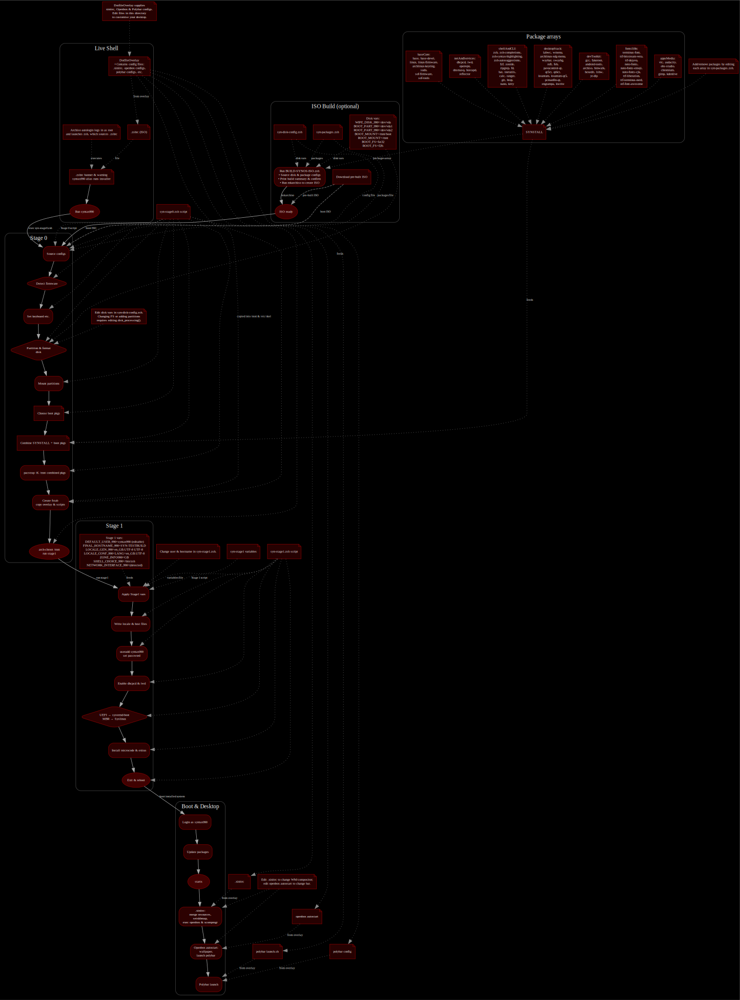

# SYN-OS


**SYN-OS** is a highly customizable Arch Linux–based operating system by **William Hayward-Holland** (*Syntax990*).

It combines Arch’s minimal base with curated build scripts, dotfiles, and system overlays to deliver a clean, modular environment with full user control.

SYN-OS is designed for those who want:
- **Complete control** over packages, configs, and theming.
- **A terminal-first workflow**, with an optional lightweight Wayland session.
- **A transparent base system**, staying fully aligned with Arch principles.

> **Note:** The live installer runs entirely in a command-line (CLI) environment. Once installed, you may launch the graphical session using **LabWC**, a lightweight Wayland window manager that provides a simple Openbox‑like workflow with modern Wayland support.  
> The included **Waybar** panel uses JSON + CSS for straightforward module, layout, and theme customization.


## Download & Quick Start

**Latest Release:**  
- **Name:** SYN-OS AEGIS
- **Size:** ~1.1 GB  [SYN-OS AEGIS (LATE-FEB 2026).iso](https://drive.google.com/file/d/13CowFj1Pwo4XzBRVkGT-cBjKuVWJ50cW/view?usp=sharing)
- **Download:** 

**Older Releases:**
- [SYN-OS SYNAPTICS (EARLY-FEB 2026).iso](https://drive.google.com/file/d/13CowFj1Pwo4XzBRVkGT-cBjKuVWJ50cW/view?usp=sharing)
- [SYN-OS XENITH (JAN 2026).iso](https://drive.google.com/file/d/1bbKsw2FQ7d2Pb8Os1lwERGEyG5j3pnpg/view?usp=sharing)
- [SYN-OS SYNTEX (April 2025).iso](https://drive.google.com/file/d/1CcPMeKCBjdqz6OJCzm1JcLhxzKSHe7ra/view?usp=sharing)
- [SYN-OS M-141 (Nov 2024)](https://drive.google.com/file/d/1oX-hyHrG4M2JqXwFH2p5DxjbFT656jWH/view?usp=sharing)  
- [ArchTech Corp. Edition (Jul 2024)](https://drive.google.com/file/d/1WRDf0JfCCNhYJJkFUXb3Xheb3YInys52/view?usp=sharing)  
- [VOLITION (Jun 2024)](https://drive.google.com/file/d/16ETNY4jlTK_UCGEwBxMTTFMn0Mf7rrTR/view?usp=sharing)  
- [Soam-Do-Huawei (May 2024)](https://drive.google.com/file/d/1bsa85uXRdrfxPydkVNI-oQnpGj4JmeQi/view?usp=sharing)  
- [Chronomorph (Feb 2024)](https://drive.google.com/file/d/142U6-w2CNOiL2jRPlHmfqcYTlEmTBXow/view?usp=drive_link)

---

### Create a Bootable USB

#### Linux
    lsblk                                   # Identify your USB device (e.g., /dev/sdX)
    sudo dd if=SYN-OS_SYNTEX_2025-04.iso of=/dev/sdX bs=4M status=progress oflag=sync
*(Replace `sdX` with your USB device — not a partition like `sdX1`.)*

#### macOS
    diskutil list
    diskutil unmountDisk /dev/diskN
    sudo dd if=SYN-OS_SYNTEX_2025-04.iso of=/dev/rdiskN bs=4m
    sync
    diskutil eject /dev/diskN
*(Replace `N` with your USB disk number.)*

#### Windows (Rufus)
1. Insert USB drive.  
2. Open [Rufus](https://rufus.ie/).  
3. Select device → choose ISO → set Partition Scheme:  
   - GPT for UEFI systems  
   - MBR for legacy BIOS  
4. Click **Start**.

---
### Boot & Install

1. Boot your system or VM from the prepared USB stick.  
2. Select **SYN‑OS** in the boot menu.  
3. The live environment loads into a clean shell.  
4. *(Optional)* You may inspect or modify the installer configuration before beginning:

        nano /etc/syn-os/synos.conf

   The installer scripts themselves are in `/usr/lib/syn-os/` if you need to check them.

5. Start the installer:

        syntax990

6. Follow the prompts. Stage 0 and Stage 1 will handle:  
   - disk partitioning  
   - filesystem creation  
   - package installation  
   - overlay merging  
   - bootloader configuration  

---

### First Boot After Install

- Remove the USB stick and reboot.  
- Log in with the user account you created during installation.  
- To start the graphical session:

        synos

This launches the default **LabWC** Wayland session, configured with:

- **Waybar** as the top panel (JSON modules + CSS styling)  
- **Swaybg** for background handling  
- **archlinux-xdg-menu** integration for dynamic application menus  
- A minimal, clean environment designed to be extended by the user


### About the Desktop Configuration

**Waybar**  
- Configured via `~/.config/waybar/config.jsonc`  
- Styled using `~/.config/waybar/style.css`  
- Modules, spacing, colour schemes, and fonts can be modified easily

**LabWC**  
- Uses Openbox-style XML syntax  
- Key files:

```
~/.config/labwc/rc.xml       # keybindings, window behaviour, placement rules
~/.config/labwc/menu.xml     # menu definition (includes archlinux-xdg-menu)
~/.config/labwc/environment  # session-wide environment variables
```

LabWC’s menu system can incorporate automatically generated XDG menus from:

```
/etc/xdg/menus/archlinux-applications.menu
```

This keeps the application list synced with installed packages, without maintaining menu items manually.

---

# **Package Collection**

Packages in SYN‑OS are grouped into logical arrays inside the installation scripts.  
These metas define the entire installed system footprint.

| **Category**                           | **Description**                                                                   | **Packages**                                                                                                                                       |
| -------------------------------------- | --------------------------------------------------------------------------------- | -------------------------------------------------------------------------------------------------------------------------------------------------- |
| **1. Base Core**                       | Essential Arch Linux base system, kernel, firmware, and mandatory core components | base, base-devel, linux, linux-firmware, archlinux-keyring, sudo, sof-firmware, sof-tools                                                          |
| **2. Networking & Services**           | Networking stack, DHCP/DNS, Wi‑Fi, VPN, mirror refresh                            | dhcpcd, iwd, openvpn, dnsmasq, hostapd, reflector                                                                                                  |
| **3. Shell & CLI**                     | Shell environment, completions, fuzzy finders, improved CLI tools, core userland  | zsh, zsh-completions, zsh-syntax-highlighting, zsh-autosuggestions, fzf, zoxide, ripgrep, fd, bat, inetutils, calc, ranger, git, btop, nano, foot  |
| **4. Desktop Stack**                   | Wayland-based desktop, panel, menus, theming layer, GUI essentials                | labwc, wmenu, archlinux-xdg-menu, waybar, swaybg, rofi, feh, pavucontrol-qt, qt5ct, qt6ct, kvantum, kvantum-qt5, pcmanfm-qt, engrampa, kwrite      |
| **5. Developer Toolkit**               | Build chain, firmware analysis, ISO tools, hardware inspection                    | gcc, fakeroot, android-tools, archiso, binwalk, hexedit, lshw, yt-dlp                                                                              |
| **6. Fonts & Internationalisation**    | Console font, UI fonts, emoji, multilingual sets, Nerd Fonts, icon fonts          | terminus-font, ttf-bitstream-vera, ttf-dejavu, noto-fonts, noto-fonts-emoji, noto-fonts-cjk, ttf-liberation, ttf-terminus-nerd, otf-font-awesome   |
| **7. Applications (Media & Creative)** | Media playback, content creation, web browser                                     | vlc, audacity, obs-studio, chromium, gimp, kdenlive                                                                                                |


## Philosophy

SYN‑OS is built to be a transparent and predictable system. All behaviour is defined by:
- **Shell scripts** (orchestrators + modular strategy functions)  
- **Package arrays** (category-based, reusable, documented)  
- **Staged overlay directories** (dotfiles, configs, themes)  
- **Declarative config** (synos.conf selects which strategies to run)  

Nothing is hidden behind wrappers or helpers — every file that ends up on the final system exists in this repository and is copied or generated during installation.

The goal is not to automate Arch installation for convenience, but to provide a **clean, modular, strategy-driven framework** where:
- Every component is inspectable and replaceable  
- New features can be added as isolated strategy functions  
- Changes are declarative (edit `synos.conf`, not imperative script logic)  
- The installer is easy to reason about and extend for your own OS variant

---

### System Overview

#### ISO Environment
Booting the SYN‑OS ISO loads a minimal live system containing the `syntax990` command. Running it begins the installer and triggers the two‑stage setup.

---

### Stage 0 — Pre‑Chroot Setup (Orchestrator + Modular Strategies)
Executed directly from the live environment.

**Purpose:**  
Prepare the disk, create the target filesystem, install base packages, and assemble the new system structure — all via modular, reusable strategy functions.

**Architecture:**  
Stage 0 is now a thin **orchestrator** that calls specialized strategy scripts in sequence. Strategy selection is declarative via `synos.conf`:

```zsh
PartitionStrat="uefi-bootctl"  # or mbr-syslinux
VolumeStrat="luks-lvm"         # or luks-only, lvm-only, plain
FilesystemStrat="f2fs"          # or ext4, btrfs, xfs
BootloaderStrat="auto"          # or systemd-boot, syslinux, grub
```

**Modular Strategy Scripts:**
- `syn-partition.zsh` — Partition strategies (UEFI/GPT, MBR/MSDOS)  
- `syn-volume.zsh` — Volume strategies (LUKS+LVM, LUKS-only, LVM-only, plain)  
- `syn-filesystem.zsh` — Filesystem strategies (ext4, f2fs, btrfs, xfs)  
- `syn-mount.zsh` — Mount orchestration  
- `syn-pacstrap.zsh` — Base install + state handoff  
- `syn-packages.zsh` — Category‑based package arrays  

**Main actions:**
1. Load `synos.conf` and validate all strategy selections  
2. Execute partition strategy (GPT or MSDOS)  
3. Execute volume strategy (LUKS/LVM combinations)  
4. Execute filesystem strategy (format root + swap)  
5. Execute mount strategy (mount root, boot, swap)  
6. Execute pacstrap strategy (install, genfstab, copy scripts, persist state)  
7. Enter `arch-chroot` to Stage 1  

**Why Strategies Matter:**  
Each strategy function is independent and testable. Adding a new storage layout (e.g., ZFS, Btrfs subvolumes) requires only a new function in `syn-volume.zsh`. No monolithic refactoring needed.

---

### Stage 1 — In‑Chroot Configuration
Stage 1 performs all configuration inside the target filesystem, using the persisted state from Stage 0.

**Main actions:**
- Creating users and assigning shells  
- Applying user dotfile overlays from `DotfileOverlay/` into the user environment  
- Configuring mkinitcpio HOOKS (dynamically selected based on `PartitionStrat` + `VolumeStrat`)  
- Enabling services  
- Applying localisation (locale, console, timezone)  
- Deploying desktop environment components (LabWC, waybar, swaybg, QT settings, etc.)  
- Installing and configuring bootloader (systemd-boot for UEFI, syslinux for BIOS; LUKS/LVM kernel params auto-applied)  
- Final cleanup

---


#### **(A) airootfs/**
This is the **ISO’s live system**:  
- `/etc`, `/usr`, `/root`, systemd units  
- installer scripts  
- networking and SSH defaults  
- mirror selection service  
- temporary runtime only

#### **(B) DotfileOverlay/**
This is the **installed system’s defaults**:  
- `/etc/skel/.config/*`  
- LabWC config  
- Waybar modules + CSS  
- Foot, Qt5ct, Ranger configs  
- themes added under `/usr/share/themes`  

These are merged by Stage 1 into the target system’s filesystem.


This structure ensures that:
- Every file placed on the final system is visible in the repo  
- No configuration is generated implicitly  
- Overlays remain modular and easy to replace  
- Packages and logic stay separated and readable  

### Summary

SYN‑OS is not a “preconfigured Arch distro.”  
It is a **script‑driven system builder** with a clear directory structure, consistent staging process, and modular overlays. Boot the ISO, run `syntax990`, and the system is built exactly from what you see in this repository — no hidden steps, no opaque tooling, no surprises.
## Building Your Own ISO

SYN‑OS includes everything required to rebuild the entire operating system image from source.  
If you have **Arch Linux**, **Arch‑based distros**, or even **SYN‑OS itself**, you can create a fresh ISO locally.

This is possible because the repository *is* a complete **ArchISO profile** containing:

- package arrays (`syn-packages.zsh`)  
- stage scripts (`syn-stage0.zsh`, `syn-stage1.zsh`)  
- filesystem overlays (`overlays/`)  
- user dotfile templates (`DotfileOverlay/skel/`)  
- boot configuration  
- airootfs defaults  

---

### 1. Install Prerequisites

On Arch or any derivative:

```zsh
sudo pacman -S archiso git
```

---

### 2. Clone the SYN‑OS Repository

```zsh
git clone https://github.com/syn990/SYN-OS.git
cd SYN-OS
```

This directory contains the full ISO profile used to generate official releases.

---

### 3. (Optional) Make Changes Before Building

You can adjust anything inside the repo to make the ISO “your own OS”:

**Modify packages:**

```
syn-packages.zsh
```

**Customize installer strategies:**

```
synos.conf                                   # Select PartitionStrat, VolumeStrat, etc.
syn-partition.zsh, syn-volume.zsh, etc.      # Add or modify strategy functions
```

**Edit installer behaviour:**

```
syn-stage0.zsh                               # Thin orchestrator; usually unchanged
syn-stage1.zsh                               # Bootloader, users, services, overlays
```

**Change default configs / dotfiles / desktop layout:**

```
DotfileOverlay/skel/.config/*                (LabWC, Waybar, Foot, Qt5ct, etc.)
DotfileOverlay/etc/*                         (system configs)
syn-resources/*                              (menus, scripts, assets)
```

**Example: Add a new volume strategy (e.g., ZFS):**

Simply add a function to `syn-volume.zsh`:

```zsh
volumeStrat_zfs() {
  # Your ZFS setup logic here
  ...
}
```

Then select it in `synos.conf`:

```zsh
VolumeStrat="zfs"
```

Everything copied into the final system is visible and editable right here.

---

### 4. Build the ISO

Simply run:

```zsh
sudo zsh ./BUILD-SYNOS-ISO.zsh
```

The script will:

1. Validate prerequisites  
2. Generate an ArchISO working directory  
3. Copy the profile structure into `work/`  
4. Build a full **airootfs** from the package arrays  
5. Inject overlays and dotfiles  
6. Apply bootloader configuration  
7. Produce a complete ISO under:

```
out/
 └── syn-os-<date>.iso
```

This ISO is functionally identical to official releases.

---

### 5. Use Your Custom ISO

- Flash it to USB (dd / Rufus / Ventoy / BalenaEtcher)  
- Boot into the live environment  
- Run the installer:

```zsh
syntax990
```

The system you install will reflect **all modifications you made** in the repo —  
packages, defaults, dotfiles, LabWC layout, Waybar configuration, everything.

---

### Why This Matters

Many users eventually want to:
- rebuild SYN‑OS with different packages  
- change LabWC or Waybar defaults  
- remove certain services  
- replace themes or fonts  
- add custom scripts  
- use SYN‑OS as a base for their own distro / spin  

This build system is intentionally simple, modular, and transparent so anyone can remaster it with minimal effort and full visibility.

If you can edit a directory, you can change the OS.
## License

SYN-OS is licensed under the **MIT License**. See the [LICENSE](LICENSE) file for more details.


## Project History and Installer Evolution

SYN‑OS began as an experimental bootstrap project called **SYN‑RTOS**, built around a pair of simple shell scripts that installed Arch Linux with custom packages and dotfiles. Over time, the system matured into a modular, structured installer with staged execution, overlay directories, and a defined ArchISO profile. Each release refined the build process, dotfile strategy, and installation logic.

### Release Timeline

| Release | Date / Version | Key Focus |
|--------|-----------------|-----------|
| **SYN‑RTOS (V1–V3)** | 2018–2022 | Prototype two‑script installer; manual partition definitions; long monolithic package list; root overlay copied by hand. |
| **SYN‑OS V4** | 2023–2024 | First modular installer layout; separated shell components; clearer directory structure; early `syn-stage0.sh`. |
| **Chronomorph** | Feb 2024 | First named release; refined V4 installer; lightweight GUI using Openbox + Tint2. |
| **Soam‑Do‑Huawei** | May 2024 | Incremental script improvements; adjusted package selection. |
| **VOLITION** | Jun 2024 | Further refinement of scripts, theming, and overall stability. |
| **ArchTech Corp. Edition** | Jul 2024 | Corporate-oriented customisations; issues with pacman integration and dotfile drift identified. |
| **M‑141** | Nov 2024 | Pre‑canonical release; improved documentation and general polish. |
| **SYNTEX** | Apr 2025 | Removal of AI‑generated code; return to minimal, intentional installer logic. |
| **XENITH** | Jan 2026 | Start of the transition away from X11; Openbox + Polybar deprecated. Experimental Wayland groundwork. |
| **SYNAPTICS** | Early Feb 2026 | Comprehensive overhaul; full Wayland integration; LabWC default session; legacy Openbox themes maintained for compatibility. |
| **AEGIS** | Late Feb 2026 | Defensive architecture release; modular storage strategies formalised; installer pipeline hardened; encryption integrated as a first-class workflow. |

---

### Installer Evolution

The **`syn-stage0`** script is the core of the installation pipeline. Its evolution reflects the shift from experimental scripts to a maintainable, transparent, and predictable system builder.

| Aspect | Early `syn-stage0.sh` | Modern `syn-stage0.zsh` |
|--------|------------------------|--------------------------|
| **Interpreter** | `/bin/sh` | `/bin/zsh` for better syntax and features |
| **Structure** | Single linear script using global variables | Modular functions (`syn_os_environment_prep`, `disk_processing`, `pacstrap_sync`, etc.) |
| **Boot Mode Handling** | Hard‑coded for UEFI/GPT only | Automatically detects UEFI vs MBR and branches safely |
| **Package Handling** | One long string (`SYNSTALL`) | Arrays grouped by purpose (core, services, environment, user apps, dev tools, fonts, optional) |
| **User Prompts** | Basic `read -p` confirmations | Controlled confirmation logic, colourised warnings, structured messaging |
| **Dotfiles & Scripts** | Manual copy of `root_overlay` and separate stage scripts | Uses `DotfileOverlay/` directory; unified stage scripts packaged inside airootfs |
| **Error Handling** | Minimal checks; script terminated on failure | Centralised `check_success` after each critical action |
| **Motivation for Change** | Rapid prototype to create a customised Arch install | Maintainability, safety, clarity; easy replacement or extension of components |

### Rationale

Breaking the process into functions made it easier to test and modify one piece without disturbing the rest.  Detecting the boot environment (UEFI vs MBR) removed hard‑coded assumptions that could brick a system.  Grouping packages into arrays lets users add or remove categories (developer tools, optional extras) with a single edit instead of parsing a monolithic string.  Finally, copying dotfiles and scripts from clearly named overlay directories encourages users to personalise the system without digging through obscure paths.

---
[Right-Click to view vector map of SYN-OS structure]




# SYN‑OS ARCHIVAL EDITIONS
These editions represent canonical snapshots of earlier SYN‑OS architectures.  
They are reconstructed states that reflect how each era behaved in practice,  
not how the Git history recorded it.

---

# 0.9 — Unified Boot Path Edition

**Directory:** `archives/0.9-unified-boot-path-edition/`  
**Era:** First coherent installer; EFI/MBR awareness; early polybar; maturing structure.

## Layout
```

Edition-0.9/
├─ syn-stage0.sh
├─ syn-stage1.sh
├─ Overlays/
│   ├─ root/
│   └─ etc/
├─ Dotfiles/
│   ├─ openbox/
│   ├─ tint2/
│   ├─ polybar/
│   └─ theme-old/
├─ Packages/
│   ├─ base.lst
│   ├─ services.lst
│   └─ gui.lst
└─ README-0.9.md

```

## Key Traits
- `/bin/sh` interpreter  
- EFI vs MBR detection with simple directory checks  
- `SYNSTALL` still a giant single string  
- No arrays yet  
- Early polybar experiments  
- Tint2/Openbox hybrid environment  
- Bootloader logic finally stable  

---

# 0.7 — Variable Storm Edition

**Directory:** `archives/0.7-variable-storm-edition/`  
**Era:** Explosion of globals; duplicated scripts; rolling-release chaos.

## Layout
```

Edition-0.7/
├─ syn-stage0.zsh
├─ syn-stage1.zsh
├─ syn-packages.zsh/
├─ root_overlay/
├─ gui-experiments/
└─ README-0.7.md

```

## Key Traits
- Multiple variable files  
- No consistent naming or grouping  
- Early attempts at modularity  
- Several abandoned GUI experiments  
- Accidental logic regressions common  
- Dotfiles drifting between commits  

---

# 0.4 — ISO‑Genesis Edition

**Directory:** `archives/0.4-iso-genesis-edition/`  
**Era:** First self-built ISO; installer packaged into the live environment.

## Layout
```

Edition-0.4/
├─ archiso/
│   ├─ profiledef.sh
│   ├─ airootfs/
│   │   ├─ root/
│   │   └─ etc/
├─ syn-stage0.sh
├─ syn-stage1.sh
└─ README-0.4.md

```

## Key Traits
- ArchISO profile created manually  
- Git finally included in ISO  
- Stage0/Stage1 shipped together  
- Minimal theming  
- Linear bootloader logic  
- First time SYN‑OS felt like "a distro"  

---

# 0.1 — Stage0 Text‑Loader Edition

**Directory:** `archives/0.1-text-loader-edition/`  
**Era:** Installer run from vanilla Arch ISO, fetching scripts manually.

## Layout
```

0.1/
├─ stage0.sh
├─ stage1.sh
└─ README-0.1.md

```

## Key Traits
- `pacman -Sy git` just to fetch scripts  
- Two-script installer  
- No variables  
- Hardcoded partitions  
- No theming  
- Primitive filesystem copying  
- Install completed in minutes with zero safety checks  

---

# Notes
These reconstructed editions document the *evolution* of SYN‑OS,  
not a literal commit-by-commit timeline.  
They serve as reference models for how each stage of the project functioned.

