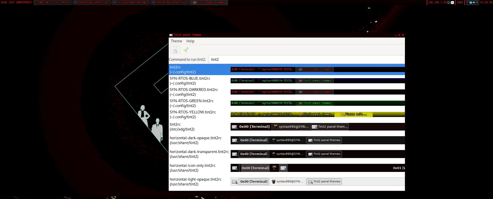

# SYN-OS


**SYN-OS** is a highly customizable Arch Linux-based operating system crafted by William Hayward-Holland (Syntax990). It leverages a collection of build scripts, dotfiles, and custom theming to provide a streamlined, efficient, and personalized computing experience. With a focus on modularity and user control, SYN-OS bridges the gap between the minimalism of vanilla Arch and a functional desktop environment.

---

## Table of Contents

- [Key Features](#key-features)
- [Installation Overview](#installation-overview)
- [Package Collection](#package-collection)
  - [Package Categories](#package-categories)
- [Customization and Theming](#customization-and-theming)
  - [Dotfiles and Configuration](#dotfiles-and-configuration)
  - [Openbox Window Manager](#openbox-window-manager)
  - [Tint2 Panel](#tint2-panel)
  - [xinitrc and Startup Scripts](#xinitrc-and-startup-scripts)
- [System Architecture](#system-architecture)
- [Target Audience](#target-audience)
- [Development Status](#development-status)
- [Getting Started](#getting-started)
  - [Downloading the ISO](#downloading-the-iso)
  - [Creating a Bootable USB Drive](#creating-a-bootable-usb-drive)
    - [Mac Users](#mac-users)
    - [Windows Users](#windows-users)
  - [Booting into the SYN-OS Live Environment](#booting-into-the-syn-os-live-environment)
  - [Running the Installation](#running-the-installation)
  - [Post-Installation](#post-installation)
- [Contributing](#contributing)
- [License](#license)
- [Support](#support)

---

## Key Features

- **Modular Package Collection**: Carefully curated packages categorized for logical system components.
- **Custom Dotfiles and Theming**: Pre-configured settings and themes for an out-of-the-box personalized experience.
- **Two-Stage Installation Process**: Automated scripts that streamline setup.
- **Terminal-Centric Design**: Starts in a terminal environment by default, emphasizing efficiency.
- **Flexible GUI Options**:
  - Transition to X session via `startx`.
  - Customized Openbox window manager with extensive theming.
  - Custom Tint2 panel with specialized menus.
- **Highly Customizable**: Easily modify variables, scripts, and configurations to tailor the system to your needs.
- **Root Overlay Feature**: Add custom files and configurations during installation for further personalization.

---

## Installation Overview

The SYN-OS installation is handled through a streamlined two-script process that automates system setup while allowing for customization:

1. **Stage 0 (`syn-stage0.zsh`)**:
   - Initiated with the command `syntax990` (an alias in `.zshrc` on the installation media).
   - Prepares the system by configuring disk partitions, setting up the environment, and installing packages.
   - Organizes packages into logical arrays for clarity and modularity.
   - Executes `arch-chroot` to enter the installation environment and automatically runs `syn-stage1.zsh` for the next stage.

2. **Stage 1 (`syn-stage1.zsh`)**:
   - Finalizes the installation within the chroot environment.
   - Contains user account variables that can be customized prior to execution, allowing for personalized setup.
   - Sets up users, installs the bootloader, and applies configurations.

**Note**: The MBR/UEFI boot process has been unified, so separate scripts for each boot method are no longer required. The installation scripts handle bootloader installation seamlessly.

---

### Customizing Installation Scripts

Before running `syntax990` to initiate the installation, you may want to customize certain settings in both `syn-stage0.zsh` and `syn-stage1.zsh` to fit your specific requirements, such as disk partitioning, package selection, and user account details.

#### Editing Stage 0 and Stage 1 Scripts

Both scripts are located in `/root/syn-resources/scripts/`. You can use `nano`, a simple command-line editor, to make these edits.

1. **Open the scripts** with `nano`:
   - For Stage 0:
     ```bash
     nano /root/syn-resources/scripts/syn-stage0.zsh
     ```
   - For Stage 1:
     ```bash
     nano /root/syn-resources/scripts/syn-stage1.zsh
     ```

2. **Edit Variables and Settings**:
   - In `syn-stage0.zsh`, you might adjust partitioning and package arrays.
   - In `syn-stage1.zsh`, you can set user account details and any other custom settings.

3. **Save Changes**:
   - After editing, press `CTRL + O`, then `Enter` to save.
   - Exit `nano` with `CTRL + X`.

Making these adjustments before running `syntax990` ensures that the installation process will be tailored to your environment and requirements.

---

## Package Collection

Packages are organized into arrays within the installation scripts, reflecting different system components for logical clarity.

### Package Categories

To enhance readability, the packages are presented in the following table format:

| **Category**              | **Description**                                  | **Packages**                                                                                                                                                        |
|---------------------------|--------------------------------------------------|---------------------------------------------------------------------------------------------------------------------------------------------------------------------|
| **Base Packages**         | Essential system components                      | `base`, `base-devel`, `linux`, `linux-firmware`, `archlinux-keyring`, `sudo`, `zsh`, `gcc`, `fakeroot`, `dosfstools`, `pacman-contrib`                              |
| **System Utilities**      | Fundamental system functionalities               | `alsa-utils`, `dhcpcd`, `dnsmasq`, `hostapd`, `iwd`, `pulseaudio`, `python-pyalsa`, `kbd`, `archlinux-xdg-menu`                                                      |
| **Control Center Apps**   | GUI tools for system settings                    | `lxrandr`, `obconf-qt`, `pavucontrol-qt`                                                                                                                            |
| **Window Manager & GUI**  | Graphical interface and window management        | `openbox`, `xorg-server`, `xorg-xinit`, `qt5ct`, `xcompmgr`, `tint2`                                                                                                |
| **CLI Tools**             | Command-line utilities                           | `git`, `htop`, `man`, `nano`, `reflector`, `rsync`, `wget`                                                                                                          |
| **GUI Applications**      | User-friendly applications                       | `engrampa`, `feh`, `kitty`, `kwrite`, `pcmanfm-qt`                                                                                                                  |
| **Fonts**                 | Visual appearance and compatibility              | `terminus-font`, `ttf-bitstream-vera`                                                                                                                               |
| **Additional CLI Tools**  | Extra command-line utilities for advanced users  | `android-tools`, `archiso`, `binwalk`, `brightnessctl`, `hdparm`, `hexedit`, `lshw`, `ranger`, `sshfs`, `yt-dlp`                                                    |
| **Additional GUI Apps**   | Enhanced functionality applications              | `audacity`, `chromium`, `gimp`, `kdenlive`, `obs-studio`, `openra`, `spectacle`, `vlc`                                                                              |
| **Bootloader Packages**   | Bootloader installation packages                 | `systemd-boot` (for UEFI systems), `syslinux` (for BIOS/MBR systems)                                                                                                |


---

## Customization and Theming

### Dotfiles and Configuration

SYN-OS comes with a comprehensive set of dotfiles located in the `DotfileOverlay` directory, providing pre-configured settings for:

- Shell environment (`.zshrc`, `.bashrc`)
- Editor configurations
- Application settings

These dotfiles are copied to the new system during installation, offering a consistent and personalized environment out-of-the-box.

### Openbox Window Manager

Openbox is customized extensively in SYN-OS, offering:

- **Custom Themes**: A selection of compiled themes to choose from.
- **Keybindings**: Pre-configured keyboard shortcuts for efficient navigation.
- **Menus**: Customized right-click menus for quick access to applications.


### Tint2 Panel

The Tint2 panel is tailored to enhance usability:

- **Custom Layout**: Adjusted panel size, position, and appearance.
- **Specialized Menus**: Quick access to system controls and applications.
- **Systray Integration**: Seamless integration with system notifications and indicators.



### xinitrc and Startup Scripts

The `~/.xinitrc` file is customized to:

- Launch Openbox with the preferred configurations.
- Start background services and applications.
- Provide an easy way to modify startup behavior.

---

## System Architecture

- **Core Base**: Built upon Arch Linux for simplicity and control.
- **Terminal-Focused**: Boots into a terminal (TTY) environment by default.
- **Optional GUI**: Start the graphical environment with `startx` when needed.
- **Modular Components**: Packages and configurations are organized logically for easy modification.

---

## Target Audience

SYN-OS is designed for users who desire:

- **Granular Control**: Deep customization options over their operating system.
- **Efficiency**: A minimal environment without unnecessary bloat.
- **Customization**: A template to build upon vanilla Arch with pre-configured options.
- **Learning Experience**: Insight into the build process and system configuration.

---

## Development Status

- **Active Development**: Ongoing improvements and updates.
- **Latest Release**: **SYN-OS-M-141** (November 2024)
- **Community Contributions**: Open to issues, feature requests, and pull requests.
- **Single Developer**: Primarily developed by William Hayward-Holland (Syntax990).

---

## Getting Started

### Downloading the ISO

- **Latest Version**: [SYN-OS-M-141 Edition (November 2024)](https://drive.google.com/file/d/1oX-hyHrG4M2JqXwFH2p5DxjbFT656jWH/view?usp=sharing)

Earlier versions:

- **[SYN-OS-ArchTech Corp. Edition JULY 2024](https://drive.google.com/file/d/1WRDf0JfCCNhYJJkFUXb3Xheb3YInys52/view?usp=sharing)**
- **[SYN-OS-VOLITION JUNE 2024](https://drive.google.com/file/d/16ETNY4jlTK_UCGEwBxMTTFMn0Mf7rrTR/view?usp=sharing)**
- **[SYN-OS-Soam-Do-Huawei MAY 2024](https://drive.google.com/file/d/1bsa85uXRdrfxPydkVNI-oQnpGj4JmeQi/view?usp=sharing)**
- **[SYN-OS-Chronomorph FEB 2024](https://drive.google.com/file/d/142U6-w2CNOiL2jRPlHmfqcYTlEmTBXow/view?usp=drive_link)**

### Creating a Bootable USB Drive

#### Mac Users

1. **Insert a USB drive** with at least 4GB of storage.
2. **Open Terminal** (Applications > Utilities).
3. Identify your USB drive with `diskutil list`.
4. Unmount the USB drive: `diskutil unmountDisk /dev/diskN` (replace `N` with your disk number).
5. Write the ISO to the USB drive:

    ```bash
    sudo dd if=/path/to/SYN-OS-M-141.iso of=/dev/diskN bs=1m
    ```
6. **Eject the USB drive** after the process completes.

#### Windows Users

1. **Download and install Rufus** from the [official website](https://rufus.ie/).
2. **Insert a USB drive** with at least 1GB of storage.
3. **Open Rufus** and select your USB drive under "Device."
4. **Select SYN-OS ISO**: Click on the "Select" button next to "Boot selection" and choose the downloaded SYN-OS ISO file.
5. **Partition Scheme**: Ensure that the partition scheme is set to "MBR" for BIOS or "GPT" for UEFI systems.
6. **Click "Start"** to create the bootable USB drive.

### Booting into the SYN-OS Live Environment

1. **Restart your computer** and boot from the USB drive.
2. **Select SYN-OS** from the boot menu.
3. **Enter the live environment**, which starts in a terminal (TTY).

### Running the Installation

1. **Optional Customization**:

   - **Edit Variables**: If necessary, edit the installation scripts to match your disk setup.
   - **Check Disk Names**: Run `lsblk` to verify disk and partition names.

2. **Start Installation**:

   - **Execute the Alias**: Simply type `syntax990` and press Enter.
   - **Installation Begins**: The alias runs the installation scripts from start to finish.

3. **Follow Prompts**:

   - **Confirmation**: You'll be prompted to confirm disk wiping and other critical actions.
   - **Automatic Configuration**: The script handles bootloader installation seamlessly.

### Post-Installation

1. **Reboot the System**:

   - Remove the USB drive.
   - Boot into your new SYN-OS installation.

2. **First Login**:

   - Log in with the credentials set during installation.

3. **Start X Session** (if desired):

   - At the terminal prompt, type `startx` to launch the graphical environment.

4. **Further Customization**:

   - Modify dotfiles, themes, and configurations to tailor the system to your preferences.

---

## Contributing

Contributions are welcome! Feel free to:

- **Report Issues**: Use the GitHub issue tracker to report bugs or request features.
- **Submit Pull Requests**: Share improvements or fixes.
- **Collaborate**: Join discussions and contribute to the project's growth.

---

## License

SYN-OS is licensed under the **MIT License**. See the [LICENSE](LICENSE) file for more details.


---

## Support

For support and inquiries:

- **Email**: `william@npc.syntax990.com`
- **LinkedIn**: [William Hayward-Holland](https://www.linkedin.com/in/william-hayward-holland-990/)
- **Arch Wiki**: Refer to [The Arch Wiki](https://wiki.archlinux.org) for general guidance.

Feel free to explore and customize SYN-OS to suit your preferences and requirements. Your feedback and contributions are highly appreciated!

---

**Enjoy your journey with SYN-OS!**

---

**Note**: This README is intended for the GitHub project of SYN-OS. The latest release is **SYN-OS-M-141**, reflecting the most recent updates and enhancements.

---

### Additional Information

- **GitHub Repository**: [https://github.com/syn990/SYN-OS](https://github.com/syn990/SYN-OS)
- **Issue Tracker**: [GitHub Issues](https://github.com/syn990/SYN-OS/issues)
