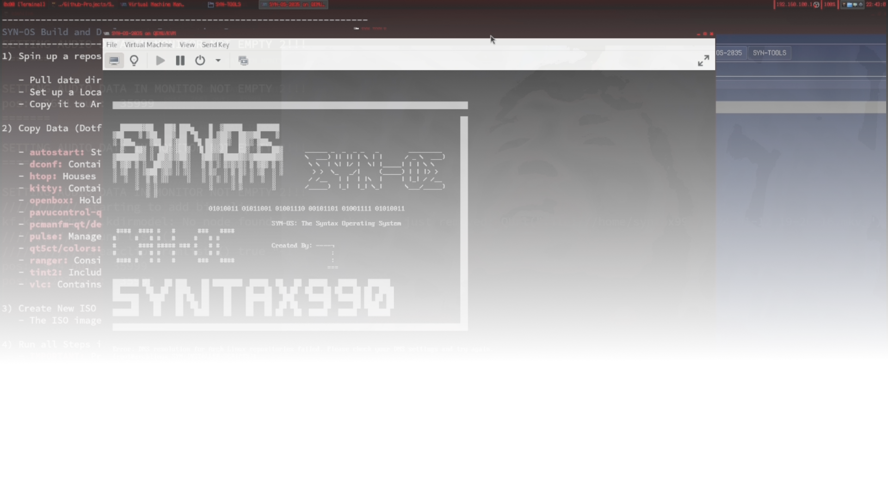
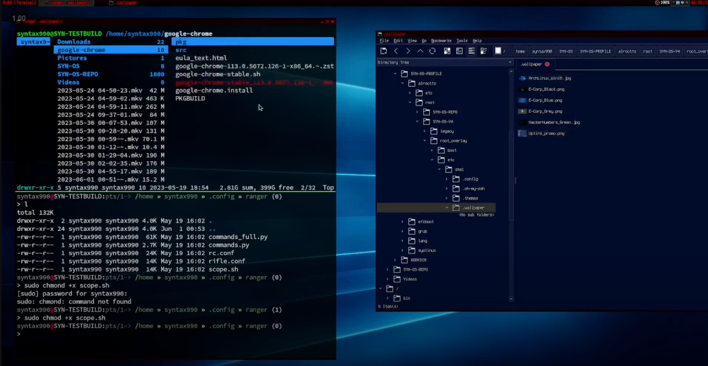
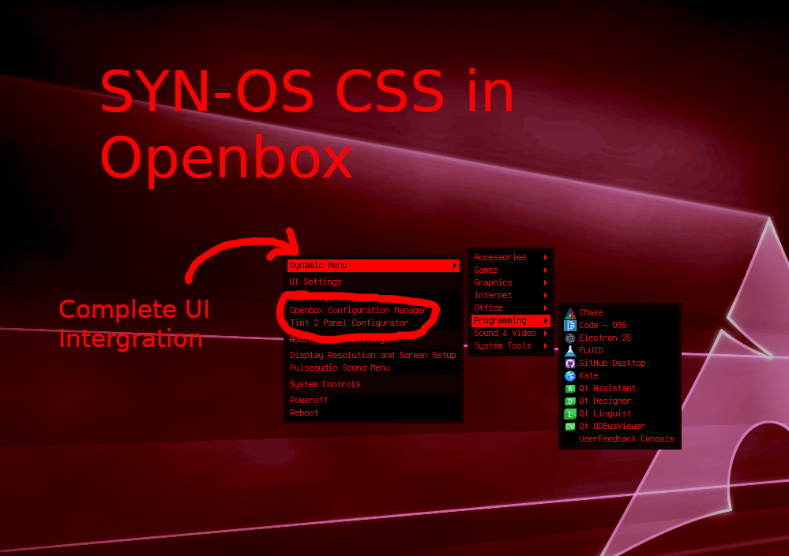
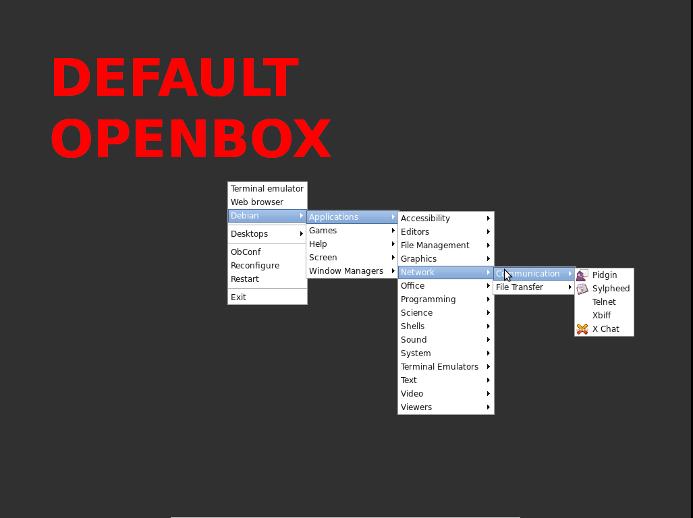

# SYN-OS

**SYN-OS** is an Arch Linux-based operating system created by William Hayward-Holland (Syntax990). It utilizes build scripts to systematically install and configure an Arch Linux system, offering a highly customizable and efficient computing experience.

## Table of Contents
- [Key Features](#key-features)
- [Installation Process](#installation-process)
- [Customization Options](#customization-options)
- [System Architecture](#system-architecture)
- [Target Audience](#target-audience)
- [Development Status](#development-status)
- [Getting Started](#getting-started)
  - [Downloading the ISO](#downloading-the-iso)
  - [Creating a Bootable USB Drive](#creating-a-bootable-usb-drive)
  - [Boot into the SYN-OS Live Environment](#boot-into-the-syn-os-live-environment)
  - [Customize the Installation](#customize-the-installation-optional)
  - [Run the Installation Command](#run-the-installation-command)
  - [Follow the On-Screen Prompts](#follow-the-on-screen-prompts)
  - [Post-Installation](#post-installation)
- [Contributing](#contributing)
- [License](#license)
- [Support](#support)

## Key Features & Unique Aspects

- **Terminal-Centric Design**: Starts in a terminal environment (tty) by default, emphasizing efficiency and simplicity.
- **Flexible GUI Options**: 
  - Transition to X session via `startx` command.
  - Openbox window manager with extensive theme customization.
  - Custom tint2 panel with specialized menus.
- **Highly Customizable**: Far beyond vanilla Arch, with pre-configured options and easy customization.
- **Efficient Installation**: Two-stage process with automatic boot method detection (UEFI/MBR).
- **Modular Components**: Built from modular components for maximum flexibility.
- **Custom Openbox Themes**: Compiled themes offer a range of visual styles out-of-the-box.
- **Tint2 Panel Configuration**: Specially configured panel with custom menus, enhancing usability.
- **xinitrc Customization**: Easily modify the X session startup process.
- **Display Manager Option**: Install and configure a display manager for alternative GUI startup.
- **Root Overlay Feature**: Add custom files/configurations during installation.

## Installation Process

1. **Stage 0 (syn-stage0.zsh)**:
   - Handles disk partitioning, package installation, and initial system setup.
   - Detects boot environment (UEFI or MBR).

2. **Boot-specific Stage (syn-uefi.zsh or syn-mbr.zsh)**:
   - Automatically executed based on the detected boot environment.
   - Completes installation with bootloader setup, user account creation, and final configurations.

## Customization Options

- Modify variables for disk partitioning, package selection, locale settings, etc.
- Extensive theme customization for Openbox and other components.
- Custom tint2 panel configuration.
- xinitrc modifications for personalized X session startup.

## System Architecture

- Based on Arch Linux with significant enhancements.
- Starts in a terminal environment (tty) by default.
- Optional X session with highly customized Openbox environment.
- Custom-configured tint2 panel with specialized menus.

## Target Audience

SYN-OS is designed for users seeking granular control over their system, offering more pre-configured options and a template for customization based on vanilla Arch Linux.

## Development Status

SYN-OS is primarily developed by a single developer. The project is ongoing, with updates and improvements made as time allows.

## Getting Started

1. **Download the SYN-OS ISO**:
   - Download the latest version of SYN-OS from the link below:
   - 
     - **[SYN-OS-ArchTech Corp. Edition JULY 2024](https://drive.google.com/file/d/1WRDf0JfCCNhYJJkFUXb3Xheb3YInys52/view?usp=sharing)**
   - Earlier versions:
     - **[SYN-OS-VOLITION MAY 2024](https://drive.google.com/file/d/16ETNY4jlTK_UCGEwBxMTTFMn0Mf7rrTR/view?usp=sharing)**
     - **[SYN-OS-Soam-Do-Huawei MAY 2024](https://drive.google.com/file/d/1bsa85uXRdrfxPydkVNI-oQnpGj4JmeQi/view?usp=sharing)**
     - **[SYN-OS-Chronomorph FEB 2024](https://drive.google.com/file/d/142U6-w2CNOiL2jRPlHmfqcYTlEmTBXow/view?usp=drive_link)**

2. **Create a Bootable USB Drive**:
   - **Windows Users**:
     1. Download and install Rufus from the [official website](https://rufus.ie/).
     2. Insert a USB drive with sufficient storage capacity.
     3. Open Rufus and select the inserted USB drive under "Device."
     4. Click on the "Select" button next to "Boot selection" and choose the downloaded SYN-OS ISO file.
     5. Ensure that the partition scheme is set to "MBR" for BIOS or "GPT" for UEFI systems.
     6. Click "Start" to create the bootable USB drive.
   - **Mac Users**:
     1. Insert a USB drive with sufficient storage capacity.
     2. Open Disk Utility (you can find it in Applications > Utilities).
     3. Select your USB drive from the list of available drives.
     4. Click on the "Erase" tab and format the USB drive using the "MS-DOS (FAT)" format.
     5. Once formatted, open Terminal (you can find it in Applications > Utilities).
     6. Use the `diskutil list` command to identify the disk identifier of your USB drive.
     7. Use the `sudo dd if=/path/to/SYN-OS-ISO-file of=/dev/diskN bs=1m` command to write the SYN-OS ISO to the USB drive (replace `/path/to/SYN-OS-ISO-file` with the actual path to the ISO file and `/dev/diskN` with the disk identifier of your USB drive).
     8. This process may take some time. Once it's complete, eject the USB drive.

3. **Boot into the SYN-OS Live Environment**:
   - Use the bootable USB drive to boot your computer into the SYN-OS live environment.

4. **Customize the Installation (Optional)**:
   - If needed, edit the installation scripts to suit your system.
   - Run `lsblk` to check disk names and modify variables accordingly.

5. **Run the Installation Command**:
   - In the terminal, simply run: `syntax990`
   - This alias will execute the entire installation process from start to finish.

6. **Follow the On-Screen Prompts**:
   - The system will guide you through any necessary inputs during installation.

7. **Post-Installation**:
   - After installation completes, reboot into your new SYN-OS system.

Note: Running `syn-stage0.zsh` directly is only necessary if you plan to edit the script. For most users, the `syntax990` alias provides a streamlined installation process.

## Contributing

Contributions, issues, and feature requests are welcome. Feel free to check the GitHub repository for more information.

## License

SYN-OS is licensed under the MIT License. See [LICENSE](LICENSE) for details.

## Support

For support, you can contact William Hayward-Holland via [LinkedIn](https://www.linkedin.com/in/william-hayward-holland-990/) or through email at `william@npc.syntax990.com`. Additional guidance is available on [The Arch Wiki](https://wiki.archlinux.org).

Feel free to explore and customize SYN-OS to tailor it to your preferences and requirements.
