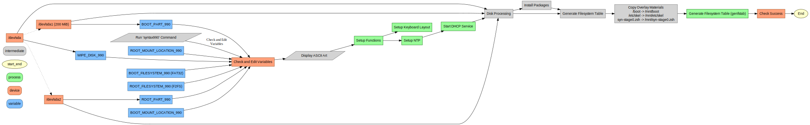

<p align="center">
  
</p>

# SYN-OS Readme - The Syntax Operating System - Based on Arch

### SYN-OS Overview

**SYN-OS** is an Arch Linux-based* operating system created by William Hayward-Holland (Syntax990). It utilises build scripts to systematically install and configure an Arch Linux system according to user preferences. This package serves as your template to assimilate and repurpose this system for an embedded system or a minimal desktop/server graphical environment that is predictable and transparent by design.

#### User Interface and Interaction

SYN-OS is intentionally designed with a "Terminal By Design" philosophy, prioritizing efficiency and simplicity. Upon startup, SYN-OS initiates in a terminal environment (tty), offering users a fast and lightweight interface for command-line interaction.

For users who prefer a graphical user interface (GUI), SYN-OS provides the option to transition to an X session through the `xinitrc` script. Executing the `startx` command seamlessly switches to a graphical environment while maintaining the underlying principles of speed and minimalism.

In the graphical environment, SYN-OS utilises the Openbox window manager, enhancing the user experience with basic compositing features such as transparency and shadows. Despite these enhancements, SYN-OS remains true to its roots, focusing on simplicity and functionality without unnecessary distractions or resource-intensive components.

#### Project Structure

1. **scripts:**
    - **syn-stage0.zsh:** Defines disks, installs packages, and prepares the system for chroot.
    - **syn-stage1.zsh:** Chrooting script for executing final stages of the installer.

2. **DotfileOverlay:**
    - **scripts:**
        - **syn-stage0.zsh:** Defines disks, installs packages, and prepares the system for chroot.
    - **etc/skel:** User-specific settings and preferences.
        - **.xinitrc:** X.Org initialization script for autostarting xcompmgr and openbox.
        - **.oh-my-zsh:** Customizations for Oh My Zsh.
        - **.zshrc:** Zsh shell configurations.
        - **.config:**
            - **kitty:** Terminal emulator settings.
            - **ranger:** File manager configurations.
            - **openbox:** Window manager settings.
            - **tint2:** Panel configuration.
            - **dconf:** dconf settings.
            - **vlc:** VLC media player configuration.
            - **htop:** htop system monitor settings.
            - **pcmanfm-qt:** PCManFM-Qt file manager configuration.
            - **pulse:** PulseAudio settings.
            - **pavucontrol-qt:** pavucontrol-qt audio control configuration.
            - **autostart:** Scripts for autostarting applications.
            - **qt5ct:** Qt5 applications configuration.
        - **.themes:** Custom user themes.

#### Archiso Profile

1. **pacman.conf:** Configuration file for Pacman, the package manager. Defines repository settings and package preferences.

2. **bootstrap_packages.x86_64:** List of essential packages necessary during initial bootstrapping process.

3. **syslinux:**
    - **archiso_sys-linux.cfg:** Configuration file specifying settings for the Syslinux bootloader when using the Linux kernel.
    - **archiso_pxe.cfg:** Configuration for PXE booting with Syslinux.
    - **archiso_sys.cfg:** Main configuration file for Syslinux in the Archiso environment.
    - **archiso_tail.cfg:** Tail configuration for Syslinux.
    - **syslinux.cfg:** General Syslinux configuration.
    - **archiso_head.cfg:** Header configuration for Syslinux.
    - **archiso_pxe-linux.cfg:** Configuration for PXE booting with Syslinux using the Linux kernel.

4. **airootfs:**
    - **airootfs/etc:**
        - **passwd:** User account information.
        - **resolv.conf:** Configuration for DNS resolution.
        - **motd:** Message of the day displayed at login.
        - **hostname:** Hostname configuration.
        - **os-release:** Information about the operating system release.
        - **mkinitcpio.d:** MKinitcpio configurations for the initial RAM disk.
        - **vconsole.conf:** Configuration for the virtual console.
    - **airootfs/root:** Root user's home directory.
    - **airootfs/usr:** Directory containing user-specific files.

5. **efiboot:**
    - **loader:**
        - **entries:**
            - **syn.conf:** Configuration for SYN-OS within the EFI loader.
        - **loader.conf:** General loader configuration.

6. **grub:**
    - **loopback.cfg:** Configuration for loopback booting.
    - **grub.cfg:** General GRUB configuration.

#### Downloading the ISO

To download the latest version of SYN-OS, click on the respective link below:

- **[SYN-OS-VOLITION MAY 2024](https://drive.google.com/file/d/16ETNY4jlTK_UCGEwBxMTTFMn0Mf7rrTR/view?usp=sharing)**

Older versions below:

- **[SYN-OS-Soam-Do-Huawei MAY 2024](https://drive.google.com/file/d/1bsa85uXRdrfxPydkVNI-oQnpGj4JmeQi/view?usp=sharing)**
- **[SYN-OS-Chronomorph FEB 2024](https://drive.google.com/file/d/142U6-w2CNOiL2jRPlHmfqcYTlEmTBXow/view?usp=drive_link)**

After downloading the ISO, save it to your local machine.

#### Creating a Bootable USB Drive

For both Windows and Mac users, you can create a bootable USB drive using the following steps:

1. **Windows Users:**
   - Download and install Rufus from the [official website](https://rufus.ie/).
   - Insert a USB drive with sufficient storage capacity.
   - Open Rufus and select the inserted USB drive under "Device."
   - Click on the "Select" button next to "Boot selection" and choose the downloaded SYN-OS ISO file.
   - Ensure that the partition scheme is set to "MBR" for BIOS or "GPT" for UEFI systems.
   - Click "Start" to create the bootable USB drive.

2. **Mac Users:**
   - Insert a USB drive with sufficient storage capacity.
   - Open Disk Utility (you can find it in Applications > Utilities).
   - Select your USB drive from the list of available drives.
   - Click on the "Erase" tab and format the USB drive using the "MS-DOS (FAT)" format.
   - Once formatted, open Terminal (you can find it in Applications > Utilities).
   - Use the `diskutil list` command to identify the disk identifier of your USB drive.
   - Use the `sudo dd if=/path/to/SYN-OS-ISO-file of=/dev/diskN bs=1m` command to write the SYN-OS ISO to the USB drive (replace `/path/to/SYN-OS-ISO-file` with the actual path to the ISO file and `/dev/diskN` with the disk identifier of your USB drive).
   - This process may take some time. Once it's complete, eject the USB drive.

After creating the bootable USB drive, you can proceed to boot your computer from it and install SYN-OS following the on-screen instructions.

Once booted and connected to the internet (automatic on ethernet + DHCP) it should be as simple as one command to install the entire system.

```markdown
    
#### Customizing the ISO (requires SYN-OS)

1. Open kitty (or any terminal).
2. Clone the repository: `git clone https://github.com/syn990/SYN-OS.git`
3. Navigate to the SYN-ISO-PROFILE directory: `cd SYN-OS/SYN-ISO-PROFILE`
4. Edit configurations and customize packages in `airootfs/etc` to suit your preferences.
5. Run the new build script: `./BUILD-SYNOS-ISO.zsh`
6. Find the output ISO in the 'SYN-ISO-PROFILE' directory.
7. Boot the ISO.
```

## The installation process (syn-stage0.zsh) (Run 'syntax990' to start)

<p align="center">
  <a href="./SYN-OS/Graphviz/syn-stage0.svg">
    
  </a>
</p>

Click on the image above to view it in full size.

## The installation process (syn-stage1.zsh) (Run 'sh syn-stage1.zsh' to start, within the chroot enviroment)


<p align="center">
  <a href="./SYN-OS/Graphviz/syn-stage1.svg">
    
  </a>
</p>

Click on the image above to view it in full size.

#### Screenshots


<p align="center">
  
</p>


<p align="center">
  
</p>


```markdown
### Support

For support, you can contact William Hayward-Holland via [LinkedIn](https://www.linkedin.com/in/william-hayward-holland-990/) or through email at `william@npc.syntax990.com`. Additional guidance is available on [The Arch Wiki](https://wiki.archlinux.org).

Feel free to explore and customize SYN-OS to tailor it to your preferences and requirements.

#### License

SYN-OS is licensed under MIT. Refer to [LICENSE](https://github.com/syn990/SYN-OS/blob/main/LICENSE) for details.
```

