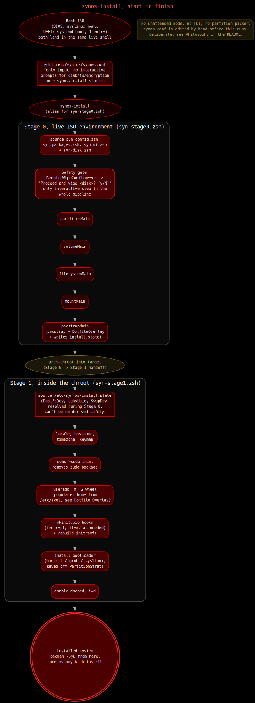

# SYN-OS

An Arch Linux build by William Hayward-Holland (Syntax990). One installer,
one dotfile overlay, one theme engine — no DE, no config-management layer,
just scripts you can read start to finish. This README describes what the
scripts actually do, not what a feature list says they do.


---

## The installer: `syn-stage0.zsh` → chroot → `syn-stage1.zsh`

`synos-install` runs `syn-stage0.zsh`. The very first thing it does is
re-exec itself under `script -qefc`, not a `tee` pipe — `pacstrap`/`pacman`
check `isatty()` to decide whether to draw progress bars, and a pipe fails
that check where a pty doesn't. Everything either script prints, in both
stages, ends up in one timestamped log under `/root/`, which gets copied
onto the freshly installed disk right after the chroot returns.



**Stage 0** sources `syn-config.zsh` (reads `/etc/syn-os/synos.conf`),
`syn-packages.zsh`, `syn-disk.zsh`, `syn-pacstrap.zsh`. The only interactive
moment in the whole pipeline is one confirm prompt before anything
destructive runs — gated by `RequireWipeConfirm` (default `yes`), not
removable by accident. Then it's a straight pipeline: `partitionMain` →
`volumeMain` → `filesystemMain` → `mountMain` → `pacstrapMain`, and it hands
off with `arch-chroot "$RootMountLocation" /bin/zsh /usr/lib/syn-os/syn-stage1.zsh`.

`pacstrapMain` also writes `/etc/syn-os/install.state` — `RootFsDev`,
`SwapDev`, `LuksUuid` — facts Stage 0 resolved by actually touching disks,
which Stage 1 has no way to safely re-derive from `synos.conf` alone. Stage
1's first act is sourcing that file; if it's missing, Stage 1 refuses to
continue rather than guess.

**Stage 1**, inside the chroot: locale/hostname/timezone/console, then a
`doas`→`sudo` shim (writes a one-line `sudo` wrapper around `doas`,
uninstalls the real `sudo` package), then the user account. If
`UserAccountPassword` is still the literal string `CHANGE_ME` from the
template config, Stage 1 stops here rather than shipping a system with a
known default password. The password line is stripped out of
`synos.conf` on the target disk immediately after use.

`syn-filemanager` is built here, not shipped prebuilt: `makepkg` refuses to
run as root, so Stage 1 `chown`s `/usr/src/syn-filemanager` to the new user
and runs `makepkg` as them, then `pacman -U`s the result. If that fails,
install continues anyway — it logs which key (`Super+E`) won't work and
leaves the source in `/usr/src/syn-filemanager` for a manual retry, instead
of aborting an otherwise-working install over one optional package. Same
philosophy shows up in `mkinitcpio` HOOKS assembly (`encrypt`/`lvm2` hooks
only added if `Encryption`/`UseLvm` are actually set) and in bootloader
selection, which branches on `PartitionStrat` three ways —
`uefi-bootctl`, `mbr-syslinux`, `mbr-grub` — with `mbr-grub` needing its own
unencrypted `/boot` split, since GRUB itself never touches LUKS; the
`encrypt` initramfs hook resolves `cryptdevice=` at boot regardless of
which bootloader got it there.

```bash
nano /etc/syn-os/synos.conf   # every choice lives here, read once, no prompts
synos-install
```

Full stage-by-stage detail: [Installer Overview](./SYN-OS/SYN-ISO-PROFILE/airootfs/usr/share/syn-os/docs/installer-overview.md) · [Stage 0](./SYN-OS/SYN-ISO-PROFILE/airootfs/usr/share/syn-os/docs/stage0.md) · [Stage 1](./SYN-OS/SYN-ISO-PROFILE/airootfs/usr/share/syn-os/docs/stage1.md) · [synos.conf](./SYN-OS/SYN-ISO-PROFILE/airootfs/usr/share/syn-os/docs/synos-conf.md)

---

## Where the desktop actually comes from

Nothing under `~/.config` on an installed system is generated at build
time. `DotfileOverlay/` in this repo is laid out exactly like the real
filesystem — `pacstrapMain` runs one `cp -r` onto the target disk during
Stage 0, then a handful of `chmod -R +x` calls fix up execute bits a plain
copy doesn't reliably preserve. That puts everything at `/etc/skel`; it
isn't in any user's home yet. Stage 1's `useradd -m` is what actually fans
it out, by copying `/etc/skel` into the new account — which is also why any
user added by hand *after* install gets identical defaults for free,
without the overlay ever targeting `/home/<user>` directly.

If you're editing this repo from a machine already running SYN-OS: your
live `~/.config` is a snapshot from whenever that system was last built.
Editing it does nothing to `DotfileOverlay/`; editing `DotfileOverlay/`
does nothing to your live desktop. They only sync at install/rebuild time,
one direction, repo → disk.

---

## How the pieces talk to each other

**The theme engine** is the one place SYN-OS generates configs instead of
hand-authoring them — read `syn-theme-apply` and the tradeoff is explicit
in the code: six unrelated config formats, one edited variable. A theme is
9 color variables sourced from a flat `.theme` file
(`SYN_BG`, `SYN_ACCENT`, `SYN_URGENT`, …). `syn-theme-apply <name>` runs a
longest-key-first `sed` substitution — `SYN_BG_ALT` has to be replaced
before `SYN_BG`, or `SYN_BG`'s rule fires first and leaves a stray `_ALT`
behind — against a template per consumer, and every consumer reloads on
its own terms, not uniformly:

| Consumer | Reload |
|---|---|
| Waybar CSS, glyph | live, `pkill -SIGUSR2 waybar` |
| `mako` | live, `makoctl reload` |
| `swaybg` wallpaper | live, process restarted with the new image |
| LabWC `themerc` + `rc.xml` `<name>` | live, `labwc --reconfigure` |
| `foot` | **new windows only** — foot has no live-reload signal, `SIGUSR1` only affects colors already loaded at startup |
| `qt6ct` (falkon, pavucontrol-qt, syn-filemanager), GTK3, Superfile | next launch |

`qt5ct` gets rendered too, even though every Qt app on the system links
Qt6 — kept as dead-but-ready code in case a Qt5 app ever gets installed,
per the script's own comment. Themes needing real gradients/bevels instead
of the shared flat-solid look (`labwc-themerc.$NAME.tmpl`,
`waybar-style.$NAME.css.tmpl`, `foot-colors-dark.$NAME.tmpl`) drop a
theme-specific override template next to the shared one; `syn-theme-apply`
checks for it and falls back to the shared template if it's absent — no
branching logic needed per theme, just a filesystem convention.

**The root menu** (`Super+Space`) is `menu.xml`, mostly static XML, plus
Openbox-style pipe menus for anything that has to reflect live state
instead of a fixed list. `syn-pipe-docs.zsh` is the plainest example: it
globs `/usr/share/syn-os/docs/*.md`, turns `installer-overview.md` into the
label "Installer Overview" via a `${(C)...}` zsh case transform, and wires
each entry to `foot -e /usr/local/bin/syn-docs-view.zsh <file>` — note the
absolute path; `foot -e` execs argv directly with no shell in between, so a
bare filename would just silently fail to launch. `syn-docs-view.zsh`
itself renders the markdown with `glow` in that terminal, then greps the
same file for `` references and opens each as
a real `feh` image window — the doc, and its diagram, from one menu click,
without a browser. Same pipe-menu pattern drives Themes, Audio, Display,
Share, Superfile, BlackArch, and Services from their own generator scripts
under `/usr/lib/syn-os/syn-pipe-*.zsh` — none of them a hand-maintained
list that can drift from what's actually installed.

---

## Download and install

[**Download SYN-OS (~1.1 GB)**](https://drive.google.com/file/d/1MFceD89VX8kxDUn4kMmDmg2Wp5CvY1ba/view?usp=sharing)

```bash
lsblk                          # find your USB, e.g. /dev/sdb
sudo dd if=SYN-OS.iso of=/dev/sdX bs=4M status=progress oflag=sync
```

macOS: `diskutil unmountDisk /dev/diskN` then `sudo dd if=SYN-OS.iso of=/dev/rdiskN bs=4m`.
Windows: [Rufus](https://rufus.ie/) — GPT for UEFI, MBR for BIOS.

Boot the USB, select **SYN-OS**, you land in the live shell — run the two
commands from [above](#the-installer-syn-stage0zsh--chroot--syn-stage1zsh).
Reboot, log in, run `synos` to start the LabWC session.

---

## Build your own ISO

Needs an Arch environment — an installed SYN-OS/Arch system, or the live
ISO shell itself.

```bash
sudo pacman -S archiso git
git clone https://github.com/syn990/SYN-OS.git
cd SYN-OS/SYN-OS
sudo zsh ./BUILD-SYNOS-ISO.zsh
```

Output lands in `ISO_OUTPUT/*.iso`. From an installed desktop, the same
build is `Super+Space` → SYN-OS Tools → ISO Builder, no terminal needed.
Windows/macOS hosts can't run the build script natively — boot the
downloaded ISO in any VM tool and build from inside that live shell.
Details: [Building the ISO](./SYN-OS/SYN-ISO-PROFILE/airootfs/usr/share/syn-os/docs/building-the-iso.md).

---

## Documentation

The same docs this README links to are browsable on the installed system
itself — `Super+Space` → Docs — rendered by `syn-docs-view.zsh` exactly as
described above. In the repo, they live under
[`docs/`](./SYN-OS/SYN-ISO-PROFILE/airootfs/usr/share/syn-os/docs/):

| Area | Docs |
|---|---|
| **Installer** | [Overview](./SYN-OS/SYN-ISO-PROFILE/airootfs/usr/share/syn-os/docs/installer-overview.md) · [Stage 0](./SYN-OS/SYN-ISO-PROFILE/airootfs/usr/share/syn-os/docs/stage0.md) · [Stage 1](./SYN-OS/SYN-ISO-PROFILE/airootfs/usr/share/syn-os/docs/stage1.md) · [synos.conf](./SYN-OS/SYN-ISO-PROFILE/airootfs/usr/share/syn-os/docs/synos-conf.md) · [Storage strategies](./SYN-OS/SYN-ISO-PROFILE/airootfs/usr/share/syn-os/docs/storage-strategies.md) |
| **Packages** | [Package collection](./SYN-OS/SYN-ISO-PROFILE/airootfs/usr/share/syn-os/docs/packages.md) |
| **Desktop** | [LabWC](./SYN-OS/SYN-ISO-PROFILE/airootfs/usr/share/syn-os/docs/labwc.md) · [Waybar](./SYN-OS/SYN-ISO-PROFILE/airootfs/usr/share/syn-os/docs/waybar.md) · [Dotfile overlay](./SYN-OS/SYN-ISO-PROFILE/airootfs/usr/share/syn-os/docs/dotfile-overlay.md) · [Zsh](./SYN-OS/SYN-ISO-PROFILE/airootfs/usr/share/syn-os/docs/zsh.md) · [Wayland vs X11](./SYN-OS/SYN-ISO-PROFILE/airootfs/usr/share/syn-os/docs/wayland.md) |
| **Theming** | [Theme engine](./SYN-OS/SYN-ISO-PROFILE/airootfs/usr/share/syn-os/docs/theming/theme-engine.md) · [Theme gallery](./SYN-OS/SYN-ISO-PROFILE/airootfs/usr/share/syn-os/docs/theming/theme-gallery.md) |
| **Tools** | [syn-filemanager](./SYN-OS/SYN-ISO-PROFILE/airootfs/usr/share/syn-os/docs/tools/syn-filemanager.md) · [SYN-SHARE](./SYN-OS/SYN-ISO-PROFILE/airootfs/usr/share/syn-os/docs/tools/syn-share.md) · [SYN-CRYPTER](./SYN-OS/SYN-ISO-PROFILE/airootfs/usr/share/syn-os/docs/tools/syn-crypter.md) · [SYN-REDSHIRT](./SYN-OS/SYN-ISO-PROFILE/airootfs/usr/share/syn-os/docs/tools/syn-redshirt.md) · [SYN-GRAPHMAP](./SYN-OS/SYN-ISO-PROFILE/airootfs/usr/share/syn-os/docs/tools/syn-graphmap.md) · [WiFi menu](./SYN-OS/SYN-ISO-PROFILE/airootfs/usr/share/syn-os/docs/tools/wifi.md) · [Screenshots/recording](./SYN-OS/SYN-ISO-PROFILE/airootfs/usr/share/syn-os/docs/tools/screenshot-and-recording.md) · [Services toggle](./SYN-OS/SYN-ISO-PROFILE/airootfs/usr/share/syn-os/docs/tools/services-toggle.md) · [BlackArch toggle](./SYN-OS/SYN-ISO-PROFILE/airootfs/usr/share/syn-os/docs/tools/blackarch-toggle.md) · [Notifications](./SYN-OS/SYN-ISO-PROFILE/airootfs/usr/share/syn-os/docs/tools/notifications.md) |
| **Build** | [Building the ISO](./SYN-OS/SYN-ISO-PROFILE/airootfs/usr/share/syn-os/docs/building-the-iso.md) |
| **Background** | [Philosophy](./SYN-OS/SYN-ISO-PROFILE/airootfs/usr/share/syn-os/docs/philosophy.md) · [Project History](./SYN-OS/SYN-ISO-PROFILE/airootfs/usr/share/syn-os/docs/history.md) |
| **Concepts** | [Window manager](./SYN-OS/SYN-ISO-PROFILE/airootfs/usr/share/syn-os/docs/concepts/window-manager.md) · [Wayland](./SYN-OS/SYN-ISO-PROFILE/airootfs/usr/share/syn-os/docs/concepts/wayland.md) · [Shell](./SYN-OS/SYN-ISO-PROFILE/airootfs/usr/share/syn-os/docs/concepts/shell.md) · [Arch Linux](./SYN-OS/SYN-ISO-PROFILE/airootfs/usr/share/syn-os/docs/concepts/arch-linux.md) · [Filesystem hierarchy](./SYN-OS/SYN-ISO-PROFILE/airootfs/usr/share/syn-os/docs/concepts/filesystem.md) |

---

## License

MIT, see [LICENSE](LICENSE).

## Contact

- **Email:** william@npc.syntax990.com
- **LinkedIn:** [William Hayward-Holland](https://www.linkedin.com/in/william-hayward-holland-990/)
- **Arch Wiki:** [wiki.archlinux.org](https://wiki.archlinux.org)
