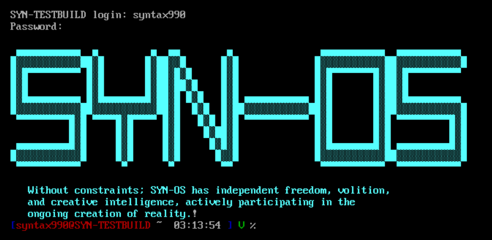
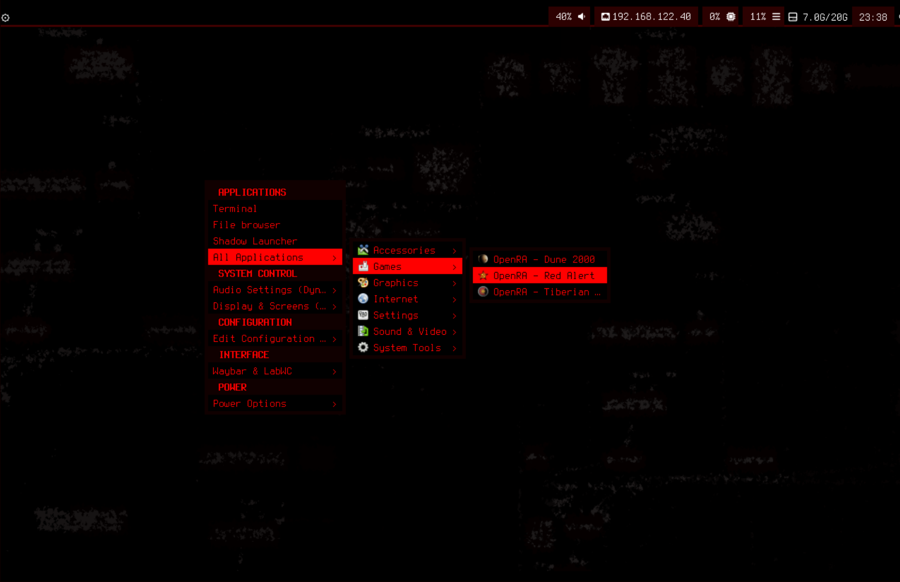

# SYN-OS

**A custom Arch Linux–based operating system by William Hayward-Holland (Syntax990)**

SYN-OS is a personal operating system built on top of Arch Linux. Not a standalone distro, just Arch with a structured installer, a chosen set of packages, and a configured desktop on top. No installer wizard, no app store, no hand-holding.

Boot the ISO. Run one command. Get a working system that you can fully understand, modify, and rebuild.

> No black boxes, no binaries, no mystery. Outside of packages downloaded directly from Arch Linux's official servers, everything on this system is plain text you can read before it runs.



## What You Get

When installation is complete, you have a minimal but fully functional desktop:

- A **Wayland** graphical session (the modern display system used by most Linux desktops today)
- **LabWC** as the window manager — lightweight, keyboard-friendly, Openbox-style behaviour
- **Waybar** as the top panel — fully scriptable, styled with CSS
- **Zsh** as your shell with autosuggestions, syntax highlighting, and fuzzy search built in
- A curated set of applications: browser, media player, image editor, terminal, file manager, and more
- **Full source visibility** — every file on your system came from this repository

---

## Download

| Release | Date | Download |
|---|---|---|
| **AEGIS** *(latest)* | Mar 2026 | [SYN-OS AEGIS (~1.1 GB)](https://drive.google.com/file/d/13CowFj1Pwo4XzBRVkGT-cBjKuVWJ50cW/view?usp=sharing) |
| SYNAPTICS | Feb 2026 | [SYN-OS SYNAPTICS](https://drive.google.com/file/d/13CowFj1Pwo4XzBRVkGT-cBjKuVWJ50cW/view?usp=sharing) |
| XENITH | Jan 2026 | [SYN-OS XENITH](https://drive.google.com/file/d/1bbKsw2FQ7d2Pb8Os1lwERGEyG5j3pnpg/view?usp=sharing) |
| SYNTEX | Apr 2025 | [SYN-OS SYNTEX](https://drive.google.com/file/d/1CcPMeKCBjdqz6OJCzm1JcLhxzKSHe7ra/view?usp=sharing) |
| M-141 | Nov 2024 | [SYN-OS M-141](https://drive.google.com/file/d/1oX-hyHrG4M2JqXwFH2p5DxjbFT656jWH/view?usp=sharing) |
| ArchTech Corp. Edition | Jul 2024 | [ArchTech Corp.](https://drive.google.com/file/d/1WRDf0JfCCNhYJJkFUXb3Xheb3YInys52/view?usp=sharing) |
| VOLITION | Jun 2024 | [VOLITION](https://drive.google.com/file/d/16ETNY4jlTK_UCGEwBxMTTFMn0Mf7rrTR/view?usp=sharing) |
| Soam-Do-Huawei | May 2024 | [Soam-Do-Huawei](https://drive.google.com/file/d/1bsa85uXRdrfxPydkVNI-oQnpGj4JmeQi/view?usp=sharing) |
| Chronomorph | Feb 2024 | [Chronomorph](https://drive.google.com/file/d/142U6-w2CNOiL2jRPlHmfqcYTlEmTBXow/view?usp=drive_link) |

---

## Create a Bootable USB

You need to write the ISO image onto a USB stick so your computer can boot from it.

**Linux**
```bash
lsblk                          # lists your drives — find your USB (e.g. /dev/sdb)
sudo dd if=SYN-OS.iso of=/dev/sdX bs=4M status=progress oflag=sync
```
Replace `sdX` with your USB device — not a partition like `sdX1`.

**macOS**
```bash
diskutil list                  # find your USB disk number
diskutil unmountDisk /dev/diskN
sudo dd if=SYN-OS.iso of=/dev/rdiskN bs=4m
sync
diskutil eject /dev/diskN
```

**Windows** — Use [Rufus](https://rufus.ie/):
1. Insert USB → open Rufus → select the ISO
2. Partition scheme: **GPT** for modern (UEFI) systems, **MBR** for older (BIOS) systems
3. Click **Start**

---

## Install

1. Boot your machine or VM from the USB stick
2. Select **SYN-OS** from the boot menu
3. You will land in a terminal — this is the live environment
4. *(Optional)* Inspect or adjust the installer config before starting:
   ```bash
   nano /etc/syn-os/synos.conf
   ```
5. Run the installer:
   ```bash
   synos-install
   ```
6. Follow the prompts — the two-stage installer handles everything:
   - Disk partitioning and encryption
   - Filesystem creation
   - Package installation
   - Config and dotfile deployment
   - Bootloader setup

---

## First Boot

Remove the USB, reboot, and log in with the account created during installation.

Launch the desktop:
```bash
synos
```

This starts the **LabWC** Wayland session — your panel, wallpaper, menus, and applications are all ready.

---

## The Desktop at a Glance



| Component | What it does |
|---|---|
| **LabWC** | Window manager — controls how windows open, move, resize, and stack |
| **Waybar** | Top panel — clock, system stats, workspaces, custom modules |
| **Swaybg** | Sets the desktop wallpaper |
| **Wmenu** | Application launcher — press the top left icon, type a name pr path, run things |
| **Foot** | Terminal emulator — your main interface for most tasks |
| **spf (Superfile)** | File manager with a graphical interface |
| **Zsh** | Your shell — the language you type commands in |

---

## Philosophy

Most Linux distributions make choices on your behalf and hide the details. SYN-OS does the opposite.

Every package is listed in [`syn-packages.zsh`](./syn-packages.zsh). Every config file ships from [`DotfileOverlay/`](./DotfileOverlay/). Every installation step runs through clearly named stage scripts. If you want to know why something behaves the way it does, you can read the file that caused it.

The goal is a system you can audit, modify, and eventually rebuild as your own — without needing to reverse-engineer decisions made by someone else.

---

## Build Your Own ISO

SYN-OS is a complete [ArchISO](https://wiki.archlinux.org/title/Archiso) profile. If you are on Arch Linux or any Arch-based system, you can rebuild the ISO yourself:

```bash
sudo pacman -S archiso git
git clone https://github.com/syn990/SYN-OS.git
cd SYN-OS
sudo zsh ./BUILD-SYNOS-ISO.zsh
```

Output is written to `out/syn-os-<date>.iso`. Any changes you made to packages, configs, dotfiles, or installer logic will be reflected in the image. See the [Building the ISO](./docs/building-the-iso.md) doc for full details.

---

## Project History

SYN-OS began in 2018 as a pair of shell scripts called **SYN-RTOS** — a quick way to bootstrap Arch with personal preferences. Over seven years it evolved into a staged, modular installer with a full ISO profile, encryption support, and a Wayland desktop.

| Release | Era |
|---|---|
| SYN-RTOS V1–V3 | 2018–2022 — two-script prototype |
| SYN-OS V4 | 2023–2024 — first modular layout |
| Chronomorph | Feb 2024 — first named release, Openbox + Tint2 |
| M-141 | Nov 2024 — pre-canonical polish |
| SYNTEX | Apr 2025 — stripped back to intentional logic only |
| XENITH | Jan 2026 — X11 deprecated, Wayland groundwork |
| SYNAPTICS | Feb 2026 — full Wayland, LabWC default session |
| AEGIS | March 2026 — modular storage strategies, hardened pipeline, encryption first-class |

---

## License

MIT — see [LICENSE](LICENSE).

---

## Contact

- **Email:** william@npc.syntax990.com
- **LinkedIn:** [William Hayward-Holland](https://www.linkedin.com/in/william-hayward-holland-990/)
- **Arch Wiki:** [wiki.archlinux.org](https://wiki.archlinux.org) — invaluable reference for everything under the hood

---

---

## Documentation

The README covers getting started. Everything below goes deeper — how the system actually works, what each component does, and how to modify or extend it. These documents are written so that following along will teach you how Linux desktops are constructed, even if that was not your intention.

### The Installer (They do not exist yet!)

| Document | Description |
|---|---|
| [How the Installer Works](./docs/installer-overview.md) | End-to-end walkthrough of what happens when you run `synos-install` |
| [Stage 0 — Pre-Chroot Setup](./docs/stage0.md) | Disk partitioning, volume setup, filesystem creation, pacstrap — everything before `arch-chroot` |
| [Stage 1 — In-Chroot Configuration](./docs/stage1.md) | Users, bootloader, services, dotfile deployment — everything inside the new system |
| [synos.conf — Declarative Strategy Selection](./docs/synos-conf.md) | How to choose partition, volume, filesystem, and bootloader strategies without touching script logic |
| [Storage Strategies](./docs/storage-strategies.md) | LUKS encryption, LVM, F2FS, Btrfs — what each strategy does and when to use it |
| [Building the ISO](./docs/building-the-iso.md) | How to rebuild SYN-OS from source and make it your own |

### Packages

| Document | Description |
|---|---|
| [Package Collection](./docs/packages.md) | Full breakdown of `syn-packages.zsh` — every category, every package, and why it is included |

### The Desktop

| Document | Description |
|---|---|
| [LabWC — Window Manager](./docs/labwc.md) | How LabWC works, key config files (`rc.xml`, `menu.xml`, `environment`), keybindings, and layout |
| [Waybar — The Panel](./docs/waybar.md) | Module structure, `config.jsonc`, `style.css`, and how to add or restyle modules |
| [Wayland vs X11 — What Changed and Why](./docs/wayland.md) | Plain-English explanation of the display system, why SYN-OS moved to Wayland, and what that means in practice |
| [Zsh Configuration](./docs/zsh.md) | Shell setup, aliases, plugins (autosuggestions, syntax highlighting, fzf, zoxide) |
| [Dotfile Overlay](./docs/dotfile-overlay.md) | How `DotfileOverlay/` works, what gets deployed where, and how to customise defaults |

### Concepts

| Document | Description |
|---|---|
| [What is a Window Manager?](./docs/concepts/window-manager.md) | The difference between a desktop environment, window manager, and compositor — explained plainly |
| [What is Wayland?](./docs/concepts/wayland.md) | How the Linux display system works and why it matters |
| [What is a Shell?](./docs/concepts/shell.md) | TTY, terminal emulator, shell, prompt — what each layer actually is |
| [What is Arch Linux?](./docs/concepts/arch-linux.md) | The base SYN-OS is built on — rolling release, pacman, AUR, and the Arch philosophy |
| [Filesystem Hierarchy](./docs/concepts/filesystem.md) | What `/etc`, `/usr`, `/home`, `/mnt` and the rest of the Linux directory tree actually mean |

### Archival Editions

| Document | Description |
|---|---|
| [Edition 0.1 — Text Loader](./archives/0.1-text-loader-edition/) | Two-script prototype, no variables, hardcoded partitions |
| [Edition 0.4 — ISO Genesis](./archives/0.4-iso-genesis-edition/) | First self-built ISO, Stage 0 + Stage 1 packaged together |
| [Edition 0.7 — Variable Storm](./archives/0.7-variable-storm-edition/) | Explosion of globals, early modularity attempts, abandoned GUI experiments |
| [Edition 0.9 — Unified Boot Path](./archives/0.9-unified-boot-path-edition/) | First coherent installer, EFI/MBR awareness, early Polybar, Openbox + Tint2 |
