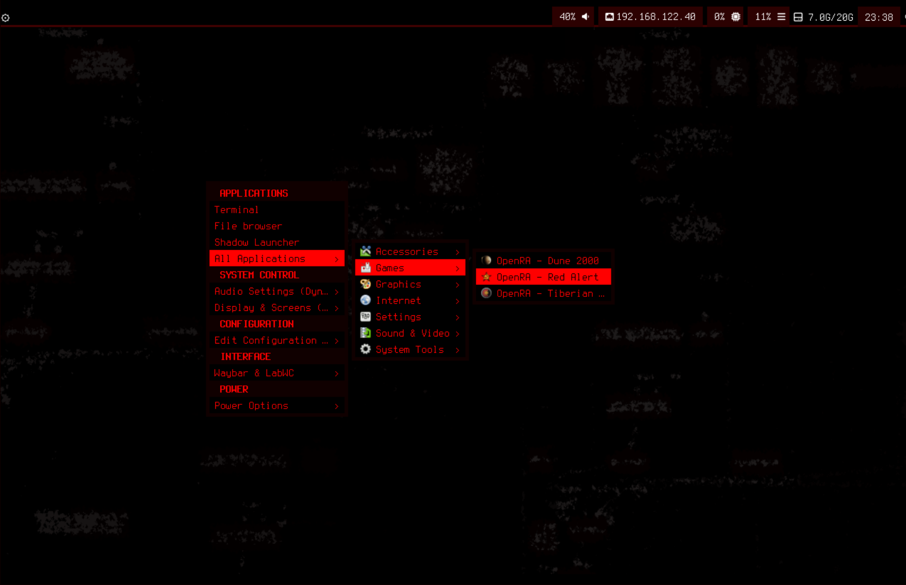
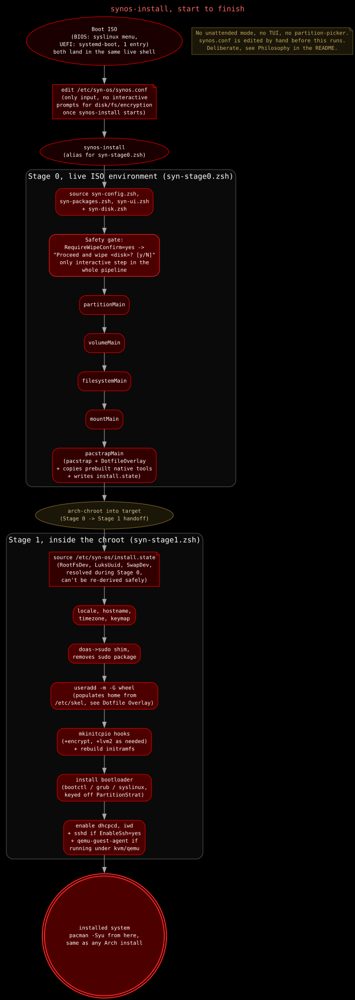
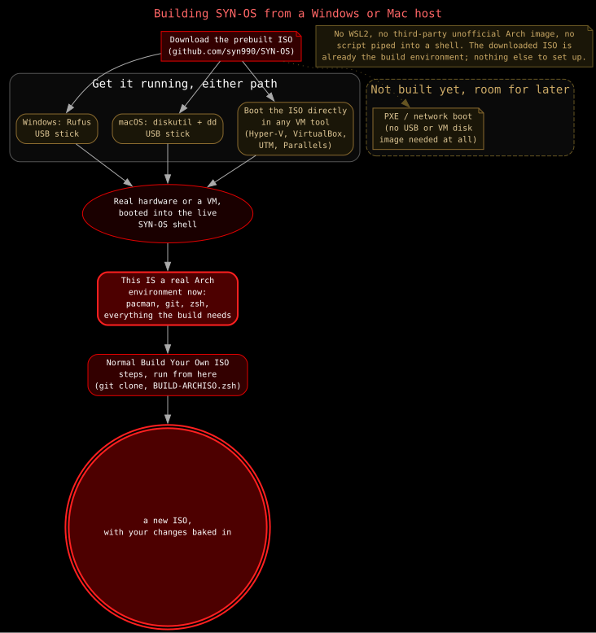
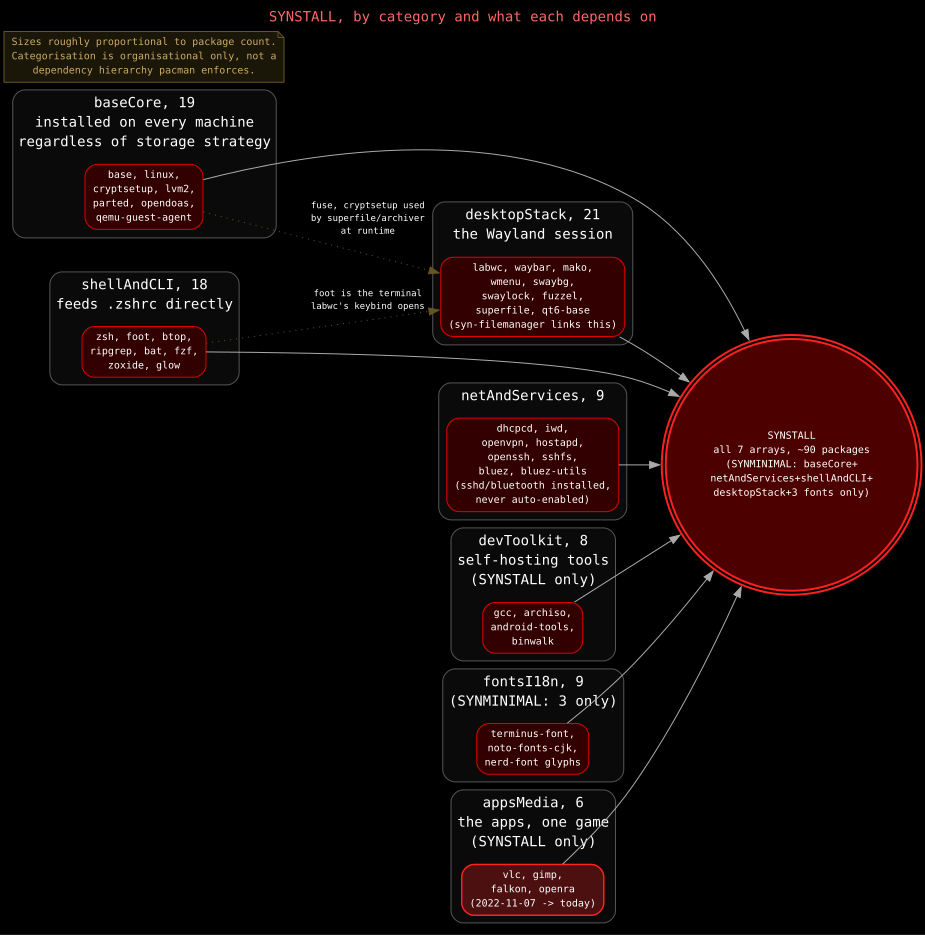
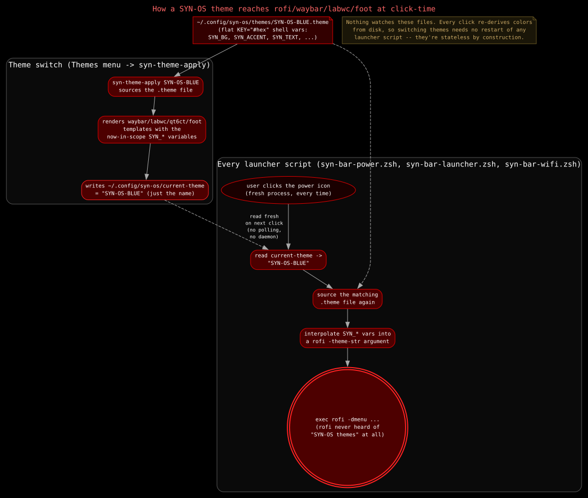
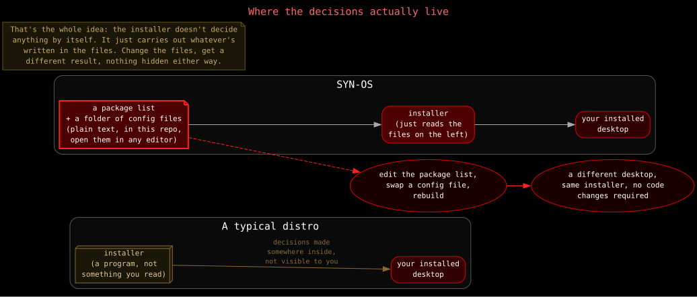

# SYN-OS

A hand-built Arch Linux desktop by William Hayward-Holland (Syntax990).


*From an earlier build, before the most recent menu reorg. An updated capture is on the list, see [Documentation](#documentation) below.*

No desktop environment, no bloat, no config layer to fight with. One
installer, one live theme system, and a shelf of tools built from
scratch to do exactly what's needed and nothing more. Almost none of
them are shell wrappers around some other program either, they're real
native programs (mostly C, one Qt6/C++) written for this system
specifically, and they talk to each other: one daemon owns every sound
the desktop makes, one popup handles every password prompt, and
connecting to another SYN-OS machine on your network updates your own
bar automatically. More on that below.

---

## Download and install

**Download SYN-OS (~1.1 GB)** (LINK IS MISSING)

```bash
lsblk                          # find your USB, e.g. /dev/sdb
sudo dd if=SYN-OS.iso of=/dev/sdX bs=4M status=progress oflag=sync
```

macOS: `diskutil unmountDisk /dev/diskN` then `sudo dd if=SYN-OS.iso of=/dev/rdiskN bs=4m`.
Windows: use [Rufus](https://rufus.ie/). GPT for UEFI, MBR for BIOS.

Boot the USB and pick SYN-OS. You'll land in a live shell, no desktop
yet. Set your choices, then install:

```bash
synos-config    # quick interactive picker for every setting
synos-install
```

Reboot, log in, run `synos` to start the desktop. There's no dual-boot
detection and no resize-to-make-room step, it expects a disk it can use
freely and wipes it before installing. Full walkthrough: [How installing
SYN-OS works](./SYN-ISO-PROFILE/airootfs/usr/share/syn-os/docs/installer-overview.md).



Partitioning, encryption, LVM, and filesystem are all independent
choices, not one preset, and the same config file drives all of it. See
[Disk & storage options](./SYN-ISO-PROFILE/airootfs/usr/share/syn-os/docs/storage-strategies.md).

---

## Build your own ISO

You'll need an Arch environment, either an installed SYN-OS/Arch system
or the live ISO shell itself.

```bash
sudo pacman -S archiso git
git clone https://github.com/syn990/SYN-OS.git
cd SYN-OS
sudo zsh ./BUILD-ARCHISO1.zsh
```

That's the current builder: a re-enterable menu that walks you through
picking a target (the working tree as it sits right now, an older commit
browsed from the project's own history, or a local profile directory),
where to put the finished ISO, and then runs the build with a live log.
It re-execs itself under `doas`/`sudo` on its own, so running it as a
plain user works too.

`BUILD-ARCHISO.zsh` (no `1`) is still around alongside it, kept
specifically for pulling one of the project's own named historical
editions and building it exactly as it shipped, going back to 2021. Not
every old edition still builds today, some depended on packages that no
longer exist anywhere in Arch's repositories.

From an installed desktop you don't need a terminal at all: `Super+Space`
→ SYN-OS Tools → ISO Builder opens the same thing as a proper ncurses TUI,
current tree / commit browser / local profile, with the build log
scrolling live in its own panel. More detail: [Building your own
ISO](./SYN-ISO-PROFILE/airootfs/usr/share/syn-os/docs/build/iso-builder.md).

Windows and macOS can't run any of these build scripts directly. Boot
the downloaded ISO in a VM and build from inside that live session
instead.



---

## What's included

A curated set, not everything under the sun. The core system, Wi-Fi/
Bluetooth/VPN/SSH networking, a nicer shell out of the box, the desktop
itself, a full compiler toolchain, broad font coverage, and a handful of
everyday apps (media player, image editor, browser). Choose the full set
above or a minimal profile that drops the toolchain and extra apps, set
with `PackageProfile` in `synos.conf`.



See [The package collection](./SYN-ISO-PROFILE/airootfs/usr/share/syn-os/docs/packages.md).

---

## The tool suite

None of these are generic Linux utilities glued together. Every one below
is a native program, mostly C, one Qt6/C++, written for SYN-OS
specifically and built to work with the rest of the system.

| Tool | What it does |
|---|---|
| [**syn-connect**](./SYN-ISO-PROFILE/airootfs/usr/share/syn-os/docs/tools/syn-connect.md) | One TUI for Wi-Fi, Bluetooth, Ethernet, and VPN instead of four separate tools. Talks to iwd and BlueZ directly over D-Bus. |
| [**syn-relay**](./SYN-ISO-PROFILE/airootfs/usr/share/syn-os/docs/tools/syn-relay.md) | Connects two SYN-OS machines: pull a remote's stats into your own bar, launch its apps as local windows, or watch and control its screen. |
| [**syn-sysmon**](./SYN-ISO-PROFILE/airootfs/usr/share/syn-os/docs/tools/syn-sysmon.md) | CPU, RAM, sensors, and a live log viewer, one click away from the bar. Switches to a connected SYN-RELAY remote's stats while you're connected to one. |
| [**syn-audio**](./SYN-ISO-PROFILE/airootfs/usr/share/syn-os/docs/tools/audio.md) | A real mixer for PulseAudio/PipeWire, keyboard and mouse driven, themed like everything else. |
| [**syn-filemanager**](./SYN-ISO-PROFILE/airootfs/usr/share/syn-os/docs/tools/syn-filemanager.md) | A small Qt6 file manager: browse, copy, move, and delete, with safe handling across filesystems. |
| [**syn-share**](./SYN-ISO-PROFILE/airootfs/usr/share/syn-os/docs/tools/syn-share.md) | Share files over rsync, Samba, NFS, HTTP, TFTP, or netcat, as a server or a client, one menu for all six. |
| [**syn-crypter**](./SYN-ISO-PROFILE/airootfs/usr/share/syn-os/docs/tools/syn-crypter.md) | Encrypts files with AES-256-GCM, Blowfish, or RSA, plus a joke XOR cipher named after *Uplink*'s Redshirt tool. |
| [**syn-graphmap**](./SYN-ISO-PROFILE/airootfs/usr/share/syn-os/docs/tools/syn-graphmap.md) | Draws a Graphviz map of any directory tree, themed to match whatever's currently active. |
| [**syn-wallgen**](./SYN-ISO-PROFILE/airootfs/usr/share/syn-os/docs/tools/syn-wallgen.md) | Procedurally renders a wallpaper for every theme, a little different each time it runs. |
| [**syn-uplink-dialpad**](./SYN-ISO-PROFILE/airootfs/usr/share/syn-os/docs/tools/syn-uplink-dialpad.md) | The one popup every password, login, and connection prompt on the system actually uses. |
| [**syn-bar-core**](./SYN-ISO-PROFILE/airootfs/usr/share/syn-os/docs/tools/syn-bar-core.md) | The daemon behind the bar. Window title, CPU/RAM/disk, and the only thing in SYN-OS that knows how to actually play a sound. |
| [**syn-iso-builder**](./SYN-ISO-PROFILE/airootfs/usr/share/syn-os/docs/build/iso-builder.md) | The ncurses TUI covered above, for building your own ISO without touching a terminal. |

They're not eleven separate islands either. Every one of them that
plays a sound routes through syn-bar-core instead of touching audio
itself, so retuning what a failure sounds like is a one-file change
instead of a dozen. SYN-RELAY writes its connection state to a couple
of plain files under `$XDG_RUNTIME_DIR`, and syn-bar-core and syn-sysmon
both just read them straight off disk, no handshake between the two
needed. And every graphical password prompt on the desktop, whether
it's a `doas` call from the menu, a first-time VPN login, or connecting
to another machine, opens the exact same dialpad-style popup, because
that's the one shared component all of them were built to use.

---

## The shell and desktop, out of the box

Zsh, with the extras already wired in rather than left for you to find:
shared history across every open terminal (kept under `$XDG_STATE_HOME`,
not dumped loose in your home folder), a completion menu with real
descriptions instead of a flat list, and fzf, zoxide, autosuggestions,
and syntax highlighting all picked up automatically if they're
installed. The prompt shows your user, folder, and git branch, plus a
green or red checkmark so you know at a glance whether your last command
actually worked.

| Type this | Get |
|---|---|
| `ll` / `la` / `l` | `ls`, with sane flags already applied |
| `sudo` or `please` | Both aliased straight to `doas` |
| `mkcd foo` | Makes a directory and moves into it in one step |
| `cat`, `grep` | Swapped for `bat` and `rg` automatically, if installed |
| `synos` | Starts the desktop session |

SYN-OS has used `doas` instead of `sudo` for years now, and any `doas`
prompt triggered from a menu, not typed by hand in a terminal, opens as
a proper graphical popup instead of dropping you into a bare password
prompt. See [syn-uplink-dialpad](./SYN-ISO-PROFILE/airootfs/usr/share/syn-os/docs/tools/syn-uplink-dialpad.md).

The main menu (`Super+Space`) is five plain sections: Applications,
SYN-OS Tools, Settings, System, and Power. None of it is a fixed list
somebody forgot to update either, the app list is built from what's
actually installed, and the services menu lists whatever systemd units
are really running on your machine, not a hardcoded shortlist. The bar
across the top mirrors that same honesty: window list on the left,
focused window title in the middle, and on the right a stack of live
indicators (network, volume, CPU/RAM/temperature, disk, battery, and
only when relevant, VPN, active SSH sessions, and SYN-RELAY connection
status). Nothing sits there greyed out when it doesn't apply.

See [The shell](./SYN-ISO-PROFILE/airootfs/usr/share/syn-os/docs/zsh.md),
[The window manager (LabWC)](./SYN-ISO-PROFILE/airootfs/usr/share/syn-os/docs/labwc.md),
and [The top bar (Waybar)](./SYN-ISO-PROFILE/airootfs/usr/share/syn-os/docs/waybar.md)
for the full detail on each.

---

## Look and feel

63 themes across 5 style families (Vanilla, Flatline, Slab, Halo, Bevel),
each in dark and light, plus MATRIX and WIN95 as two hand-tuned
outliers. Pick one from Preferences → Themes and the bar, window borders,
notifications, and wallpaper all switch instantly, no restart needed.
Open terminals and Qt/GTK apps pick up the change the next time you
launch them.



Every theme's wallpaper is generated on the spot by syn-wallgen rather
than pulled from a stock photo folder, so it's never quite the same
image twice. Themes themselves are plain text files too, copy one under
`~/.config/syn-os/themes/` and change the colors to make your own.

See [The theme system](./SYN-ISO-PROFILE/airootfs/usr/share/syn-os/docs/theming/theme-engine.md)
and [Theme gallery](./SYN-ISO-PROFILE/airootfs/usr/share/syn-os/docs/theming/theme-gallery.md)
for the full list by name.

---

## Documentation

Every doc below is also right there on the installed system:
`Super+Space` → Docs. Opening one renders it straight in the terminal
and pops any diagram it references as a real image window alongside it,
no browser needed.

Want the full map instead of the guided tour? [The
Glossary](./SYN-ISO-PROFILE/airootfs/usr/share/syn-os/docs/glossary.md)
covers every package, every installer script, every desktop script, and
every path in the system, present tense, sourced straight from the code.

| Area | Docs |
|---|---|
| **Getting started** | [How installing SYN-OS works](./SYN-ISO-PROFILE/airootfs/usr/share/syn-os/docs/installer-overview.md) · [Choosing your setup (synos.conf)](./SYN-ISO-PROFILE/airootfs/usr/share/syn-os/docs/synos-conf.md) · [Disk & storage options](./SYN-ISO-PROFILE/airootfs/usr/share/syn-os/docs/storage-strategies.md) |
| **What's included** | [The package collection](./SYN-ISO-PROFILE/airootfs/usr/share/syn-os/docs/packages.md) |
| **The desktop** | [The window manager (LabWC)](./SYN-ISO-PROFILE/airootfs/usr/share/syn-os/docs/labwc.md) · [The top bar (Waybar)](./SYN-ISO-PROFILE/airootfs/usr/share/syn-os/docs/waybar.md) · [The tone/notification hub (syn-bar-core)](./SYN-ISO-PROFILE/airootfs/usr/share/syn-os/docs/tools/syn-bar-core.md) · [How your settings are set up](./SYN-ISO-PROFILE/airootfs/usr/share/syn-os/docs/dotfile-overlay.md) · [The shell](./SYN-ISO-PROFILE/airootfs/usr/share/syn-os/docs/zsh.md) · [Why Wayland, not X11](./SYN-ISO-PROFILE/airootfs/usr/share/syn-os/docs/wayland.md) |
| **Look and feel** | [The theme system](./SYN-ISO-PROFILE/airootfs/usr/share/syn-os/docs/theming/theme-engine.md) · [Theme gallery](./SYN-ISO-PROFILE/airootfs/usr/share/syn-os/docs/theming/theme-gallery.md) · [Wallpapers (syn-wallgen)](./SYN-ISO-PROFILE/airootfs/usr/share/syn-os/docs/tools/syn-wallgen.md) |
| **Built-in tools** | [File manager](./SYN-ISO-PROFILE/airootfs/usr/share/syn-os/docs/tools/syn-filemanager.md) · [File sharing](./SYN-ISO-PROFILE/airootfs/usr/share/syn-os/docs/tools/syn-share.md) · [Encryption](./SYN-ISO-PROFILE/airootfs/usr/share/syn-os/docs/tools/syn-crypter.md) · [Directory maps](./SYN-ISO-PROFILE/airootfs/usr/share/syn-os/docs/tools/syn-graphmap.md) · [Connectivity (Wi-Fi/Bluetooth/Ethernet/VPN)](./SYN-ISO-PROFILE/airootfs/usr/share/syn-os/docs/tools/syn-connect.md) · [Remote machines (syn-relay)](./SYN-ISO-PROFILE/airootfs/usr/share/syn-os/docs/tools/syn-relay.md) · [Password & connection prompts (syn-uplink-dialpad)](./SYN-ISO-PROFILE/airootfs/usr/share/syn-os/docs/tools/syn-uplink-dialpad.md) · [Audio mixer](./SYN-ISO-PROFILE/airootfs/usr/share/syn-os/docs/tools/audio.md) · [Display & screens](./SYN-ISO-PROFILE/airootfs/usr/share/syn-os/docs/tools/display.md) · [System monitor & logs](./SYN-ISO-PROFILE/airootfs/usr/share/syn-os/docs/tools/syn-sysmon.md) · [Screenshots & recording](./SYN-ISO-PROFILE/airootfs/usr/share/syn-os/docs/tools/screenshot-and-recording.md) · [Services](./SYN-ISO-PROFILE/airootfs/usr/share/syn-os/docs/tools/services-toggle.md) · [BlackArch tools](./SYN-ISO-PROFILE/airootfs/usr/share/syn-os/docs/tools/blackarch-toggle.md) · [Notifications](./SYN-ISO-PROFILE/airootfs/usr/share/syn-os/docs/tools/notifications.md) |
| **Building it yourself** | [Building your own ISO](./SYN-ISO-PROFILE/airootfs/usr/share/syn-os/docs/build/iso-builder.md) |
| **Background** | [Why SYN-OS exists](./SYN-ISO-PROFILE/airootfs/usr/share/syn-os/docs/philosophy.md) · [Project history](./SYN-ISO-PROFILE/airootfs/usr/share/syn-os/docs/history.md) |
| **New to Linux terms?** | [What's a window manager](./SYN-ISO-PROFILE/airootfs/usr/share/syn-os/docs/concepts/window-manager.md) · [What's Wayland](./SYN-ISO-PROFILE/airootfs/usr/share/syn-os/docs/concepts/wayland.md) · [What's a shell](./SYN-ISO-PROFILE/airootfs/usr/share/syn-os/docs/concepts/shell.md) · [What's Arch Linux](./SYN-ISO-PROFILE/airootfs/usr/share/syn-os/docs/concepts/arch-linux.md) · [How Linux organizes files](./SYN-ISO-PROFILE/airootfs/usr/share/syn-os/docs/concepts/filesystem.md) |

---

## Why this exists

Most distros make the choices for you and hide where those choices
live. This one doesn't: every package is listed plainly, every config is
the actual file, not something generated behind the scenes, and the
install itself runs through scripts you can open and read start to
finish.



SYN-OS has been rebuilt from nothing more times than its author would
like to admit, going back to before the project even had a name. [Why
SYN-OS exists](./SYN-ISO-PROFILE/airootfs/usr/share/syn-os/docs/philosophy.md)
and [Project history](./SYN-ISO-PROFILE/airootfs/usr/share/syn-os/docs/history.md)
have the real story of that.

---

## License

MIT, see [LICENSE](LICENSE).

## Contact

- **Email:** william@npc.syntax990.com
- **LinkedIn:** [William Hayward-Holland](https://www.linkedin.com/in/william-hayward-holland-990/)
- **Arch Wiki:** [wiki.archlinux.org](https://wiki.archlinux.org)
