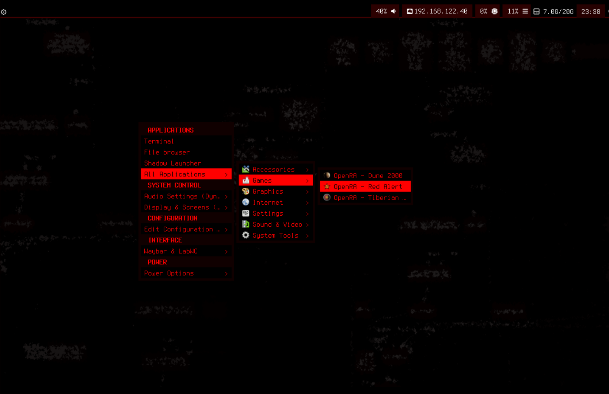
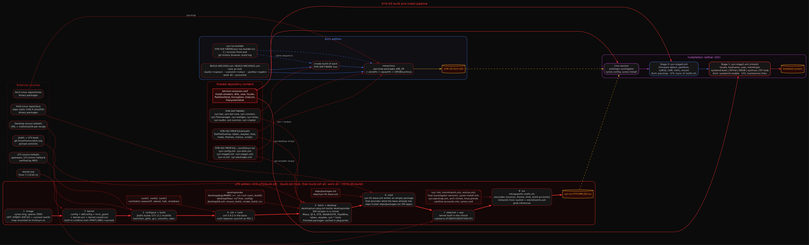
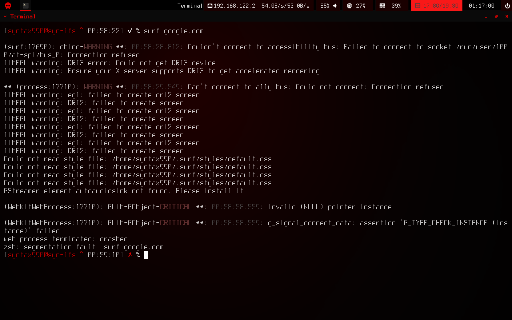
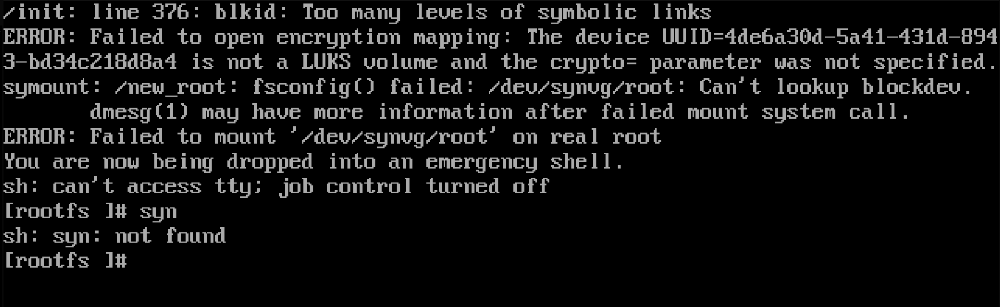
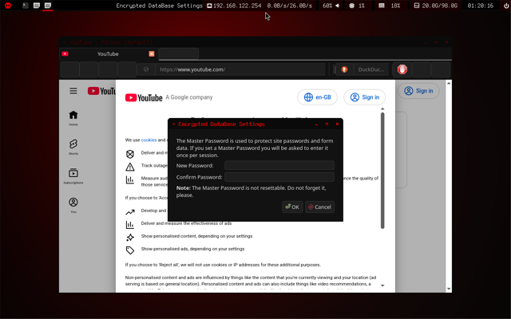

# SYN-OS

A Linux desktop by William Hayward-Holland (Syntax990).



SYN-OS is its dotfiles and its applications: labwc, waybar, foot and mako configured as one desktop, 63 live themes, and a set of native tools written for it (syn-bar, syn-connect, syn-filemanager, syn-relay, syn-crypter, syn-wallgen and others, under [SYN-SOFTWARE](./SYN-SOFTWARE)). One answers file, `synos.conf`, drives the installer.

That layer sits on one of two bases, built from the same repository:

| Stream | Base | Init | Packages | Builder |
|---|---|---|---|---|
| **Arch** | Arch Linux | systemd | pacman | `BUILD-ARCHISO.zsh`, `BUILD-ARCHISO1.zsh`, or the `syn-iso-builder` TUI, all around mkarchiso |
| **LFS** | Linux From Scratch 13.1 multilib, compiled | runit | compiled recipes, plus Void Linux binaries through xbps | [`SYN-LFS/build.zsh`](./SYN-LFS/README.md) |

Both produce a bootable ISO with a live session and the same installer: firmware detection, UEFI or BIOS, systemd-boot, rEFInd, GRUB or syslinux, LUKS2, LVM, and ext4, f2fs, btrfs or xfs.

## How it fits together



Source: [docs/diagrams/src/syn-os-build.dot](./docs/diagrams/src/syn-os-build.dot) · [SVG](./docs/diagrams/svg/syn-os-build.svg)

## Build an ISO

Arch stream, on an Arch host:

```bash
git clone https://github.com/syn990/SYN-OS.git && cd SYN-OS
sudo zsh ./BUILD-ARCHISO1.zsh
```

LFS stream, on an Arch host with about 60 GB free:

```bash
git clone https://github.com/syn990/SYN-OS.git && cd SYN-OS/SYN-LFS
./build.zsh host
./build.zsh all        # resumes at the step that stopped
./build.zsh isotest    # boots the ISO in QEMU with a blank disk
```

## Install

Boot the ISO, then:

```bash
synos-config     # edit /etc/syn-os/synos.conf
synos-install    # asks for anything left at CHANGE_ME, confirms, wipes the disk
```

## From the LFS stream's development

| | |
|---|---|
|  |  |
| surf on an early LFS image, before GStreamer's audio plugins were built | The installed system's initramfs, before `/usr/sbin` was merged into `/usr/bin` |
|  | |
| The SYN desktop on the LFS base, runit and Void applications | |

## Read more

- [The full notes](./docs/README-full.md): installing, building, the package set, every tool, theming, and the documentation index.
- [SYN-LFS](./SYN-LFS/README.md): the LFS stream in detail, and what comes next.
- [Why SYN-OS exists](./SYN-ISO-PROFILE/airootfs/usr/share/syn-os/docs/philosophy.md) · [Project history](./SYN-ISO-PROFILE/airootfs/usr/share/syn-os/docs/history.md)

MIT licensed, see [LICENSE](LICENSE). Contact: william@npc.syntax990.com
